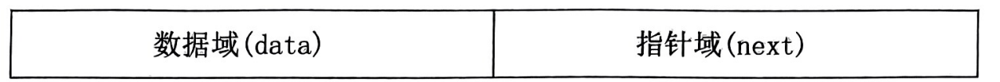

[toc]

## 基础知识

> 在计算机中，所有的数据都以二进制的形式表示。通常规定一个数额最高位作为符号位。0为正，1为负

|      | +5       | -5       |
| ---- | -------- | -------- |
| 原码 | 00000101 | 10000101 |
| 反码 | 00000101 | 11111010 |
| 补码 | 00000101 | 11111011 |

正数的反码同原码；负数的反码除符号位各位取反

正数的补码同原码；复数的补码同补码同反码+1

真值：机器数代表的真真的数值（十进制）


### 进制转换

1. 进位计数值

   |          | 范围 | 例子 |           |
   | -------- | ---- | ---- | --------- |
   | 十进制   | 0~9  | 398D | (398)~10~ |
   | 二进制   | 0~2  | 010B | (010)~2~  |
   | 八进制   | 0~7  | 716Q | (716)~8~  |
   | 十六进制 | 0~f  | 0AFH | (0af)~16~ |

2. 进制间的转换

### 字符在计算机内部的表示

ASCII:美国信息交换标准码；7位二进制

0000000B~1111111B:	0~127共128个编码

|               |       |               |        |
| ------------- | ----- | ------------- | ------ |
| 大写字母(A~Z) | 65~90 | 小写字母(a~z) | 90~122 |
| 数字(0~9)     | 48~57 | 空格(space)   | 32     |

> 控制符共32个
>
> 标点及符号共33个
>
> 大写转小写：大写ASCII+32=小写ASCII
>
> 小写转大写：小写ASCII+32=大写ASCII
>
> 一个汉字占两字节，一字节是八位二进制	1Byte=8bite
>
> 整数以补码的形式存在

## 程序设计的基本概念

### 程序

1. 由计算机高级语言所编写的程序被称为**高级语言**。

2. C语言是用途广泛、功能强大、使用灵活的**过程**性语言，即可用于编写**应用**软件，又能用于编写**系统**软件。

3. C语言属于高级语言，其编写的程序扩展名为**.c（源程序）**，经过编译后生成文件的扩展名为**.obj（目标程序）**，经过链接后生成文件的扩展名为**.exe（可执行文件）**。

4. C语言源程序的执行过程为**编译**和**链接**。

   ```mermaid
   graph LR
   .C--(编译)-->.obj--(链接)-->.exe
   ```

### 结构化程序设计

C语言是一种**结构化的程序设计语言**，它提供了三种基本结构语句，结构化程序通常由三种基本结构组成，包括**顺序**、**选择**、**循环**。

## C程序设计的初识

### 简单的C程序

```c
#include <stdio.h> /*编译预处理命令*/
main(){				//函数首部
    int a,b,s;
    a=123;b=456;s=a+b;
    printf("%d\n",s);
}
```

注释

- 作用

  1. 增加程序的可读性
  2. 注释可以插入到程序中任何位置，对程序的执行没有任何影响，编译时将被过滤掉。

- 使用方法

  ```c
  /*这是多行注释*/
  //这是单行注释
  ```

C程序的特点

1. C语言源程序由若干个**函数**组成，函数是组成C程序的**基本单位**。
2. 一个函数包括两部分：函数首部和**函数体**。
3. 函数体一般包括两部分：**定义**和执行部分。
4. 一个C语言源程序总是由**主函数**开始执行，由**主函数**结束，且主函数的位置是**任意**的。并且C程序中有且只有一个主函数
5. **语句**是组成C程序的最小单位。
6. 每条语句末尾加上**；**作为语句的结束。
7. 一行可写一条或多条语句，一条语句也可写成一行或多行。
8. C语言程序必须至少有一对**{}**，代表程序的开始、结束，里面内容称为函数体。

### 标识符、常量与变量

标识符

- 组成

  1. 标识符由数字、字母、下划线组成
  2. 开头只能是字母或下划线

- 分类

  1. 关键字：共32个

     ```c
     continue,if,else,switch,case,default,while,do,for,break,int,char,float,double,short,long,signed,unsigned,auto,static,register,extern,return,void,typeof,const,enum,sizeof,volatile,goto
     ```

     
  
  2. 预定义标识符
  
     ```c
     scanf();//输入函数
     include();//文件包含
     printf();//输出函数
     define();//宏定义
     ```
  
  3. 用户标识符
  
  > 注意：
  >
  > 1. C语言关键字不能用于用户标识符；
  > 2. C语言的关键字均为小写字母
  > 3. 表示符区分大小写

常量

- 在程序运行中其值不可改变的量。

  整型：123，-234

  实型：0.5，-34.4

  字符型：‘a’,’D’

变量

- 在程序运行中其值可以改变的量

  ```c
  int a,b,s;//若未赋值，其值为随机数
  float x,y;
  //说明：变量名由标识符组成
  ```

### 整型数据

```c
int num=11;
printf("%d",num);//11	十进制整数
printf("%o",num);//13	八进制整数
printf("%x",num);//b	十六进制（小写字母）
printf("%X",num);//B	十六进制（大写字母）
printf("%f",num);//11.000000	输出6位小数，不足时需补0，超出时则四舍五入
//输出无前导
```

1. 整型常量（没有二进制）
   - 十进制：1234，-234
   - 八进制：023，034前导为0
   - 十六进制：0x123，0Xaad前导为0x或0X
2. 整型变量
   - int 基本型
     - TC系统下占2个字节(默认)(-32768~32767)
     - VC系统下占4个字节
   - short 短整型 占2个字节
   - long 长整型 占4字节
   - unsigned 无符号型

### 实型数据

1. 实型常量
   - 小数点式：由数字、正负号、小数点组成
     1. 必须有小数点
     2. 小数点至少一边有数字
   - 指数形式：由E或e组成
     1. (E/e)两边都要有数字
     2. 指数部分必须为整数
2. 实型变量
   - 单精度：float 4个字节
   - 双精度：double 8字节（默认）

### 字符型数据

- 字符常量

  1. 定义：单引号阔以来的的**一个字符**

  2. 转义字符常量

     |        | 含义                                       |        | 含义                                                         |
     | ------ | ------------------------------------------ | ------ | ------------------------------------------------------------ |
     | ‘\n’   | 回车换行（Enter）                          | ‘\t’   | 横向跳格（Tab）<br />每行为10个显示区，每个区为8列，’\t’的作用时跳到下一个显示区 |
     | ‘\b’   | 左移覆盖<br />printf(“1234\b123”);//123123 | ‘\r’   | 回车<br />printf(“ABC\r12”)；//12C                           |
     | ‘\\\\’ | 反斜杠                                     | ‘\’‘   | 单引号                                                       |
     | ‘\\"’  | 双引号                                     | ‘\ddd’ | 1至3位八进制整数（0~127）表示一个字符。                      |
     | ‘\xhh’ | 1至2位十六进制整数表示一个字符             |        |                                                              |

- 字符串常量

  ‘A’	占1个字节
  “A”	占2个字节

  1. 双引号括起多个字符‘\0’
  2. 字符串会以null终止符结束(‘\0’)
  3. ‘\0’=0      ‘\0’ != ‘0’(48)
  4. “\ddd”    ‘\ddd’占1B，‘\0’占1B。共计2Byte
  5. “ ” -> ‘ ’‘\0’   2Byte   ;    “” -> ‘\0’ 1Byte

- 字符变量

  ```c
  %d	//十进制整数
  %o	//八进制整数
  %x	//十六进制（小写字母）
  %X	//十六进制（大写字母）
  %f	//输出6位小数，不足时需补0，超出时则四舍五入
  //输出无前导
  ```

### 算数表达式

1. 加减乘除取余

   +、-、*、/、%

   - a/b	a,b为整型；a,b任一为实型，结果为实型
   - a%b       出现负数，余数的符号与被除数一致(符号与a一致)；b只能是整数

2. 运算符的优先级与结合性

   1. 优先级：次序

      () -> *、/、% -> +、-

   2. 结合性：方向

      ()、*、/、%、+、-：自左向右

3. 强制类型转换符

   ```c
   int a=2;double b=3.6;
   printf("%d\n",(int)b+a);//5
   ```

### 赋值表达式

1. 赋值运算符

   形式：变量名=表达式

   优先级：仅高于逗号运算符

   结合性：自右向左

   说明：先计算表达式的值，然后将其值赋给变量

2. 复合赋值运算符

   +=、-=、*=、/=、%=

   优先级：仅高于逗号运算符

   结合性：自右向左
   
   ```c
   int j=3;
   j+=j-=j*j;	//j=j-j*j;j=j+j;
   printf("%d",j);
   ```

### 自加自减与逗号运算符

1. 自加自减

   \-\-变量    变量\-\-      \+\+变量     变量\+\+

   注意：自加自减的**对象必须是变量**

   前值：++a或-\-a；先自加/自减后赋值

   后值：a++或a\--；先赋值后自加/自减

2. 逗号运算符

   形式：表达式1，表达式2，……，表达式n

   说明：自左向右顺序求值，将表达式n的值作为整个逗号表达式的值

   优先级：最低

   ```c
   int a,b;
   a=(a=3,b=7,b++,a+b);//a=11
   ```

## 顺序结构

### 赋值语句

> %d:十进制整数
> %o:八进制整数
> %x:16进制（小写字母）
> %X:16进制（大写字母）
> %f:输出6位小数，不足需补0，超出则四舍五入
> %u:无符号

赋值语句的构成：在赋值表达式的后面加上**分号**就构成了赋值语句

- a=2   赋值表达式
- a=2;b=a+2;赋值语句
- ++i;赋值语句

```c
x=a+b=c;	//false;	(a+b)必须是变量
++(i+1);	//false;	(i+1)自加自减的对象必须是变量
a=b%6.8;	//false;	b%6.8取余只能为整
```

### 数据的输出

```c
printf("字符格式说明 转义字符",输出项……);
```

- 指定宽度输出

  ```c
  %md
  int a=1324;
  printf("a=%5d\n",a);	//实际<m，左补空格
  printf("a=%2d\n",a);	//实际>m,原样输出
  
  --------输出----------
  a=  1234
  a=1234
  ```

  ```c
  /*
  %m.nf
  m数据宽度总长	n小数位数，小数点也算作一位
  实际<m,结果前用空格填充至m位
  实际>m,正常输出
  指定小数位数，四舍五入保留指定位数，不足补0
  未指定：默认6位
  */
  printf("%5.2f",123,4567);	//123.46
  printf("%10.3f",123,4567);	//123.457
  printf("%8.1f",123,4567);	//123.5
  printf("%6.2f",123,4547);	//123.45
  printf("%2.2f",1,1);		//1.10
  ```

  ```c
  //多余的输出项不输出
  printf("%d\n",x,y);		//仅输出x的值
  ```

  ```c
  //假定int型占2个字节
  //TC int范围-32768~32768
  int a=23767,b=1;
  printf("%d",a+b);		//-32768
  
  //%u	无符号
  //unsigned int 0~65535
  unsigned int a=65535,b=1;	//此时a与int  a=-1对应
  printf("%u\n",a+b);		//0
  printf("%d\n",a);		//-1
  ```

### 数据的输入

```c
/*
scanf("字符 格式说明",地址……);
1. &取地址运算符
2. 分隔符可以使用空格和回车，并且可以混合使用
*/
int a,b,c;
scanf("%d%d%d",*a,&b,&c);

------输入方法1-----
1 2 3(用空格间隔)
------输入方法2-----
1
2
3(用回车换行间隔)
```

```c
//程序运行时输入123456
scanf("%2d%2d",&a,&b);	//输入宽度不得小于指定宽度
printf("%d,%d",a,b);	//12,34

scanf("%5.2f",&x);	//false;	输入不能规定小数点后的位数
scanf("%f",&x);		//true;
printf("%5.2f",x);	//false;	输出可以规定小数点后的位数

scanf("%c%c",&c1,&c2);	//xy	不用加空格
printf("%c,%c",c1,c2);	//x,y

scanf("%c%d",&ch,&a);	//A10与A 10均可
scanf("%d%c",&a,&ch);	//10A(10 A不可)

char c;
c=getchar();		//字符输入
putchar(c);			//字符输出
```

### 复合语句与空语句

```c
{a=3;b=3;c=a+b;}	//符合语句
;		//空语句
```

### 程序实例

```c
/*
	输入两个整数a和b，将其值交换后输出
*/

---------------------
int a,b,t;
scan("%d%d",&a,&b);
t=a;a=b;b=c;
printf("a=%d,b=%d\n",a,b);

---------------------
int a,b;
scan("%d%d",&a,&b);
a=a+b;b=a-b;a=a-b;
printf("a=%d,b=%d\n",a,b);
```

## 选择结构

### 关系运算与逻辑运算

C语言中逻辑值：C语言将**非0**值当作真，**0**值当作假

1. 关系运算符

   \>、\>=、\<、\<=、==、!=

   优先级：前四者高于后两者

   结合性：自左向右

2. 关系表达式：

   成立：1

   不成立：0

逻辑运算

1. 逻辑运算符

   !,&&,||

   优先级：! > && > ||

   结合性：！自右向左
   	&&、||自左向右

   | 优先级 | 运算符       |
   | ------ | ------------ |
   | 1      |              |
   | 2      | 算术运算符   |
   | 3      | *、/、%      |
   | 4      | +、-         |
   | 5      | >、<、>=、<= |
   | 6      | ==、!=       |
   | 7      | &&           |
   | 8      | \|\|         |
   | 9      | 赋值运算符   |
   | 10     | 逗号运算符   |

2. 逻辑表达式

   ```c
   &&
       0&&0=0	0&&1=0
       1&&0=0	1&&1=1
   ||
       0||0=0	1||0==1
       0||1=1	1||1==1
   !
       !0=1	!1=0
   ```

3. 短路运算

   ```c
   a&&b	a为false(0)，则b不用执行
   a||b	a为true(非0)，则b不用执行
       
   -----e.g.-------
   int a=1,b=2,c=3;
   printf("%d",(a>b)&&(c=1));	//0;false
   printf("%d",c);		//3
   
   -----e.g.-------
   int a=1,b=2,m=2,n=2;
   printf("%d",(m=a<b)||++n);	//1;true
   printf("%d",n)	//2
   
   -----e.g.-------
   int a=1,b=2,c=1,t;
   t=++a||++b&&++c;	//&&的优先级比||大
   t=++a||(++b&&++c);	//与上一句运行效果一致
   ```

```c
//&&运算优先级高，先结合
//从左向右计算
int a=1,b=1,c=1,t;
t=++a||++b&&++c;

/*
	a=2;
	b=1;
	c=1;
	t=1;
*/
```


### if语句

```c
if(条件){语句1}
	else if(条件){语句2}
		else{语句3}
```

### 条件运算符

> 形式：条件？值1：值2
>
> 执行过程：条件为真(非0)结果为**值1**，条件为假(0)结果为**值2**
>
> 优先级：仅高于赋值运算符与逗号运算符
>
> 结合性：自右向左

```c
score>=90时，grade为A；score<60时，grade为C;其余为B
grade=score>=90?'A':score<60?'C':'B';
```

### switch语句

switch和case都是关键字

1. switch语句的执行过程是先进入在向下
2. case后面的表达式必须为**整型常量或整型常量表达式**（也可以是字符）
3. default表示“其它”分支，可有可无。位置任意

break语句的功能是种植当前的switch语句

```c
switch(1){
    default:printf("2");
    case 1:printf("1");
}//输出1；当switch(2)，输出21

switch('a'){
    case 'a':case 'g':printf("1");
}//输出1；switch('g')时，结果相同
```


## 循环结构

### while

形式：while(条件) 语句;

执行过程：先判断条件，当田间为真时执行循环语句，知道条件为假循环结束。

循环和if一样，条件后只能控制一条语句

循环的三要素：**初值、条件、增量**

循环次数：**看条件成立次数**

```c
//统计从键盘输入的字符个数
int count=0;char ch;
while((ch=getchar())!='\n'){
    count++;
}
printf("个数为%d",count);
```

### do-while

```c
//形式
do{语句}
while(条件);
/*
	执行过程：先执行语句，再判断条件，当条件为真时继续执行循环语句，直到条件为假，循环结束。
*/
```

while与do-while的区别

1. do-while语句至少执行一次，while语句可能一次也不执行
2. do-while语句结束的标志时while后面的分号

```c
//1000以内水仙花数（各位的三次方相加等原数字）
main(){
    int i=100,a,b,c;
    do{
        a=i%10;b=(i/10)%10;c=i/100;
        if((a*a*a+b*b*b+c*c*c)==i){
            printf("水仙花数：%d",i);
        }
    }while(++i<1000)
}
```

### for

```c
//形式：
for(;;){}//初值、条件、增量都可省；分号不可省
for(初值;结束条件;增量){
    语句
}
```

### break与continue

```c
break;		//终止当前循环	可在switch中使用
continue;	//跳出本次循环	不可在switch中使用
```

### 循环嵌套

一个循环体内包含另一个完整的循环结构，称为**循环的嵌套**

```c
//鸡兔同笼问题
int Heads,Legs,Chickens,Rabbits;
scanf("%d",&Heads);
scanf("%d",&Legs);
Rabbits=(Legs-(Head*2))/2;
Chickens=Heads-Rabbits;

-------笨办法（循环嵌套）------
此处省略不写
```

```c
//求1000以内的所有完全数（因子（不包括自身）之和等于本身的数

#include <stdio.h>
main(){
    int i,j,sum=0;
    for(i=2,i<1000,i++){
        sum=0;
        for(j=1;j<=i/2;j++){	//还可优化为j<=sqrt(i)
            if(i%j==0)sum+=0;
        }
        if(sum===i)printf("%d\n",i);
    }
}
```

```c
//最小公倍数

//更相减损法
while(a!=b){
    while(a>b) a-=b;
    while(b>a) b-=a;
}
----------------
while(a!=b){
    a>b?a-=b;b-=a;
}

//辗转相除法
int fun(int n,int m){
    int r;
    while(n){
        r=m%n;
        m=n;
        n=r;
    }
    return m;
}
```

## 函数

### 函数的定义与返回值

> 函数在使用前需要先定义，通常是在程序的开头部分进行函数的声明或定义。函数的返回值类型由函数的类型决定，通常在函数定义时指定。如果函数没有返回值，可以使用`void`关键字表示。返回值类型应与函数的实际返回值类型一致

1. 函数应**先定义**，后使用
2. C源程序开始于**主函数**，同时结束于**主函数**
3. 实参负责传递，形参负责接收，函数调用时将实参赋予对应的形参
4. 实参的类型可以于形参类型不一致，以**形参**的类型为准
5. 实参与形参个占用**独立**的存储单元
6. 形参单独定义，属于**临时变量**，**调用**时为其分配存储单元，函数调用结束后释放其存储单元
7. 函数的默认返回值类型为**int**，可省略
8. 函数的返回值类型就是由**函数类型**决定的。

void的关键字，无返回值类型，返回但没有值

return语句，函数只能带回一个返回值

函数应该先定义后使用，如果函数的调用出现在定义之前，则要先对函数进行声明

```c
float fun(float x,float y);		//true	先声明
float fun(float x,float y){return x+y;}	//true
int fun(int,int);				//true
```

### 函数的调用

> 函数可以通过语句调用、表达式调用、参数调用以及递归调用来执行。函数调用时，实参会传递给函数的形参，形参会接收这些实参，执行函数体中的操作，然后可以返回一个值（如果有的话）

- 语句调用：fun(a,b);
- 表达式调用：y=fun(a,b);
- 参数调用：将函数的返回值作为实参进行调用，称为函数的参数调用
- 递归调用：函数直接或间接的调用自己

### 函数之间的值传递

> 在C语言中，函数参数的传递方式可以分为值传递和地址传递。对于值传递，函数接收参数的副本，因此在函数内部对参数的修改不会影响到外部的变量。对于地址传递，函数接收参数的指针，可以通过指针修改原始变量的值，因为它们引用相同的内存地址

函数的实参传递分为**值传递**和**地址传递**

## 数组

一组具有相同数据类型的有序集合具有连续的存储空间

### 一维数组

```c
/*
类型说明符 数组名[常量表达式]
*/
int a[10];	//true
int a[10.0];//false
int a[n];	//false
#define N 10
int a[N];	//true
int a['A'];	//true
int a[]={1,2,3,45};	//true		数组元素长度为初始化元素个数，可以少赋值，但不能多赋值
int a[];			//false		只定义不赋值时，不能省略长度
```

1. 定义数组时需要指定数据元素的个数，方括号的**常量表达式**用来表示元素的个数，及数组长度。
2. 常量表达式中可以包括常量和符号常量，**不能包含变量**
3. C语言规定为负值的元素默认为‘\0’

一维数组的引用

数组必须先定义，在使用。C语言规定只能逐个引用数组元素，不能一次引用整个数组。

数组元素的表示形式为：数组名[下标]

```c
//颠倒一维数组的元素顺序
int a[10],i,t;
for(i=0,i<=4;i++){
    t=a[i];
    a[i]=a[9-i];
    a[9-i]=t;
}
```

### 二维数组

```c
//类型说明符 数组名[常量表达式][常量表达式]
int a[][3]={1,2,3,4,5};	//true 	等于int a[2][3]={{1,2,3},{4,5,'\0'}}
```

1. 二维数组初始化可以省略**行**下标，但是不能省略**列**下标
2. 没复制则行列不能省略
3. 数组可以少赋值但不可以多赋值

### 排序

```c
//冒泡排序（Bubble Sort）
//冒泡排序是一种基本的排序算法，它多次遍历数组，比较相邻的元素并交换它们，使得较大的元素逐渐“浮”到数组的末尾。冒泡排序的时间复杂度为O(n^2)。
void main(){
    int a[10],i,j,st,t;
    for(i=0;i<10,i++)
        scanf("%d",&a[i]);
    for(i=1;i<10;i++){
        st=0;
        for(j=0;j<10-i;j++){
            if(a[j]>a[j+1]){
                t=a[j];a[j]=a[j+1];a[j+1]=t;st=1;
            }
        }
        if(st==0)break;
    }
}

void bubbleSort(int arr[], int n) {
    for (int i = 0; i < n - 1; i++) {
        for (int j = 0; j < n - 1 - i; j++) {
            if (arr[j] > arr[j + 1]) {
                // 交换arr[j]和arr[j+1]
                int temp = arr[j];
                arr[j] = arr[j + 1];
                arr[j + 1] = temp;
            }
        }
    }
}

int main() {
    int arr[] = {64, 34, 25, 12, 22, 11, 90};
    int n = sizeof(arr) / sizeof(arr[0]);

    bubbleSort(arr, n);

    printf("Sorted array: ");
    for (int i = 0; i < n; i++) {
        printf("%d ", arr[i]);
    }

    return 0;
}
```

```c
//快速排序（Quick Sort）
//快速排序是一种高效的分治排序算法，通过选择一个基准元素，将数组分为两部分，然后对每部分进行递归排序。快速排序的平均时间复杂度为O(n log n)
void quickSort(int arr[], int low, int high) {
    if (low < high) {
        int pivotIndex = partition(arr, low, high);
        quickSort(arr, low, pivotIndex - 1);
        quickSort(arr, pivotIndex + 1, high);
    }
}

int partition(int arr[], int low, int high) {
    int pivot = arr[low];  // 选择第一个元素作为基准
    int i = low + 1;
    int j = high;

    while (1) {
        while (i <= j && arr[i] <= pivot) {
            i++;
        }
        while (arr[j] >= pivot && j >= i) {
            j--;
        }
        if (j < i) {
            break;
        } else {
            // 交换arr[i]和arr[j]
            int temp = arr[i];
            arr[i] = arr[j];
            arr[j] = temp;
        }
    }

    // 交换arr[low]和arr[j]
    int temp = arr[low];
    arr[low] = arr[j];
    arr[j] = temp;

    return j;
}

int main() {
    int arr[] = {64, 34, 25, 12, 22, 11, 90};
    //计算数组arr的元素个数
    int n = sizeof(arr) / sizeof(arr[0]);

    quickSort(arr, 0, n - 1);

    printf("Sorted array: ");
    for (int i = 0; i < n; i++) {
        printf("%d ", arr[i]);
    }

    return 0;
}
```

```c
//选择排序

// 交换两个元素的值
void swap(int *x, int *y) {
    int temp = *x;
    *x = *y;
    *y = temp;
}

// 选择排序函数
void selectionSort(int arr[], int n) {
    int i, j, min_idx;

    // 遍历数组
    for (i = 0; i < n - 1; i++) {
        // 假设当前索引的元素是最小的
        min_idx = i;

        // 在未排序部分查找最小元素的索引
        for (j = i + 1; j < n; j++) {
            if (arr[j] < arr[min_idx]) {
                min_idx = j;
            }
        }

        // 将找到的最小元素与当前元素交换
        swap(&arr[i], &arr[min_idx]);
    }
}

int main() {
    int arr[] = {64, 25, 12, 22, 11};
    int n = sizeof(arr) / sizeof(arr[0]);

    printf("原始数组: ");
    for (int i = 0; i < n; i++) {
        printf("%d ", arr[i]);
    }

    selectionSort(arr, n);

    printf("\n排序后的数组: ");
    for (int i = 0; i < n; i++) {
        printf("%d ", arr[i]);
    }

    return 0;
}

```


### 搜索

```c
//线性搜索（Linear Search）
//线性搜索是一种基本的搜索算法，它顺序遍历数组，逐个比较元素，直到找到目标元素或遍历完整个数组。线性搜索的时间复杂度为O(n)
int linearSearch(int arr[], int n, int target) {
    for (int i = 0; i < n; i++) {
        if (arr[i] == target) {
            return i;  // 返回目标元素的索引
        }
    }
    return -1;  // 目标元素不存在
}
```

```c
//二分搜索（Binary Search）
//二分搜索要求数组是有序的，它通过反复将目标值与数组的中间元素比较，从而将搜索范围减半。二分搜索的时间复杂度为O(log n)。
int binarySearch(int arr[], int low, int high, int target) {
    while (low <= high) {
        int mid = low + (high - low) / 2;  // 计算中间索引
        if (arr[mid] == target) {
            return mid;  // 找到目标元素，返回索引
        } else if (arr[mid] < target) {
            low = mid + 1;  // 更新开始索引
        } else {
            high = mid - 1;  // 更新结束索引
        }
    }
    return -1;  // 目标元素不存在
}

int main() {
    int arr[] = {11, 22, 34, 44, 55, 66, 77, 88, 99};
    int n = sizeof(arr) / sizeof(arr[0]);
    int target = 44;

    int result = binarySearch(arr, 0, n - 1, target);

    if (result != -1) {
        printf("Element found at index %d.\n", result);
    } else {
        printf("Element not found in the array.\n");
    }

    return 0;
}

```

### 求矩阵上三角和下三角的和

```c
int a[3][3]={1,2,3,4,5,6,7,8,9};
int i,j,s=0;
for(i=0;i<sizeof(a)/sizeof(a[0]);i++){
    for(j=i;j<sizeof(a)/sizeof(a[i];j++){
        s+=a[i][j];
    }
}
printf("%d\n",s);

int a[3][3]={1,2,3,4,5,6,7,8,9};
int i,j,s=0;
for(i=0;i<sizeof(a)/sizeof(a[0]);i++){
    for(j=0;j<=i;j++){
        s+=a[i][j];
    }
}
printf("%d\n",s);
```


## 指针

### 指针与变量

1. 指针的概念

   指针即**地址**，变量的指针就是变量的地址

2. 指针的定义

   ```c
   /*
   	定义指针变量的一般形式为
   	基类型 *指针变量名	（*	指针说明符，说明为指针）
   */
   ```

3. 指针的赋值

   ```c
   //通过取地址运算符：&
   int a,*p;
   p=&a;
   
   //通过另一个指针
   int a,*p,*q;
   p=&a;
   q=p;
   
   //空指针的定义
   int *p=NULL;
   p=&x;	//false		空指针不可被引用
   1. NULL，其值为0。空指针不能引用
   ```

4. 指针的操作

   ```c
   /*
   	&	取地址运算符
   	*	取内容运算符
   */
   int a=1,*b=&a;
   scanf("%d",*b);
   
   
   /*
   	野指针何时出现？
   	1. 使用未初始化的指针。
   	2. 指针被指向的内存被释放后仍继续访问。
   	3. 指针越界，超过内存范围。
   */
   int *p,a=1;
   *p=a+a;			//false		野指针
   
   ```

5. 指针的应用

   ```c
   //可被赋值
   int a=1,*p=&a;*p=2;		//运行完成后，a=2
   
   //可被运算
   (p-p)==0;			//ture
   ```

   ```c
   /*
   	输入两个整数a和b，将其值交换后输出
   */
   int a,b,*p,*q,t;
   p=&a;q=&b;
   scanf("%d%d",p,q);
   t=*p,*p=*q,*q=t;
   printf("%d,%d\n",a,b);		//5,3
   printf("%d,%d\n",*p,*q);	//5,3
   
   int a,b,*p,*q,*t;
   p=&a;q=&b;
   scanf("%d,%d\n",a,b);		//3,5
   printf("%d,%d\n",*p,*q);	//5,3
   ```

### 指针与一维数组

```c
int a[10];
/*
	a是一维数组名，即一维数组的首地址，第0个元素a[0]的地址
	a<=>&a[0]
	a+i<=>&a[i]
	*(a+i)<=>a[i]
*/
```

```c
/*
	取内容运算符>算术运算符
	指针指向哪一位，哪一位就是该指针的首元素
*/
int a[]={1,2,3},*p;
p=a+1;
*(p+1)==3;		//1(true)
```

**常量自身不可被改变**

> int a[]={1,2},*p=&a;
>
> a是常量，不能自加自减 a==&a[0]
>
> 数组名是地址常量，不可赋值
>
> 指针是变量，可以赋值
>
> | 地址变量 |      | 地址常量 |      |
> | :------: | :--: | :------: | :--: |
> |   p++    |  ✔️   |   a++    |  ❌   |
> |   ++p    |  ✔️   |   ++a    |  ❌   |
> |   p+1    |  ✔️   |   a+1    |  ✔️   |

```c
int a[10],*p=a,*q=p+3;
p>p==0;	//✔️
p<q==1;	//✔️
q-p==3;	//✔️
```

```c
int main() {
    int a[]={3,6,9};
    int *p=a;
    printf("*a:\t%d\n",*a);     //3
    printf("*(a+1):\t%d\n",*(a+1)); //6
    printf("*a+1:\t%d\n",*a+1);     //4
    printf("++*a:\t%d\n",++*a);     //4
//    printf("*++a:%d",*++a);               //false
//    printf("*a++:%d",*a++);               //false
    printf("*++a:\tfalse\n");
    printf("*a++:\tfalse\n");
    printf("*++p:\t%d\n",*++p);     //6
    printf("*p++:\t%d\n",*p++);     //6
    return 0;
}
```

**当形参为指针数组时无需定义长度**

```c
fun(int b[]){
    
}
```

### 指针与二维数组

1. 二维数组的地址

   ```c
   int a[3][4];
   /*
   a是二维数组名，即二维数组的首地址，第[0]行的地址
   */
   ```

   - 二维数组地址和内容的引用方式

     二维数组引用时出现\*[]任意两个，则为内容
     二维数组引用时出现\*[]任意一个，则为地址

     1. \*(a+1)+2:第1行第2列的地址
     2. \*(\*(a+2)+3):第2行地3列的内容
     3. a[1]+2:第1行第2列的地址
     4. \*(a[2]+3):第2行第3列的内容

   - 二维数组的四种引用方式

     ```c
     a[i][j]
     *(*(a+i)+j)
     *(a[i]+j)
     (*(a+i))[j]
     ```
   
   ```c
   //编写程序，把N*N矩阵A加上矩阵A的转置，存放在矩阵B中。（N为3）
   
   #include <stdio.h>
   #define N 3
   void main(){
       int a[N][N],b[N][N],i,j;
       for(i=0;i<N;i++){
           for(j=0;j<N;j++){
               scanf("%d",&a[i][j]);
           }
       }
       for(i=0;i<N;i++){
           for(j=0;j<N;j++){
               b[i][j]=a[i][j]+a[j][i];
           }
       }
   }
   ```
   

### 指针的结合

1. 与\[]\[]优先级高于*

   ```c
   int *p[3];	//为指针数组，即一个数组中有三个指针变量
   int (*p)[3];	//为数组指针，即p时指向一个数组的指针
   ```

2. 与()()优先级高于*

   ```c
   int *p();	//为指针函数，p为函数名，返回值为int类型的指针
   int (*p)();	//为函数指针，p为指针名，指向函数，返回值为int类型的值
   ```

3. 考点

   p先和*结合，说明是指针

   p先和[]结合，说明是数组

   p先和()结合，说明是函数
   
   

### 数组指针

```c
int (*p)[4];	//p为类型为int型数组的指针。该数组的长度为4
				//1. 本质为指针
```

### 指针数组

```c
int *q[3];		//q是由三个指针变量构成的数组，简称指针数组。q[0]、q[1]、q[2]均为int *
				//q是地址的地址	**q=*q[0]=内容

fun (int *p[3]){}
main(){
    int a[3][3];
    fun(a);
}
```

### 函数指针

```c
int (*p)();
//p是返回值为整型函数的指针
```

### 指针函数

```c
int *p();
//p是返回值为整型指针的函数
```

## 字符串

### 字符数组与字符串

1. 定义

   用来粗放囊字符数据的数组就是字符数组，字符数组中的一个元素存放一个字符

   `char s[5]`

2. 字符数组的初始化

   ```c
   char s[5]={'A','B','C','D'};	//{}不可省略
   char s[5]={'A','B'};			//{'A','B','\0','\0','\0'}			省略的元素默认为'\0'
   char s[]={'A','B','C'}			//长度默认为初始化元素个数，3个
   ```

3. 字符数组与字符串

   ```c
   //在字符数组中，存放'\0',就可以当作字符串
   //字符串以空字符('\0')结尾，这是C字符串的标志
   //(int) '\0'==0;//true
   char s[5]={"ABCD"};				//{'A','B','C','D','\0'}	串+组
   char s[5]="ABCD";				//{'A','B','C','D','\0'}	串+组
   char s[5];s="ABC";				//false			数组名（地址）不能被赋值
   char s[5]="ABCD!";				//{'A','B','C','D','!'}		数组，不是字符串（没有'\0'）
   char s[]="ABCD!";				//{'A','B','C','D','!','\0'}	串+组
   char s[]="match";				//则数组s有6个元素
   ```

### 字符串指针

1. 定义

   ```c
   char *p;
   ```

2. 赋值

   ```c
   char *p="ABCD";					//{'A','B','C','D','\0'}	p指向'A'的地址
   *(p+4)=='\0'		//true
   ```

### 字符串的输入与输出

1. 利用scanf和printf函数

   ```c
   /*
   	%c	字符
   	%s	字符串		字符串输出是遇到'\0'结束，且不包括'\0'
   */
   char s[]="ABCD\0E";		//{'A','B','C','D','\0','E','\0'}
   printf("%c\n",s[2]);	//C
   printf("%s",s);			//ABCD
   ```

2. 字符串输入输出函数

   ```c
   /*
   	char *gets(char *str)	字符串输入函数
   	int puts(const char *s) 字符串输出函数
   	1. 用于字符串的输入输出
   	2. 带有空格的字符串不能用于scanf()，输入带空格的字符串必须使用gets()
   	3. puts()输出自动换行
   	
   	但，输入空格字符时，scanf()与getchar()均可
   */
      char str[100];
    
      printf( "Enter a value :");
      gets( str );
    
      printf( "\nYou entered: ");
      puts( str );
   ```

### 字符串数组

```c
char s[][5]={"ABC","DEF"};		//{{'A','B','C','\0','\0'},{'D','E','F','\0','\0'}}
printf("%s\n",&s[1][1]);		//EF
printf("%s\n",p+5);				//DEF
```

```c
//删除字符串s中的所有小写字母
main(){
    int i,n=0,s[20]="a1b2c3";
    printf("\n");
    for(i=0;s[i]!='\0';i++){
        if(s[i]>='a'&&s[i]<='z'){
            s[n++]=s[i];
        }
    }
    s[n]='\0';
    for(i=0;s[i]!='\0';i++){
        printf("%c",s[i]);
    }
}
```

### 字符串函数

1. 字符串长度函数

   ```c
   #include <string.h>
   
   /*
   	size_t strlen(const char *str)
   	strlen是计算一个字符串的长度函数，以字符串末尾的空字符(‘\0’)结束
   	strlen函数接受一个指向字符串的指针作为参数，并返回一个size_t类型的整数，表示字符串的长度
   	str参数是要计算长度的字符串，通常是一个以空字符('\0')结尾的字符数组或字符指针
   */
   strlen("ABCD");		//4
   strlen("\t\"\xff\065\n");	//5
   strlen("hello\0\t\\\'");	//5
   
   /*
   	sizeof(type)
   	sizeof(expression)
   	sizeof()统计字符数组时，数组长度就是sizeof()的返回值
   	不是函数，是操作符，统计字节数
   */
   char s[]="ABCD";
   strlen(s);	//4
   sizeof(s);	//5
   sizeof(int);	//2
   sizeof(float);	//4
   sizeof(char);	//1
   ```

2. 字符串复制函数

   ```c
   /*
   	strcpy(字符数组1,字符串2)
   	将字符串2('\0'结束)覆盖字符数组1中。只有字符串1变化
   	字符数组1的长度不能小于字符串2的长度
   */
   char s[20]="ABC12";
   char t[20]="DEF";
   strcpy(s,t);
   printf("%s,%s\n",s,t);	//DEF12,DEF
   ```

3. 字符串连接函数

   ```c
   /*
   	strcat(字符数组1,字符数组2)
   	连接两个字符数组中的字符串，把字符串2接到字符串1（首个'\0'）之后。（只有字符串1变化
   	字符数组1必须足够大，以便容纳连接后的新字符串；连接后字符串1后面的'\0'取消，只保留新串最后的'\0'
   */
   char s[20]="ABC\01234";
   char t[20]="DEF";
   strcat(s,t);			//连接后，s[20]="ABCDEF\04"
   printf("%s,%s\n",s,t);	//ABCDEF,DEF
   ```

4. 字符串比较函数

   ```c
   /*
   	strcmp(str1,str2)
   	比较两个字符串1和字符串2
   	连个字符串比较时自左向右逐个字符按ASCII码值大小进行比较
   	1>2 1
   	1<2	-1
   	1=1	0
   */
   strcmp("ABC","ABB");	//1
   strcmp("ABC","ACB");	//-1
   strcmp("ABC","ABC");	//0
   strcmp("AB","ABCD");	//-1
   ```

```c
#include <string.h>
#include <stdio.h>
main(){
    char p[20]="EFGH",q[]="EFGH",r[]="EFGHI";
    strcat(p,r);strcpy(p+strlen(q),q);
    printf("%d\n",strlen(p));		//8
}
```

```c
/*
	调用函数void first_second_largost(int a[],int n,int* x,int* y)
	n代表元素数，x,y都是指针，求数组a[10]={6,14,2,8,11,17,9,5,7,19}的最大值和第二大值。（不能改变数组原顺序）
*/

#include <stdio.h>

void first_second_largest(int a[], int n, int* x, int* y) {
    int i;
    *x = *y = a[0];
    for (i = 1; i < n; i++) {
        if (*x < a[i]) {
            *y = *x;
            *x = a[i];
        } else if (*y < a[i] && *x != a[i]) {
            *y = a[i];
        }
    }
}

int main() {
    int a[10] = {6, 14, 2, 8, 11, 17, 9, 5, 7, 19};
    int x, y;
    first_second_largest(a, sizeof(a) / sizeof(a[0]), &x, &y);
    printf("x=%d, y=%d", x, y);
    return 0;
}

```


## 变量的总用域与存储类

### 变量的作用域

1. 作用域
   - 所谓作用域就是变量的**有效范围**
   - 根据变量的作用域可以划分为**局部**变量和**全局**变量
2. 局部变量
   - 在**复合语句内部**或**函数内部**定义的变量称为局部变量
   - 作用域：自定义位置起，到**复合语句**或**函数**的结束
3. 全局变量
   - 自**函数外部**定义的变量称为**全局变量**
   - 作用域：自定义位置起，到**整个程序的结束**
   - 内部变量和外部变量同名时，**内部优先**

### 变量的存储类

1. 自动型：auto

   函数中的**局部变量**，**默认**都是**动态**分配空间的，在`调用`该函数时系统会给这些变量`分配`存储空间，函数`调用结束`时就**自动释放**存储空间。这类局部变量称为自动变量，用关键字auto作为存储类别声明。

   自动存储类别是默认的存储类别。局部变量（在函数内部定义的变量）通常具有自动存储类别。这些变量在函数调用时被分配内存，函数退出时被销毁。自动变量的作用域仅限于定义它们的块或函数内部。

   ```c
   /*
   	存储类 存储类型 变量名
   	变量默认的存储类型为auto类型
   	auto int a;
   	函数中的局部变量，如果不专门声明是static存储类别，都是动态地分配存储空间的。函数中的形参和在函数中定义的局部变量（包括符合语句中的局部变量）都属于此类。如 函数中定义变量 int a; 和 auto int a; 是等价的，关键字“auto”是默认省略的。
   */
   ```

2. 寄存器型:register

   **速度比内存快、不能取地址**

   使用`register`关键字声明的变量请求编译器将其存储在CPU的寄存器中，以提高访问速度。然而，编译器可以忽略这个请求，具体寄存器分配取决于编译器和系统。寄存器变量通常用于频繁访问的数据

   - 如果一个变量频繁使用，可以声明为寄存器变量。由于寄存器的读写速度远快于内存的读写速度。所以能提高执行效率。
   - 由于现在的计算机的速度愈来愈快，性能愈来愈高，优化的编译系统能够识别出使用频繁的变量，从而自动地将这些变量放在寄存器中，而不需要程序设计者指定。因此，现在实际上用register声明变量的必要性不大。

3. 静态型:static

   **编译时执行静态语句、函数结束不影响静态变量的空间、默认初始值为0 其它变量默认初始值为随机值、静态只允许内部文件访问，不允许外部访问、和程序同生共死**

   希望函数中的局部变量的值在函数调用结束后不消失而保留原值，即其占用的存储单元不释放，这类局部变量称为静态局部变量。

   静态存储类别的变量在程序生命周期内保持存在。全局变量和使用`static`关键字声明的局部变量具有静态存储类别。静态变量在首次使用时被初始化，然后保留其值，即使函数退出或作用域结束。它们的作用域可以是整个程序（全局变量）或局部作用域（静态局部变量）。

   - 静态局部变量属于静态存储类别，在静态存储区内分配存储单元。自动变量（即动态局部变量）属于动态存储类别，分配在动态存储空间中。
   - 静态局部变量实在编译时赋初始值的，即只赋值一次。
   - 如果在定义局部变量时不赋初值的话，则对静态局部变量来说，编译时自动赋初值0（对数值型变量）或空字符‘\0’（对字符变量）。而对自动变量来说，它的值是一个不确定的值。这是由于每次函数调用结束后存储单元已经释放，下次调用时又重新另分配存储单元，所分配的单元中的内容时不可知的。
   - 虽然静态局部变量在函数调用结束后仍然存在，但别的函数不能引用它。因为它是局部变量。

   ```c
   #include <stdio.h>
   int fun(int x){
       static int y=3;
       y+=x;
       return(y);
   }
   main(){
       int a=2,b=3,c;
       c=fun(a);		//c=3+2
       c=fun(b);		//c=5+3
       printf("%d\n",c);//8
   }
   ```

   ```c
   #include <stdio.h>
   int f(int a){
       int b=0;
       static int c=1;
       c+=1;
       ++b;
       return(a+b+c);
   }
   main(){
       int i;
       for(i=1;i<=3;i++){
           printf("%3d",f(i));	//  4  6  8
           /*
           	a+b+c=1	+1	+1+1=4	=  4
           	a+b+c=2	+1	+2+1=6	=  6
           	a+b+c=3	+1	+3+1=8	=  8
           */
       }
   }
   ```

   > 1. auto自动型，默认类型
   > 2. register寄存器型
   > 3. static静态型、内部变量、内部函数、仅允许当前文件使用
   > 4. extern外部变量、外部函数 允许其他文件使用

4. extern

   **声明的变量可以被外部文件使用**

   在一个文件内扩展外部变量的作用域，应在引用前用关键字extern对该变量作“外部变量声明”，表示把该外部变量的作用域扩展到此位置。

   - 将外部变量的作用域扩展到其他文件

     如在file1.c中定义 int num; 在file2.c中 加上#include “file1.c” ，然后在需要引用的地方前面加上 extern int num; 即可。

     extern即可以用来扩展外部变量在本文件中的作用域，又可以使外部变量的作用域从一个文件扩展到程序中的其他文件。编译器区别处理原则是：遇到extern时，现在本文件中找外部变量的定义，如果找到，就在本文件中扩展作用域；如果找不到，就在连接时从其他文件中找外部变量的定义。如果找到就将作用域扩展到本文件；如果没有就报错。

   - 将外部变量的作用域限制在本文件中

     有时在程序设计中希望某些外部变量只限制被本文件引用，而不被其他文件引用，这时可以在定义外部变量时加一个static声明。

     加上 static 声明、只能用于本文件的外部变量称为静态外部变量。

   ```c
   #include <stdio.h>
    
   int test()
   {
       extern num;//用extern声明外部变量时，类型名可写可不写，如”extern int num;”也可以写成”extern num;”。因为它不是定义变量，可以不指定类型，只许写出外部变量名即可。
       printf("The num is : %d\n", num);
       return 0;
   }
    
   int num = 666;
    
   int main()
   { 
       test();
       return 0;
   }
   //运行的结果时  The num is : 666
   ```

5. 动态存储方式与静态存储方式

   从变量值的生存角度划分，可以分为**静态**存储方式和**动态**存储方式

   |          | 静态区                               | 动态区                                                       |
   | -------- | ------------------------------------ | ------------------------------------------------------------ |
   | 变量类型 | 静态局部变量<br />全局变量或外部变量 | 动态变量                                                     |
   | 初始化   | 初始化在**编译**阶段、**初值为0**    | **初值为随机值**                                             |
   | 生存周期 | **整个程序**                         | **它所在的局部**<br />通常通过 `malloc()` 和 `free()` 函数进行操作 |

总结变量的存储类：

1. auto 自动型，默认类型
2. register 寄存器型
3. static静态型、内部变量、内部函数，仅允许当前文件使用
4. extern外部变量、外部函数，允许其他文件使用

### 动态与静态

- 静态
  - 变量类型：静态局部变量
  - 全局变量或外部变量
  - 初始化在编译阶段、初值为0
  - 生存期：整个程序
- 动态
  - 变量类型：动态变量
  - 初值为随机值
  - 生存期：它所在的局部

## 编译预处理

C语言提供的与处理功能主要有三种：**宏定义**、**文件包含**和**条件编译**。

### 宏定义

```c
#define 宏名	替换文本		//代码替代
#define 宏名（参数） 替换文本		//函数式宏，模拟函数的行为，但是它在编译时进行文本替换，不涉及函数调用的开销

#define N 5
//此时N是符号常量；可用于初始化数组int a[N];
#define f(x) 2*x;			//函数式宏在编译时展开，避免了函数调用的开销。

//取消宏定义
#undef N
```

在C语言程序中，符号常量的的定义要使用`#define`预处理命令

1. 宏名习惯用大写字母，但是也可以用小写

2. 宏定义不是C语句，行末不必加分号

3. **宏定义占用编译时间，不占用运行时间**

4. 宏定义可以嵌套

   ```c
   #define P N+5
   #define N 6
   ```

5. 宏定义中所有宏名都被替换为替换文本

```c
//运算时，先替换，再计算
#define k 2+3
k/k	=2+3/2+3	=6

#define ADD 10+5
3*ADD/5	=3*10+5/5	=31

#define f(x) x*x
int a=6,b=2;
f(a)+f(b)	=6*6+2*2	=40
f(a+b)	=6+2*6+2	=20
f(a)/f(b)	=6*6/2*2	=36

#define M(x,y) x*y
M(2,1+1)	=2*1+1	=3
```

### 文件包含

所谓“文件包含”就是指一个源文件可以将另一个源文件的全部内容包含进来，即将另外的文件包含到文本中。C语言提供了`#include`**命令**用来是实现“文件包含”。

作用：将指定头文件的内容插入到当前源文件的位置，从而将头文件和当前源文件连接成一个源文件。这允许在当前源文件中使用头文件中定义的函数、变量、宏等内容

```C
#include <文件名>	//系统目录
#include "文件名"	//系统目录+用户目录
```

```C
#include "stdio.h"	//标准输入输出的头文件
	printf();	//输出
	scanf();	//输入
#include "math.h"	//数学函数的头文件
	pow(x,y);	//x^y
	fabs();		//浮点类型的绝对值
	abs();		//整型的绝对值
	sqrt();		//开方
#include <string.h>	//字符串函数的头文件
	strcpy();	//复制
	strcat();	//连接
	strcmp();	//比较
```

### 条件编译

条件编译命令有三种基本形式

```c
//1
#ifdef 标识符
程序段1
#else
程序段2
#endif

//2
#ifndef 标识符
程序段1
#else
程序段2
#endif

//3
#if 表达式
程序段1
#else
程序段2
#endif
```

## 结构体

### 自定义类型

> 在C语言中，数组是表示类型相同的数据，而结构体则是若干**不同类型**数据项的集合

```c
/*
	typedef，关键字，自定义类型
*/
typedef int INTERGER;
INTEGER i,j;	//等于int i,j;

typedef int* INTEGER;
INTEGER p;		//整型指针
INTEGER *q;		//整型指针的指针
```

### 结构体

1. 结构体类型的说明

   ```c
   /*
   	声明结构体类型的一般形式为：
   	struct 结构体名{成员列表};
   	struct	结构体类型关键字
   	结构体名	结构体名/变量名/类型名
   	struct 结构体名：	结构体类型/结构体类型名
   */
   struct student{
       int id;
       char name[8];
       float score;
   };
   struct date{
       int year;
       int month;
       int day;
   };
   ```

2. 结构体变量的定义

   ```c
   //1. 先说明结构体类型，在定义结构体变量
   struct student{
       int num;
       char name[8];
   };
   struct student a,*b,c[3];
   
   //2. 说明结构体类型的同时定义结构体变量
   struct student{
       int num;
       char name[8];
   }a,*b,c[3];
   
   //3. 直接定义结构体变量
   struct{
       int num;
       char name[8];
   }a,*b,c[3];		//a,*b,c[3]	结构体变量
   
   //4. 使用用户自定义类型定义结构变量
   typedef struct student{
       int num;
       char name[8];
   } STD;		//STD,别名
   STD a,*b,c[3];
   ```

   > **注意**：在C语言中，数组是表示类型相同的数据，而结构体则是若干         数据项的集合。

3. 结构体的初始化

   ```c
   //1. 结构体变量的初始化
   struct data{
       int a;
       float b;
   }s={12,24.56};
   //只能在定义变量时整体赋值
   
   //2. 结构体数组的初始化
   struct{
       int x;
       int y;
   }c[3]={12,24,36,48,60,72};
   ```

4. 结构体变量所占空间大小

   **结构体变量**所占空间大小等于所有**成员之和**

   ```c
   //在VC6.0环境下，若有以下结构体类型和说明
   struct std{
       //int在TC占两个字节；VC占四个字节
       int a[2];		//2*4	=8
       char ch[10];	//10*1	=10
       float s;		//4
       double f;		//8
   }std1,*p=&std1;
       //则结构体变量std1所占的内存空间字节数为30
   	//则结构体指针变量p所占的内存空间字节数为
   		//TC  	2
   		//VC	4
   ```

5. 结构体成员的引用

   形式一：结构体变量名.成员名

   形式二：结构体指针名->成员名

   形式三：(\*结构体指针名).成员名

   “.”成员运算符	“->”指向运算符

   优先级：最高
   结合性：自左向右
   
   ```c
   #include <stdio.h>
   struct node{
       int x;int y;
   };
   main(){
       struct node s[2]={{1,2},{3,4}},*p=s;
       printf("%d,",++p->x);
       printf("%d\n",(++p)->x);
   }
   
   ----print-----
   2,3
   //->的优先级比自加自减更高
   ```
   

```c
struct A{
    int a;
    char b[10];
    double c;
};
void f(struct A t){
    t.a=1002;
    strcpy(t.b,"ChangRong");
    t.c=1202.0;
}
void main(){
    struct A a={1001,"ZhangDa",1098.0};
    f(a);
    printf("%d,%s,%6.1f\n",a.a,a.b,a.c);
    //1001,"ZhangDa", 1098.0
}
```

### 共用体

1. 声明共用体类型

   1. `union`体共用关键字，用来定义共用体类型
   2. student共用体名
   3. {成员}
   4. ；必不可少
   5. `union+student+变量名`可以定义结构体变量

   ```c
   union student{
       int a;
       char name[100];
       float score;
   };
   ```

2. 与结构体区别

   1. 不能整体初始化共用体变量
   2. 全部成员共用一块空间
   3. 共用体变量所占空间取决于所占空间最大的成员

3. 使用

   ```c
   union cata{
       int class;
       char posit[8];
   }
   struct people{
       char name[10];
       char num[13];
       char sex[6];
       union cata ct;
   };
   struct people std;
   std.ct.class=501;
   ```

   

### 链表

1. 处理动态链表所需的函数

   ```c
   //1. malloc()
   int *p;
   p=(int*)malloc(sizeof(int));
   (类型)malloc(大小);
   //分配整型（两个字节）存储单元，返回整型指针赋给指针p
   
   //2. calloc()
   char *p;
   p=(char*)calloc(10,sizeof(char));	//分配10个字符型（1个字节）的存储单元，返回首地址赋给指针p
   
   //3. free()
   free(p);		//释放指针p所指的存储单元
   ```

   ```c
   //输入5 13 24 35 46 78
   #include <stdlib.h>
   #include <stdio.h>
   main(){
       int i,n;
       int *p,*p0;
       scanf("%d",&n);	//n=5
       p0=(int*)malloc(n*sizeof(int));
       for(p=p0,i=0;i<n;i++){
           scanf("%d",p++);
       }
       for(p=p0,i=0;i<n;i++){
           printf("%d\n",*p++);
       }
       free(p0);
   }
   
   -----------
   13
   24
   25
   46
   78
   ```

2. 指向自身的结构体类型

   ```c
   struct node{
       int data;
       struct node *next;
   };
   ```

   

   

3. 静态链表

   ```c
   #include <stdio.h>
   struct node{
       char data;
       struct node *next;
   };
   main(){
       struct node a,b,c,*p;		//定义指针变量
       a.data='Y';b.data='E';c.data='S';	//赋值
       a.next=&b;b.next=&c;c.next=NULL;	//连接
       p=&a;
       while(p){
           printf("%c\n",p->data);
           p=p->next;
       }
   }
   
   ------------
   Y
   E
   S
   ```

4. 链表的插入与删除

   - 插入
   
     ```c
     //将q节点插入到p节点之后
     q->next=p->next;
     p->next=q;
     ```
   
   - 删除
   
     ```c
     //将q节点从链表中删除
     p->next=q->next;
     free(q);
     ```

> 在说明一个联合体变量时，系统分配给它的存储空间是该联合体中**占用最大空间的成员变量所需存储空间**
>
> ```c
> #include <stdio.h>
> main(){
>     union{
>         long a;	//4
>         int b;	//2
>         char c;	//1
>     } m;
>     printf("%d\n",sizeof(m));	//ssizeof(long)	//4
> }
> ```
>
> 

## 位运算

| 运算符 | 含义     | 运算符 | 含义 |
| ------ | -------- | ------ | ---- |
| &      | 按位与   | ~      | 取反 |
| \|     | 按位或   | <<     | 左移 |
| ^      | 按位异或 | >>     | 右移 |

| 运算符 | 优先级 |
| ------ | ------ |
| ~      | 高     |
| >>或<< |        |
| &      |        |
| ^      |        |
| \|     | 低     |

1. “按位与”运算符

   ```c
   //有0为0，全1为1
   0&0=0
   0&1=0
   1&0=0
   1&1=1
   3&5=00000011&000000101
      =00000001
      =1
   ```

2. “按位或”运算符

   ```c
   //全0为0，有1为1
   0|0=0
   0|1=1
   1|0=1
   1|1=1
   3|5=011|101
      =111
      =7
   ```

3. “异或”运算符

   ```c
   //相同为0，不同为1
   0^0=0
   0^1=1
   1^0=1
   1^1=0
   3^5=011^101
      =110
      =6
   ```

4. ”取反“运算符

   ```c
   /*
   	~x相当于-(x+1)
   	原码、反码、补码、最高位表示符号位
   	0代表整、1代表负
   	正数的原码、反码、补码都相同
   	负数的反码等于原码数值位取反
   	负数的补码等于反码+1
   */
   ~-1=0
   ~0=1
   ~-5=6
   ```

5. ”左移“运算符

   ```c
   //用来将一个数的各二进制为全部左移若干位。相当于*2
   int a=15;a=a<<2;	//此时a=60
   ```

6. “右移”运算符

   ```c
   //用来将一个数的各二进制位全部右移若干位。相当于/2
   int a=15;a=a>>2;	//此时a=3
   
   int a = -8;   // 二进制：1111 1000 (补码表示的-8)		//符号位不变
   int result = a >> 1; // 结果：1111 1100 (-4)
   ```

7. 复合运算符

   ```c
   &=
   |=
   ^=
   <<=
   >>=
   a&=b  <=>  a=a&b
   a>>=2 <=>  a=a>>2
   ```

8. 位运算的特点

   |        | 0    | 1    |
   | ------ | ---- | ---- |
   | 按位&  | 清零 | 不变 |
   | 按位\| | 不变 | 置1  |
   | 按位^  | 不变 | 求反 |

## 文件

文件分为ASCII码文件和二进制文件

根据数据的组织形式，C语言将文件分为**ASCII码文件（文本文件）**和**二进制文件**种类型。

1.  文件指针

   ```c
   FILE 文件指针名;
   FILE *fp
   //FILE不是关键字（关键字需要小写）
   //FILE不可小写
   ```

2. 文件的打开与关闭

   - 打开

     ```c
     FILE *fp;
     fp=fopen("a.txt","r");
     //以只读的方式打开文件a.txt,返回一个文件型指针，若没有打开文件返回空指针NULL。
     ```

     | 打开方式 | 具体含义                                           |
     | -------- | -------------------------------------------------- |
     | rt       | 只读打开一个文本文件，只允许读数据                 |
     | wt       | 只写打开或建立一个文本文件，只允许写数据           |
     | at       | 追加打开一个文本文件，并在文件末尾写数据           |
     | rb       | 只读打开一个二进制文件，只允许读数据               |
     | wb       | 只写打开或建立一个二进制文件，只允许读写数据       |
     | ab       | 追加打开一个二进制文件，并在文件末尾写数据         |
     | rt+      | 读写打开一个文本文件，允许读和写                   |
     | wt+      | 读写打开或建立一个文本文件，允许读写               |
     | at+      | 读写打开一个文本文件，允许读，或在文件末尾追加数据 |
     | rb+      | 读写打开一个二进制文件，允许读和写                 |
     | wb+      | 读写打开或建立一个二进制文件，允许读和写           |
     | ab+      | 写打开一个二进制文件，允许读，或在文件末尾         |

     > r:只读
     >
     > a：追加
     >
     > w：只写 **新建**
     >
     > t：文本文件
     >
     > +：可读可写
     >
     > b：二进制文件

   - 文件的关闭

     ```c
     fclose(fp);
     //关闭文件指针fp所指的文件
     ```

3. 文件的读写

   ```c
   /*
   	1. fgetc()与fputc()
   		fgetc() 读字符函数
   			ch=fgetc(fp)	从文件指针fp所指的文件种读取一个字符赋给字符变量ch
           fputc()	写字符函数
   			fputc('a',fp);	字符常量
   			fputc(ch,fp);	字符变量	将一个字符写入到文件指针fp所指的文件中
   	2. fgets()与fputs()
   		fgets()	读字符串函数
   			fgets(str,11,fp);
   			从fp所指的文件中读取10个字符放入字符输入数组str中，在最后一个(第10个)字符后面加一个'\0'。
   		fputs()	写字符串函数
   			fputs("abcd",fp);字符串常量	将字符串写入到fp所指的文件中
   			fputs(str,fp);	字符数组名	将字符数组中的字符串写入到fp所指的文件中。
       3. fscanf()与fprintf()
       	int a,b;
       	fscanf(fp,"%d%d",&a,&b);	从fp所指的文件中读取两个十进制整数分别赋给整型变量a和b。
       	fprintf(fp,"%d%d",a,b);		将整型变量a和b的值以十进制的形式写入到fp所指的文件中
       4. fread()与fwrite()
       	数据块读函数fread()
       		fread(a,4,5,fp);	从fp所指的文件中，每次读4个字节的数据放入数组a中，连续读5次。
           数据块写函数fwrite()
           	fwrite(a,4,5,fp);	从a数组的首地址开始，每次将4个字节的数据写入到所指的文件中，连续写5次
   */
   ```

4. 文件定位函数

   ```c
   rewind(fp);
   //将fp所指文件的位置指针（插入点）移动到文件首部
   ```

5. 文件检测结束函数

   ```c
   feof(fp);
   /*
   	1. 判断fp所指的文件是否处于结束位置，处于结束位置返回1，否则返回0
   	2. EOF含义值文件结束标志
   */
   ```

6. 文件定位函数

   ```c
   fseek(文件指针,位移量,起始点);
   ```

   | 起始点   | 表示符号 | 数字表示 |
   | -------- | -------- | -------- |
   | 文件首   | SEEK_SET | 0        |
   | 当前位置 | SEEK_CUR | 1        |
   | 文件末尾 | SEEK_END | 2        |

   > `fseek(fp,0L,SEEK_SET);`等价于`rewind(fp);`
   >
   > `fseek(fp,100L,0);	//把fp指针指向文件的位置指针移动到离文件开头100字节处`
   >
   > 
   
   ```c
   /*
   	以二进制”写“方式打开文件d1.dat，写入1~100这100个整数后关闭文件。再以二进制”读“方式打开文件d1.dat，将这100个整数写入到另一个数组中，并打印输出。
   */
   #include<stdio.h>
   main(){
       FILE *fp;
       int i,a[100],b[100];
       fp=fopen("d1.dat","wb");
       for(i=0;i<100;i++)a[i]=i+1;
       fwrite(a,sizeof(int),100,fp);
       fclose(fp);
       fp=fopen("d1.dat","rb");
       fread(b,sizeof(int),100,fp);
       for(i=0;i<100;i++)printf("%d\n",b[i]);
   }
   ```
   
