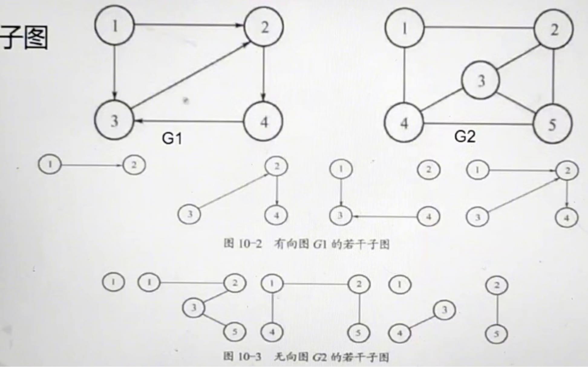
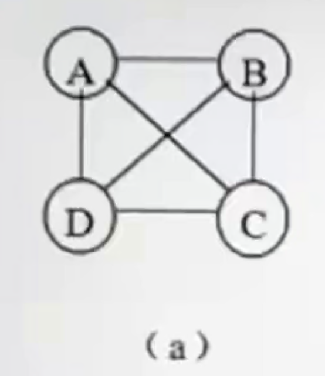

[toc]

分析清数据关系、厘清业务逻辑、采用最恰当的方法实现

## 数据结构绪论

### 数据结构概述

**数据结构（D,R）**，**就是指数据元素之间的关系**。

**D**ata数据元素集合	**R**elation数据元素之间的关系的集合

> e.g.
>
> 数据结构被形式地定义为(D,R)，其中D是**数据元素**的有限集合，R是D上的**关系**有限集合

数据结构是**指数据元素之间的关系**

- 基本概念和术语

  1. 数据（Data）：**数据**是客观事物的符号表示，在计算机科学中是指所有能**输入**到计算机中并**被计算机程序处理的符号的总称**
  2. 数据对象（Data Object）：是**性质相同的数据元素的集合**，是数据的一个子集
  3. 数据元素（Data Element）：是数据的**基本单位**，在计算机程序中通常作为一个整体进行考虑和处理。**一个数据元素可以由若干个数据项组成**。一个存储结点存储一个数据元素
  4. 数据项（Data Item）：是数据处理中的**最小单位**

  > 数据：对客观事物的符号表示。在计算机科学中是指所有能输入到计算机并被计算机处理的符号总称。
  >
  > 数据元素：数据的基本单位。数据项的集合。数据的子集
  >
  > 数据结构：相互之间的存在一种或多种特定关系的数据元素的集合

- 抽象数据类型

  1. 数据类型：常用数据类型包括**基本数据类型**和**构造数据类型**

  2. 抽象数据类型：（D，S，P）：

     - D：数据对象
     - S：D上的关系集
     - P：对D的基本操作集（增删改查）

  3. ```c
     ADT 抽象数据类型名{
         数据对象:<数据对象的含义>
         数据关系:<数据关系的定义>
         基本操作:<基本操作的含义>
     }
     ```

     > e.g.
     > 抽象数据类型的定义仅取决于它的一组**逻辑特征**，而与计算机内部如何表示和实现**无关**，即不论其内部结构如何变化，只要它的**数学特征**不变，都不影响其外部使用。

- 数据结构

  数据结构是相互之间存在一种或多种特定关系的数据元素的集合。这是对数据结构的一种简单解释。在任何问题中，数据元素都不是孤立存在的，而是在它们之间存在着某种关系，这种数据元素相互之间的关系称为结构（structure）。

  > e.g.
  >
  > 数据结构是一门研究非数值运算的程序设计问题中计算机的**数据**以及它们之间的**关系**和运算等的学科。

  数据结构一般包括以下三方面内容。

  1. 逻辑结构：

     数据的逻辑结构是对数据元素之间逻辑关系的描述。它与**数据的存储无关**，是独立于计算机的。同一逻辑结构可以有多种结构存储，主要分为两类：**线性和非线性结构**。其中集合、树、图属于非线型结构。

     > e.g.
     >
     > 数据的同一种逻辑结构，可以对应多种的不同**存储结构**

     - 集合：元素之间无关系

       结构中的数据元素之间除了“同属一个集合“外，别无其它的关系。

     - **线性**：元素之间一对一

       结构中的数据元素之间存在着一个对一个的关系

       > e.g.
       >
       > 线性结构除了首尾结点外，其它节点只有一个**前驱结点**和一个**后继结点**。
       >
       > e.g.
       >
       > 一种数据结构的元素集合K和它的二元关系为：k={a,b,c,d,e,f,g,h},R={<a,b>,<b,c>,<c,d>,<d,e>,<e,f>,<f,g>,<g,h>}则该数据结构具有**线性**结构
       >
       > e.g.
       >
       > 在线性结构中，第一个结点**没有**前驱结点，其余每个结点有且只有**1个**前驱结点；最后一个结点**没有**后续结点，其余每个结点有且只有**1个**后续结点。

     - 树形：元素之间一对多

       结构中的数据元素之间存在着一个对多个的关系

       > e.g.
       >
       > 一种数据结构的元素集合K和它的二元关系为：k={a,b,c,d,e,f,g,h},R={<d,b>,<d,g>,<b,a>,<b,c>,<g,e>,<g,h>,<e,f>}则该数据结构具有**树型**结构。
       >

     - 图形：元素之间多对多

       结构中的数据之间存在着多个对多个的关系

  2. 物理结构（存储结构）：两种常用存储结构

     - **顺序存储**：逻辑相邻的元素在物理上**一定相邻**
     - **链式存储**：逻辑相邻的元素在物理上**不一定相邻**
     - 索引存储：用结点的索引号来确定节点存储地址。优点   是检索速度快，缺点   是增加了额外的索引表，会占用较多的存储空间
     - 散列存储：根据结点的值确定它的存储地址。优点  是检索、增加和删除节点的操作都很快。缺点   是采用不好的散列函数时可能出现结点存储单元冲突，为解决冲突需要额外的时间和空间开销。

  3. 数据的运算：

     > 运算在逻辑结构
     >
     > 实现在存储结构

     数据的运算即对数据施加的操作。数据的运算**定义在数据的逻辑结构**上，但是只有**确定了存储结构**，才能具体实现这些运算。数据的运算通常包括以下5个操作。

     定义-》逻辑结构
     
     实现-》存储结构
     
     - 插入：在指定位置上添加一个新结点。
     - 删除：删去指定位置上的节点。
     - 更新：修改某结点的值
     - 查找：寻找满足指定条件的结点及其位置
     - 排序：按指定的顺序使结点重新排列

### 算法及其复杂性概述

> **程序 = 数据结构 + 算法**
>
> 算法：算法是对特定问题求解步骤的一种描述，它是指令的有限序列。其中每一条指令表示一个或多个操作。

#### 算法

##### 算法的五个特性

1. **输入：0个或多个输入**
2. **输出：1个或多个输出**
3. **确定性**：**每一条指令必须有确切的含义，没有二义性**，即对于相同的输入只能得出相同的输出。
4. **有穷性：算法中描述的操作都是可以通过已实现的基本运算执行有限次来实现的。**
5. **可行性：一个算法描述的操作是可行的。**

##### 算法的四个要求

1. 正确性：算法应满足具体问题需求，设计或选择的算法应能正确反映这种需求。
2. 健壮性：当输入数据非法时，算法也能适当地作出反应或处理，而不会产生莫名其妙的输出结果
3. 可读性：算法主要是为了人的阅读及人与人之间的交流，其次才是机器执行。可读性好有助于人对算法的理解。晦涩难懂的程序易于隐藏较多错误难以调试和修改。
4. 高效率低存储：效率指的是算法执行时间。一个问题若有多个算法可解决，则执行时间短的算法效率高。存储需求指的是执行过程种所需的最大存储空间。

##### 算法复杂性的概念

> 评价一个程序优劣的重要依据是看这个程序的执行需要占用多少机器资源。在各种机器资源中，最重要的是**时间**资源和**空间**资源。
>
> 因此，在进行程序分析时，大家最关心的就是程序所用算法在运行时所要花费的时间代价和程序中使用的数据结构所占有的空间代价。通常称之为**时间复杂度（时间代价）**和**空间复杂度（空间代价）**。
>
> 算法执行时间需要通过依据该算法编制的程序在计算机上运行时所消耗的时间来度量。

> e.g.
>
> 一个算法的效率可分为**时间**效率和**空间**效率

#### 算法的时间复杂度

> 在一般情况下，算法中“基本操作”重复执行的次数时问题规模n的某个函数f(n)，算法的时间度量记作：`T(n)=O(f(n))`，**n是问题规模**
>
> 此式表示随着时间问题规模n的增大，算法执行时间的增长率和f(n)的增长率相同。所以T(n)称作算法的时间复杂度（time complexity）。
>
> 由于算法时间复杂度分析只考虑相对于问题规模n的增长率，因而在难以精确计算基本操作执行次数的情况下，只要求出它关于n的增长率即可。我们可以在计算任何算法运行时间代价的时候，**忽略所有的常数和低次项，用大O表示法来表示算法的时间复杂度**

> e.g.下述程序段中语句`s+=j;`的频度是？
>
> ```c
> s=0;
> for(i=1;j<m;i++)
>  for(j=0;j<=i;j++)
>      s+=j;
> ```
>
> 
>
> 根据高斯公式：a+…+b=(a+b)(b-a+1)/2
>
> 2+3+4+...+m=(m+2)(m-1)/2
>
> 答案为：**(m+2)(m-1)/2**

时间复杂度的推导过程

1. 求运行次数之和

2. 用1取代所有加法常数

3. 保留最高阶项

   - 常数阶

     > 1+1+1=3	//求运行次数之和
     > 1=n^0^	//用1取代所有加法常数
     > n^0^	//保留最高阶项
     > T(n)=O(f(n))=O(1)

     ```c
     int sum = 0,n=100;
     sum=(1+n)*n/2;
     printf("%d",sum);
     ```

   - 线性阶

     > 1+n	//求运行次数之和
     > 1+n=n^0^+n^1^	//用1取代所有加法常数
     > n	//保留最高阶
     > T(n)=O(f(n))=O(n)

     ```c
     int i;
     for(i=0;i<n;i++){
         //O(1)的步骤
     }
     ```

   - 对数阶

     > //2^x=n -> x=log2^n
     > 1+log~2~^n^	//求运行次数之和
     > n^0^+log~2~^n^	//用1取代所有加法常数
     > log~2~^n^		//保留最高阶
     > T(n)=O(f(n))=O(log~2~^n^)

     ```c
     int count=1;
     while(count<n){
         count=count*2;
         //O(1)的步骤
     }
     ```

   - 平方阶

     > n*n+1	//求运行次数之和
     > n^2^+n^0^	//用1取代所有加法常数
     > n^2^	//保留最高阶
     > T(n)=O(f(n))=O(n^2^)

     ```c
     int i,j;
     for(i=0;i<n;i++){
         for(j=0;j<n;j++){
             //O(1)的步骤
         }
     }
     ```


常见的时间复杂度比较

| 执行次数函数      | 大O阶         | 非正式用语 |
| ----------------- | ------------- | ---------- |
| 12                | O(1)          | 常数阶     |
| 2n+3              | O(n)          | 线性阶     |
| 3n^2^+2n+1        | O(n^2^)       | 平方阶     |
| 5log~2~^n^+20     | O(log~2~^n^)  | 对数阶     |
| 2n+3nlog~2~^n^+19 | O(nlog~2~^n^) | nlogn阶    |
| 6n^3^+2n^2^+3n+4  | O(n^3^)       | 立方阶     |
| 2^n^              | O(2^n^)       | 指数阶     |

常用的时间复杂度所消耗的时间从小到大依次是：

O(1)<`O(logn`)<O(n)<`O(nlogn)`<O(n^2^)<O(n^3^)<O(2^n^)<O(n!)<O(n^n^)

最坏情况与平均情况

> 对算法的分析，一种方法是计算所有情况的平均值，这种时间复杂度的计算方法称为**平均**时间复杂度。另一种方法是计算最坏情况下的时间复杂度，这种方法称为**最坏**时间复杂度。一般在没有特殊说明的情况下，都是指最坏时间复杂度

> e.g.
>
> 分析下面算法，给出最大语句频度**n(n-1)/2**,该算法的二时间复杂度是**O(n^2^)**
>
> ```c
> for(i=0;i<n;i++){
>  for(j=0;j<i;j++){
>      a[i][j]=0;
>  }
> }
> ```

#### 算法的空间复杂度

> 算法的空间复杂度通过计算算法所需存储空间实现，算法空间复杂度的计算公式基座：S(n)=O(f(n)),表示随着问题规模n的增大，算法运行所需存储量的增长与f(n）的增长率
>
> 算法的存储量包括：
>
> ​    输入程序所占**空间**
>
> ​    程序本身所占**空间**
>
> ​    辅助变量所占**空间**
>
> S(n)=O(f(n))
>
> 若输入数据所占空间只取决与问题本身，和算法无关，则只需要分析出输入和程序之外的额外空间。
>
> 算法原地工作指的是额外空间相对于输入数据量来说是常数。
>
> ```c
> RevArray(int a[],int n){
>  int i,j;
>  for(i=0,j=n-1;i<j;i++,j--){
>      a[i]+=a[j];
>      a[j]=a[i]-a[j];
>      a[i]-=a[j];
>  }
> }
> /*
> 	执行了n/2次
> 	所以T(n)=n/2=O(n)
> 	辅助空间只有i,j,所以S(n)=2=O(1)
> 	而因为这里使用的辅助空间，不会随着问题的规模变化而变化，简而言之，就是常量级别的，我们就称其为原地工作
> */
> ```

## 线性表

### 表的基本概念

1. 线性表是**由n个元素**（0到多个元素，若n为0，则线性表为空表状态）组成的**有限序列**

   > e.g.线性表中，其所含元素的个数被称为线性表的**长度**

   1. 首先它是一个序列。也就是说元素之间是有顺序的，若元素有多个，则第一个元素**无前驱**，最后一个元素**无后继**，其它每个元素都**有且只有**一个前驱和后继。

      > e.g.简答题。是判断以下结构D={d1,d2,……,d9},R={(d1,d2),(d1,d3),(d3,d4),(d3,d6),(d6,d8),(d4,d5),(d6,d7),(d8,d9)}。
      >
      > 答：元素中具有层次性的一对多关系，为树型结构。d1无直接前导，为根节点。d2,d5,d7,d9无直接后续，是叶子节点。

   2. 其次强调一个有限的元素个数（下标从0开始，个数从1开始）

      > e.g.
      >
      > 线性表是n个\_\_\_\_的有限序列。**数据元素**

2. 线性表的基本操作

   1. 线性表初始化 格式：`InitList(L)`

      初始条件：线性表L不存在。

      操作结果：构建一个空的线性表L。

   2. 求线性表的长度 格式：`LengthList(L)`

      > 长度分为：空间长度（最大），元素长度（当前）

      初始条件：线性表L存在。

      操作结果：返回线性表L中所有**元素的个数**。

   3. 元素定位（按值查找） 格式：`LocateElem(L,x)`

      初识条件：线性表存在，x有确定的值。

      操作结果：返回元素x在线性表L中第一次出现的位置，若x存在，则返回其位序，否则返回0

   4. 取元素操作 格式：`GetElem(L,i,e)`

      初始条件：线性表L存在，且`1<=i<=LengthList(L)`

      操作结果：返回线性表L中第i个元素，并送给e。

   5. 插入操作 格式：`InsertList(L,i,x)`

      初始条件：线性表L存在，i为插入位置（1<=i<=n+1,n为插入前的表长）。

      操作结果：在线性表L的第i个位置上插入一个值为x的元素

   6. 删除元素 格式：`DeleteList(L,i)`

      初始条件：线性表L存在，i（1<=i<=n)为给定的待删除元素的位置值。

      操作结果：删除线性表L中的第i个元素。

   7. 输出操作 格式：List(L)

      初始条件：线性表L存在。

      操作结果：按先后顺序输出线性表L的所有元素

   除此之外，还可进行一些更复杂的操作。例如，将两个或两个以上的线性表**合并**成一个线性表；把一个线性表拆分成两个或两个以上的线性表；重新复制一个线性表等。

   例如：假设利用两个线性表LA和LB分别表示两个集合A和B（即线性表中的数据元素即为集合中的成员），现要求一个新的集合A=AUB。这就要求对线性表作如下操作：扩大线性表LA，将存放于线性表LB中而不存放于线性表LA中的数据元素插入到线性表LA中去。**只要从线性表LB中依次取得每个数据元素，并依值在线性表LA中进行查访，若不存在，则插入之。**上述操作过程中可用下列算法描述。

   ```c
   //将所有在线性表Lb中但不在La中的数据插入到La中
   void union(List *La,List Lb){
       La_len=ListLength(La);
       Lb_len=ListLength(Lb);
       for(i=1;i<=Lb_len;i++){
           GetElem(Lb,i,e);//取Lb中第i个数据元素赋给e
           if(!LocateElem(La,e,equal)){
               ListInsert(La,++La_len,e);
           }
       }
   }
   ```

### 顺序表

线性表的顺序表表示称作顺序表。它是用一组地址连续的存储单元依次存储线性表的数据元素。即以元素在计算机内“物理位置相邻”表示线性表中数据元素之间的逻辑关系。

线性表（a~1~,a~2~….,a~n~)的顺序存储示意图如下

| a~1~ | a~2~ | ………. | a~i-1~ | a~i~ | ………. | a~n~ |
| ---- | ---- | ---- | ------ | ---- | ---- | ---- |

> 顺序存储结构的操作需要三个属性：
>
> 1. 存储空间的位置：数组的存储位置。
> 2. 线性表的最大存储容量：数组的长度，`MaxSize`=length+空闲空间。
> 3. 线性表的当前长度：`length`

1. 数组长度与线性表长度的区别

   数组的长度是存放线性表的存储空间的长度。线性表的长度是线性表中元素个数，随着线性表插入和删除操作的进行，这个量是变化的。在任何时刻，线性表的长度应该**小于等于**数组的长度

   数组长度一般是指数组在内存中分配的空间大小，而线性表长度则是指线性表中实际元素的个数

2. 地址计算方法

   > LOC(a~i+1~)=LOC(a~i~)+c

   所以对于第i个元素a~i~的存储位置可以由a~1~推算得出：

   > LOC(a~i~)=LOC(a~i~)+(i-1)\*c

   

   > e.g.一个顺序表的第一个元素的地址是1010，每个元素的长度是5，则第6个元素的地址是\_\_\_\_。
   >
   > loc(a~1~)=1010
   >
   > loc(a~6~)=loc(a~1~)+(6-1)\*5=**1035**

   不管它是第一个还是最后一个，都是相同的访问时间。那么我们就可以对每个线性表位置的存入或者取出数据，对于计算机来说都是**相同**的时间，也就是一个常数，因此用我们算法中学到的时间复杂度的概念来说，它的存储时间性能为O(1).我们通常把具有这一特点的存储结构称之为**随机存储**结构。

   通常用数组来描述数据结构中的顺序存储结构。

   > e.g.顺序表的存储密度为1
   >
   > e.g.在顺序表中访问任意结点的时间复杂度为**O(1)**，因此，顺序存储也被称为**随机存取结构**

   ```c
   //静态分配的一维数组
   #dfine LIST_INIT_SIZE 100	//线性表存储空间的初始分配量
   typedef struct{
       ElemType elem[LIST_INIT_SIZE];
       int length;	//当前长度
   }SqList;
   ```

   ```c
   //动态分配的一维数组
   #define LIST_INIT_SIZE 100	//线性表存储空间的初始分配量
   #define LISTINCREMENT 10	//线性表存储空间的分配增量
   typedef struct{
       ElemType *elem;	//存储空间基址
       int length;	//当前长度
       int listsize;	//当前分配的存储容量（以sizeof(ElemType)为单位）
   }SqLIST
   /*
   	数组指针elem指示线性表的基地址，length指示线性表的当前长度。listsize指示顺序表当前分配的存储空间大小，一旦因插入元素而空间不足时，可进行再分配，即为顺序表增加一个大小为存储LISTINCREMENT个数据元素的空间
   */
   ```

3. ACM算法：顺序表的插入操作

   > 插入算法的思路
   >
   > 1. 如果插入位置**不合理**，抛出异常
   > 2. 如果线性表长度大于等于数组长度，则抛出异常或动态增加容量
   > 3. 从最后一个元素开始向前遍历到第i个位置，分别将它们都**向后移动**一个位置
   > 4. 将要插入元素填入位置i处
   > 5. 表长加1

   ```c
   //静态代码实现
   /*
       #dfine LIST_INIT_SIZE 100	//线性表存储空间的初始分配量
       typedef struct{
           ElemType elem[LIST_INIT_SIZE];
           int length;	//当前长度
       }SqList;
   */
   Status ListInsert_Sq(SqList *L,int i,ElemType e){	//在顺序线性表L中第i个位置插入新的元素e
       //i的合法值为1<=i<=ListLength_Sq(L)+1
       int j;
       if(i<1||i>L.length+1){
           return -1;	//i值不合法
       }else if(L.length>=LIST_INIT_SIZE){
           return -1;	//表满
       }else{
           for(j=L.length-1;j>=i-1;j--){
               L.elem[j+1]=L.elem[j];	//插入位置及之后的元素右移
           }
           L.elem[i-1]=e;	//插入e
           L.length++;	//表长增1
           return 1;
       }
   }
   ```

   > `void *realloc(void *ptr, size_t size)`
   >
   > - ptr
   >
   >   指针指向一个要重新分配内存的内存块，该内存块之前是通过调用 malloc、calloc 或 realloc 进行分配内存的。如果为空指针，则会分配一个新的内存块，且函数返回一个指向它的指针。
   >
   > - size
   >
   >   内存块的新的大小，以字节为单位。如果大小为 0，且 ptr 指向一个已存在的内存块，则 ptr 所指向的内存块会被释放，并返回一个空指针。
   >
   > - return
   >
   >   该函数返回一个指针 ，指向重新分配大小的内存。如果请求失败，则返回 NULL。

   ```c
   //动态代码
   /*
       #define LIST_INIT_SIZE 100	//线性表存储空间的初始分配量
       #define LISTINCREMENT 10	//线性表存储空间的分配增量
       typedef struct{
           ElemType *elem;	//存储空间基址
           int length;	//当前长度
           int listsize;	//当前分配的存储容量（以sizeof(ElemType)为单位）
       }SqLIST
   */
   Status ListInsert_Sq(SqList *L,int i;ElemType e){//在顺序线性表L中第i个位置插入新的元素e。
       //i的合法值为1<=i<=ListLength_Sq(L)+1
       if(i<1||i>L.length+1){
           renturn -1;	//i值不合法
       }else if(L.length>=L.listsize){
           newbase=(ElemType*)realloc(L.elem,(L.Listsize+LISTINCREMENT)*sizeof(ElemType));	//重新开辟存储空间        
           if(!newbase) exit(-1);	//存储分配失败
           L.elem=newbase;	//新基址
           L.Listsize+=LISTINCREMENT;	//增加存储内容
       }
       q=&(L.elem[i-1]);	//q插入位置
       for(p=&(L.elem[L.length-1]);p>=q;--p){
           *(p+1)=*p;	//插入位置及之后的元素右移
       }
       *q=e;	//插入e
       L.length++;	//表增加1
       return 1;
   }
   ```

   > e.g.在一个长度为n的顺序存储结构的线性表中，向第i个元素(1<=i<=n+1)位置插入一个元素时，需要后移\_\_\_\_个元素。**n-i+1**
   >
   > e.g.若长度为n的线性表采用顺序存储结构，在其第i个位置插入一个新元素算法的时间复杂度\_\_\_\_。n-i+1=**O(n)**

4. ACM算法：顺序表的删除

   > 删除算法的思路：
   >
   > 1. 如果删除位置不合理，抛出异常
   > 2. 取出删除元素
   > 3. 从**删除元素**位置开始遍历到最后一个元素位置，分别将它们都**向前移动**一个位置
   > 4. 表长减1
   >
   > 空表不可删除；只可删除1~length个元素

   ```c
   //静态数组代码实现
   /*
       #dfine LIST_INIT_SIZE 100	//线性表存储空间的初始分配量
       typedef struct{
           ElemType elem[LIST_INIT_SIZE];
           int length;	//当前长度
       }SqList;
   */
   Status ListDelete_Sq(SqList *L,int i,ElemType *e){	//在顺序线性表L中删除第i个元素，并用e返回其值
       //i的和法治为1<=i<ListLength_Sq(L)
       int j;
       if(i<1||i>L.length)return -1;	//i值不合法
       if(L.length<=0)
           return -1;	//表空
       else
           *e=L.elem[i-1];	//将要删除的元素保存到e
       for(j=i;j<L.length;j++){
           L.elem[j-1]=L.elem[j];	//插入位置及之后的元素向左移
       }
       L.length--;	//表长减1
       return 1;
   }
   ```

   ```c
   //动态
   #define LIST_INIT_SIZE 100	//线性表存储空间的初始分配量
   #define LISTINCREMENT 10	//线性表存储空间的分配增量
   /*
       typedef struct{
           ElemType *elem;	//存储空间基址
           int length;	//当前长度
           int listsize;	//当前分配的存储容量（以sizeof(ElemType)为单位）
       }SqLIST
   */
   Status ListDelete_Sq(SqList *L,int i,ElemType *e){	//在顺序线性表L中删除第i个元素，并用e返回其值
       //i的合法值为[1,ListLength_Sql(L)]
       if((i<1)||(i>L.length))return -1;	//i值不合法
       p=&(L.elem[i-1]);	//p为被删除元素位置
       *e=*p;	//被删除的元素的值赋给e
       q=L.elem+L.length-1;	//表尾元素的位置
       for(++p;p<=q;++p)
           *(p-1)=*p;	//被删除元素之后的元素左移
       L.length--;	//表长减1
       return 1;
   }
   ```

   > n个元素的顺序表，在第i个位置插入元素需要移动**n-i+1**个元素，平均需要移动**n/2**个元素。
   >
   > n个元素的顺序表，在第i个位置删除元素需要移动**n-i**个元素，平均需要移动**(n-1)/2**个元素。
   >
   > 顺序表中，删除、插入元素约移动表中**一半**的元素

5. ACM算法：顺序表的按值查找

   > 在顺序表L中查访是否存在和e相同的数据元素的方法是：令e和L中的数据元素逐个比较之，算法的时间复杂度为O(n).

   ```c
   //普通查找
   int LocateElem_Sq(SqList L,ElemType e){//在顺序线性表L中查找第一个值与e满足compare()元素的位序
       //若未找到，则返回其在L中的位序，否则返回0
       int i=0;	//i的初值为第一个元素的位序
       while(i<L.length){
           if(L.elem[i++]==e)
               return i;
       }
       return 0;
   }
   ```

6. ACM算法：顺序表的有序合并

   ```c
   void MergeList_Sq(SqList La,SqList Lb,SqList &Lc){//已知顺序线性表La和Lb的元素按值非递减排列
       //归并La和Lb得到新的顺序线性表Lc,Lc的元素也按值非递减排列
       pa=La.elem;
       pb=Lb.elem;
       Lc.listsize=Lc.length=La.length+Lb.length;
       pc=Lc.elem=(ElemType*)malloc(Lc.listsize*sizeof(ElemType));
       if(!Lc.elem)exit(OVERFLOW);	//存储分配失败
       pa_last=La.elem+La.length-1;
       pb_last=Lb.elem+Lb.length-1;
       while(pa<=pa_last&&pb<=pb_last){
           if(*pa<=*pb)
               *pc++=*pa++;
           else
               *pc++=*pb++;
       }
       while(pa<=pa_last)
           *pc++=*pa++;
       while(pb<=pb_last)
           *pc++=*pb++;
   }
   ```

   > 时间复杂度O(n+m)

### 链表

1. 顺序存储结构的不足和解决办法

   它的最大的缺点是**插入**和**删除**时需要**移动大量元素**

2. 线性表链式存储的定义

   线性表的链式存储结构，在逻辑上紧邻的元素在物理上**不一定**紧邻

   在顺序结构中，每个元素只需要存数据元素信息。在链式结构中，除了要存储据元素外，还要存储它后面元素的**地址**

   我们把存储数据元素信息的域称为**数据域**，把存储直接后继位置的域成为**指针域**

   指针域中存储的信息称为**指针**或**链**。N个结点链接成一个链表，即线性表（a~1~，a~2~，……，a~n~）的链式存储结构因此此链表的每个结点中只包含一个指针域，所以叫单链表。单链表正是通过每个结点的指针域将线性表的数据元素按其逻辑次序连接在一起，

   我们把链表中第一个结点的存储位置叫做**头指针**，那么整个链表的存取就**必须是从头指针**开始进行了。之后每个结点，其实就是上一个的后继指针的位置。最后一个当然就意味着直接后继不存在了，所以我们规定，线性表的最后一个结点的指针为“空”（通常用NULL或“^”符号表示

   

   为了更加方便地对链表进行操作，会在第一个结点前附设一个结点，称为头结点。头结点的数据域可以不存储任何信息。也可以存储线性表的长度信息，头结点的指针域存储指向第一个结点的指针

   

3. 头结点与头指针的区别

   | 头指针                                                       | 头结点                                                       |
   | ------------------------------------------------------------ | ------------------------------------------------------------ |
   | 头指针是指链表指向第一个结点的指针，若链表有头结点，则指向头结点的指针 | 头结点是为了操作的统一和方便而设立的，放在第一元素的结点之前，其数据域一般无意义（也可存放链表的长度） |
   | 头指针具有标识作用，所以常用头指针冠以链表的名字             | 有了头指针，对第一元素结点前插入节点和删除第一节点，其操作与其它结点的操作就统一了 |
   | 无论链表是否为空，头指针均不为空。头指针是链表的必要元素     | 头结点不一定是链表必须要素                                   |

   > 头结点存在时，头指针指向头结点；不存在，指向第一个结点

   

   假设P是指向线性表第i个元素的指针，则该节点a~i~的数据域我们可以用**`p->data`**来表示，p->data的值是一个数据元素，结点a~i~的指针与可用`P->next`来表示，p->next的值是一个指针

   > e.g.线性表采用链表作为存储结构时，通常会另外附加一个头结点，这样的好处是**简化边界条件的处理**
   >
   > e.g.链式存储结构是通过**指针**表示元素之间的关系的

4. 操作：单链表的读取

   在线性表的顺序存储结构中，我们要计算任意一个元素的存储位置是很容易的。但在单链表中，必须得从开头找。获得链表第i个数据的算法思路

   > 1. 声明一个结点P指向链表第一个结点，初始化j从i开始
   > 2. 当就j<i时，就遍历链表，让p的指针向后移动，不断向下一结点，j累加1
   > 3. 若到链表末尾p为空，则说明第i个元素不存在
   > 4. 否则查找成功，返回结点p的数据

   ```c
   Status GetElem_L(LinkList L,int i,ElemType *e){	//L为带头结点的单链表的头指针
       //当第i个元素存在时，其值赋给e并返回1，否则返回-1
       p=L->next;j=1;	//初始化，p指向第一个结点，j为计时器
       while(p&&j<i){
           p=p->next;
           ++j;
       }
       if(!p||j>i)return -1;	//第i个元素不存在
       e=p->data;	//取第i个元素
       return 1;
   }	//算法的时间复杂度为O(n)
   ```

5. ACM算法：单链表的插入

   > 1. 声明一个结点p指向链表第一个结点，初始化j从1开始
   > 2. 当j<i时，就遍历链表，让p的指针向后移动，不断指向下一个结点，j累加1

   > e.g.在一个表头指针为ph的单链表中，若要向表头插入一个由指针p指向的结点，则应执行`p->next=ph;ph=p;`操作。

   ```c
   Status ListInsert_L(LinkList *L,int i,ElemType e){	//在带头结点的单链线性表L中第i个位置之前插入元素e
       p=L;j=0;
       while(p&&j<i-1){
           p=p->next;++j;	//寻找第i-1个结点
       }
       if(!p||j>i-1)return -1;
       s=(LinkList)malloc(sizeof(LNode));	//生成新的结点
       s->data=e;
       s->next=p->next;	//插入L中
       p->next=s;
       return 1;
   }
   ```

6. ACM算法：单链表的删除

   > e.g.在一个单链表中，若要删除由指针q所指向结点的后继节点（若存在的话),则执行`p=q->next;q->next=p->next;`操作

   ```c
   Status ListDelete_L(LinkList *L,int i,ElemType *e){	//在带头结点的单链线性表L中删除第i个元素，并由e返回其值
       p=L;j=0;
       while(p->next&&j<i-1){
           //寻找第i个结点，并令p指向其前驱
           p=p->next;
           ++j;
       }
       if(!(p->next)||j>i-1)
           return ERROR;	//删除位置不合理
       q=p->next;
       p->next=q->next;	//删除并释放结点
       *e=q->data;
       free(q);
       return OK;
   }
   ```

7. ACM算法：尾插法创建列表

   ```c
   void GreateList_L(LinkList *L,int n){	//逆位序输入n个元素的值，建立带表头结点的单链线性表L
       LinkList *q,*p;
       L=(LinkList)malloc(sizeof(LNode));
       L->next=NULL;	//先建立一个带头结点的单链表
       q=L;
       for(i=0;i<n;++i){
           p=(LinkList)malloc(sizeof(LNode));	//生成新结点
           scanf(&p->data);	//输入元素值
           q->next=p;	//插入到表尾
           q=q->next;	//q向后移动 等待下一次插入
       }
   }
   ```

8. ACM算法：头插法创建链表

   ```c
   void CreateList_L(LinkList *L,int n){//逆位序输入n个元素的值，建立带表头结点的单链线性表L
       LinkList *p;
       L=(LinkList)malloc(sizeof(LNode));
       L->next=NULL;	//先建立一个带投机欸但的单链表
       for(i=n;i>0;--i){
           p=(LinkList)malloc(sizeof(LNode));	//生成新结点
           scanf(&p->data);	//输入元素值
           p->next=L->next;
           L->next=p;	//插入到表头
       }
   }
   ```

9. ACM算法：合并操作

   > 在归并两个链表为一个链表时，不需要另建新表的节点空间，而只需将原来聊个链表中节点之间的关系解除，重新按元素值非递减的关系将所有结点链接成一个链表即可。

   ```c
   void MergeList_L(LinkList *La,LinkList *Lb,LinkList *Lc){	//已知单链线性表La和Lb的元素按值非递减排列
       //归并La和Lb得到新的单链线性表Lc，Lc的元素也按值非递减排列
       pa=La->next;pb=Lb->next;
       Lc=pc=La;	//用La的头结点作为Lc的头结点
       while(pa&&pb){
           if(pa->data<=pb->data){
               pc->next=pa;
               pc=pa;
               pa=pa->next;
           }else{
               pc->next=pb;
               pc=pb;
               pb=pb->next;
           }
       }
       pc->next=pa?pa:pb;	//插入剩余段
       free(Lb);	//释放Lb的头结点
   }
   ```
   
   > e.g.将长度为n的有序表和长度为m的有序表进行有序合并之后的算法的时间复杂度为**O(n+m)**
   >
   > e.g.从一个具有n个结点的单链表中查找其值等于x的结点时，在查找成功的情况下，需要平均比较**(1+n)/2**个元素结点。（查找至少对比一次）
   >
   > e.g.线性表采用链表作为存储结构时，通常会另外附加一个头结点，这样做的好处是**简化边界条件的处理**
   >
   > e.g.线性表的链式存储比顺序存储更有利于进行**按值插入和删除**
   >
   > e.g.在一个表头指针为`ph`的单链表中，若要向表头插入一个由指针p指向的结点，则应该执行**`p-next=ph;ph=p`**操作
   >
   > e.g.单链表中在结点A和结点B插入结点s的操作序列为**`A.next=&s;s.next=&B`**
   >
   > e.g.在具有头结点的单链表中，头指针指向链表中的第一个数据节点。**FALSE**
   >
   > 头指针是指向头结点的指针，在具有头结点的单链表中，头指针指向头结点，而不是直接指向第一个数据节点。若没有头结点，头指针才会指向第一个数据结点


### 循环链表

循环链表是另一种形式的链表，它的特点是表中最后一个结点的指针域指向**头结点**，整个链表形成一个环。因此，从表中**任意结点**出发均可找到表中其它结点

循环链表与单列表的差别在于算法之中的循环条件不是p或者p->next是否为空，而变成了它们是否**指向**头指针

我们常是用**尾指针表示的循环链表**，这是因为我们只要找到了尾指针，它的下一个便是头指针，这就相当于我们知道到了头指针，但如果我们用头指针表示的循环链表，那么我们如果需要尾指针，我们必须要遍历整个链表

> e.g.非空的单循环链表的头指针为head，尾指针为rear，则`rear->next==head`
>
> e.g.顺序表与链表，**顺序表**空间利用高
>
> e.g.单项循环链表采用**尾指针**实现比较好

### 双向链表

1. 双向链表定义

   双向链表也叫双链表，是链表的一种，它的每个数据结点中都有**两个**指针，分别指向**直接后继**和**直接前驱**。所以，从双向链表中的任意一个结点开始，都可以很方便地访问它的前驱结点和后继节点。**一般我们都构造双向循环链表**。

   在C语言中如下描述线性表的双向链表存储结构

   ```c
   typedef struct DuLNode{
       ElemType data;
       struc DulNode *prior;
       struc DuLNode *next;
   }DuLNode,*DuLinkList;
   ```


### 总结

|      | 顺序表                                                     | 链表                                                         |
| ---- | ---------------------------------------------------------- | ------------------------------------------------------------ |
| 访问 | O(1)                                                       | O(n)                                                         |
| 插入 | O(n)                                                       | O(1)                                                         |
| 删除 | O(n)                                                       | O(1)                                                         |
| 遍历 | O(n)                                                       | O(n)                                                         |
| 内存 | 一块连续的内存空间<br />内存空间不足时可能需要进行扩容操作 | 更灵活地利用内存<br />不需要预先分配固定大小的空间，但是每个节点需要额外的指针开销 |

| 链表结构 | 优点                                                         | 缺点                                                         |
| -------- | ------------------------------------------------------------ | ------------------------------------------------------------ |
| 单链表   | 1. 在找出节点后，插入和删除速度相较于循环表更快<br />2. 不需要预分配空间，元素个数不受限制 | 查找数据元素的速度相较于顺序表更慢                           |
| 循环链表 | 在单链表的基础上进一步改进，遍历的时候可以从任意结点开始，增加了遍历的灵活性 | 没有解决单链表查找元素比较慢的问题                           |
| 双向链表 | 在单链表的基础上进一步改进，查找元素可以反向查找前缀结点，一定程度上提升了查找元素的速度 | 需要记录前缀结点，增加了额外的内存空间开销                   |
| 静态链表 | 在插入和删除操作时，不需要移动元素，只需要修改游标，改进了顺序表插入和和删除需要移动元素的缺点 | 1.没有解决顺序表表长难以确定的问题<br />2. 失去了顺序表随机存储的特性。 |

> e.g.单项循环链表和单项链表的对比有哪些优点？
>
> 1. 单向链表只能通过结点指针找到后继结点无法找到前驱，单向循环链表找到前驱结点
> 2. 通过尾指针实现循环链表方便在表头和表尾处进行插入删除元素操作
> 3. 单项循环链表从任意结点出发都可遍历整个链表
>
> e.g.简述顺序存储和链式存储各自的缺点。
>
> 顺序存储：顺序存储时，相邻数据元素的存放地址也相邻；要求内存中可用存储单元的地址必须是连续的。
>
> 优点：存储密度大（==1），存储空间利用率高。
>
> 缺点：插入或删除元素时不方便。
>
> 链式存储：链式存储时，相邻数据元素可随意存放，但所占存储空间分两部分，一部分存放结点值，另一部分存放表示结点关系的指针。
>
> 优点：插入或删除元素时很封边，使用灵活。
>
> 缺点：存储密度小（<1），存储空间利用率低。

## 栈与队列

### 栈

**FILO**

1. 栈的基本概念

   栈是一种只能在**一端操作**的线性表，在对栈进行插入删除操作时，只能在**栈顶**进行。这也就使得了：栈底非常稳定，因为先进来的元素都被放在了**栈底**。类似于弹夹

2. 进栈出栈的变化形式

   现在有3个整数型元素1、2、3依次进栈，会有哪些出栈次序？

   > 321
   >
   > 213
   >
   > 231
   >
   > 123
   >
   > 132
   >
   > 共计5种
   >
   > 3个栈元素，就有5种出栈的次序

   如果出栈的第一个元素是入栈的最后一个元素。则只有一种出栈方式`逆序出栈`

   如果入栈顺序1、2、3、……、n，出栈第一个元素为n，问，第i个出栈的元素为n-i+1

   > e.g.输入序列为ABC，可以变成CBA时，经过的栈操作`push,push,push,pop,pop,pop`
   >
   > push：入栈
   >
   > pop：出栈
   >
   > e.g.设栈S的初始状态为空，元素e1,e2,e3,e4,e5,e6依次通入栈S，若6个元素出栈的顺序是e2,e4,e3,e6,e5,e1，则栈S的容量至少应该是`3`

3. 栈的抽象数据类型

   对于栈来讲，理论上线性表的操作特性他都具备，但是由于它的特殊性，所以针对他的操作上，也会有些变化。特别是插入和删除操作，我们改名为**push**和**pop**，英文翻译为压和弹

4. 栈的实现

   顺序栈：用**顺序存储**来实现栈的操作

   链栈：用**链式存储**来实现栈的操作

   如果栈的使用过程中元素变化不可预料，有时很小，有时非常大，那么最后使用**链**栈，反之，如果它的变化在可控范围内，建议使用**顺序**栈会更好一些。

   元素个数确定就用顺序栈

   元素不固定就用链栈

5. 栈的操作

   1. 顺序栈

      顺序栈，即栈的顺序存储结构，是利用一组地址连续的存储单元依次存放自栈底到栈顶的数据元素，同时附设指针top指示栈顶元素在顺序栈中的位置。

      栈的2种基本形态：

      栈空 top=-1

      栈满 top=MAXSIZE-1

      ```c
      #define MAX_SIZE 50	//定义栈中元素的最大个数
      typedef struct{
          ElemType elem[MAX_SIZE];	//存放栈中元素
          int top;	//栈顶指针
      }SqStack;
      ```

      ```c
      //初始化
      InitStack(SqStack &s){
          s.top=-1;
      }
      //入栈
      bool Push(SqStack &s,ElemType x){
          if(s.top == MAXSIZE-1)
              return false;	//栈满
          s.top++;	//栈顶指针+1
          s.elem[s.top]=x;	//存储栈顶位置
          return true;
      }
      //出栈
      bool Pop(Sqtack &s,ElemType *x){
          if(s.top==-1)
              return false;	//栈空
          *x=s.elem[s.top--];	//栈顶元素出栈，指针-1
          return true;
      }
      //判空
      bool isEmpty(SqStack s){
          if(s.top==-1)
              return true;
          else
              return false;
      }
      //栈读取栈顶元素
      bool GetTop(SqStack s,ElemType *x){
          if(s.top==-1)
              return false;
          *x=s.elem[s.top];
          return true;
      }
      ```

   2. 链栈

      栈的操作时线性表操作的特里，则链栈的操作易于实现。类型定义同单链表。链栈的基本形态：

      栈空条件：S==NULL（S为头指针）

      栈满（一般不出现）

      链栈的基本操作

      ```c
      //入栈
      bool Push(LinkList &s,DataType x){	//新建结点
          LinkList p=(LinkList)malloc(sizeof(LNode));
          if(!p)
              return false;	//新结点空间分配失败
          p->data=x;	//插入栈顶
          p->next=s;
          s=p;
          return true;
      }
      //出栈
      bool Pop(LinkList &s,DataType &x){
          if(s==NULL)
              return false;	//栈空
          //删除栈顶元素
          p=s;
          s=s->next;
          x=p->data;
          free(p);
          return true;
      }
      //取栈顶元素
      bool Top(LinkList s,DataType &x){
          if(s==NULL)
              return false;	//栈空
          x=s->data;
          return true;
      }
      ```

6. 栈的应用实例

   1. ACM算法：栈实现括号匹配

      依次读取数组的元素，若是遇到左括号，则将其压入栈中；若是遇到右括号，则先判断栈是否空了，如果栈已经空了，匹配失败，如果栈不空，则弹出栈顶元素，看弹出的元素是否能与该右括号匹配，如果不能匹配，说明括号匹配失败。看遍历到数组的末尾时，看栈是否为空，如果空了，匹配成功，如果不成功，匹配失败。

      ```c
      bool BreaketCheck(ElemType str[],int length){
          MyStack S;	//
          InitStack(&S);	//对栈进行初始化
          for(int i=0;i<length;i++){	//读取数组元素
              if(str[i]=='('||str[i]=='['||str[i]=='{'){
                  Push(&S,str[i]);	//左括号则入栈
              }else{
                  if(StackEmpty(&S))
                      return false;	//遇到右括号且当前栈空，匹配失败
                  char topElem;
                  Pop(&S,&topElem);	//栈顶元素出栈
                  if(str[i]==')'&&topElem!='(')
                      return false;
                  if(str[i]==']'&&topElem!='[')
                      return fale;
                  if(str[i]=='}'&&topElem!='{')
                      return false;
              }
          }
          return StackEmpty(&S);	//全部匹配成功后，栈空则说明匹配成功
      }
      ```

      > 栈的考点
      >
      > 1. 后进先出，先进后出
      >
      >    FILO(First In Last Out)
      >
      > 2. n-i+1
      >
      > 考点
      >
      > 顺序栈：用来存储实现栈的操作
      >
      > ```c
      > #define MAX 10
      > struct stack{
      >     int top;
      >     int data[MAX];
      > }s;
      > 
      > //空
      > s.top==-1;
      > //满
      > s.top==MAX-1;
      > //入栈
      > s.data[++s.top]=elem;
      > //出栈
      > elem=s.data[s.top--];
      > ```

> e.g.两个栈共享一个向量空间的好处是**节省存储空间，降低上溢发生的机率**
>
> e.g.设数组D[n]作为两个栈D1和D2的存储空间，对任何一个栈只要有当D[n]全满时才不能进行进栈操作。为这两个栈分配空间的最佳方案是**D1的栈底位置为0，D2的栈底位置为n**
>
> e.g.递归实现或函数调用时，处理参数及返回地址，应采用的数据结构时**栈**
>
> e.g.若栈采用链式存储结构，则**不需要判断栈满但需要判断栈空**
>
> e.g.一个栈的入栈序列为1,2,3,…,n，出栈序列是p~1~，p~2~，p~3~，…p~n~。若p~2~=3,则p~3~可能取值的个数为**n-1**

### 队列

**FIFO**

1. 队列的基本定义

   队列（queue）是只允许在一端进行插入操作，而在另一端进行删除操作的线性表。

   队列是一种**先进先出**（First in First Out）的线性表，简称FIFO。允许插入的一端称为**队尾**，允许删除的一端成为**队头**

   

2. 队列的抽象数据类型

   同样是**线性表**，队列也有类似线性表的各种操作，不同的就是插入数据只能在队尾进行，删除数据只能在队头进行。

   队头指针（front）、队尾指针（rear）

3. 普通队列

   因为队头和队尾均自增，所以会产生**假溢出**的问题

4. 循环队列

   所以解决**假溢出**的办法就是后面满了，就再从头开始，也就是头尾相接的循环。我们把队列的这种头尾相接的顺序存储结构称为**循环队列**

   > 队空时：front==rear
   >
   > 队满时：(rear->next)%MAX==front
   >
   > (r+1)%MAX==f
   >
   > rear指向的结点不存储元素

   通用的计算循环队列长度公式为：`(rear-front+MAX)%MAX`

   > e.g.[0……25],(r+2)%MAX==f，问队列长度？
   >
   > (r-f+MAX)%MAX=24

   单是循环存储，若不是循环队列，若不是循环队列，算法的时间性能是不高的，但循环队列又面临着数组可能溢出的问题，所以我们还需要研究一下不需要担心队列长度的存储结构。

5. 队列的操作

   1. 链式

      单是循环存储，若不是循环队列，算法的时间性能是不高的，但循环队列又面临着数组可能溢出的问题，所以我们还需要研究一下不需要担心队列长度的链式存储结构。

      ```c
      //用指针实现队列
      typedef struct QNode{
          QElemType data;
          struct QNode *next;
      }QNode,*QueuePtr;
      typedef struct QNode{
          QueuePtr front;	//指示队头元素的前一个位置
          QueuePtr rear;	//指示队尾元素的当前位置
      }LinkQueue;
      ```

      ```c
      //初始化
      Status InitQueque(LinkQueue &Q){	//构造一个空队列
          Q.front = Q.rear =(QueuePtr)malloc(sizeof(QNode));
          if(!Q.front)
              exit(OVERFLOW);	//内存分配失败
          Q.front->next=NULL;
          return ok;
      }
      
      //入队
      Status EnQuequ(LinkQueue &Q,QElemType e){	//插入元素e为Q的新的队尾元素
          p=(QueuePtr)malloc(sizeof(QNode));
          if(!p)
              exit(OVERFLOW);	//内存分配失败
          p->data=e;
          p->next=NULL;
          Q.rear->next=p;
          Q.rear=p;
          return OK;
      }
      
      //出队
      Status DnQueue(LinkQueue &Q,QElemType &e){	//若队列不空，则删除Q的队头元素，用e返回其值，并返回OK；否则返回ERROR
          if(Q.front==Q.rear)
              return ERROR;
          p=Q.front->next;
          *e=p->data;
          Q.front->next=p->next;
          if(Q.rear==p)	//防止rear被销毁
              Q.rear=Q.front;
          free(p);
          return OK;
      }
      
      //销毁
      Status DestroyQueue(LinkQueue &Q){//销毁队列
          while(Q.front){
              Q.rear=Q.front->next;
              free(Q.front);
              Q.front=Q.rear;
          }
          return OK;
      }
      ```

      在上述模块的算法描述中，应该注意删除队列的头元素算法中的特殊情况。一般情况下，删除队列头元素时仅需修改头结点中的指针，但当队列中最后一个元素被删除后，队列的尾指针也丢失了，因此需对队尾指针重新赋值（指向头结点）；

   2. 顺序

      在队列的顺序存储结构中，除了用一组地址连续的存储单元依次存放从队列头到队列尾的元素之外，尚需附设两个指针front和rear分别指示队列头元素及队列尾元素的位置。为了在C语言中描述方便起见，在此我们约定：初始化建空队列时，令front=rear=0，每当插入新的队列尾元素时，“尾指针增1”;每当删除队列头元素时，“头指针增1”.**因此，在非空队列中，头指针始终指向队列头元素，而尾指针始终指向队列尾元素的下一个位置**，由于普通队列产生的假溢出问题，我们常采用**循环队列**来实现顺序存储队列。

      ```c
      #define MAXSIZE 100
      typdef struct{
          QElemType *base;
          int front;
          int rear;
      }SqQueue;
      ```

      注意：此处至少用一个元素空间来区分队列空和满

      ```c
      //初始化
      bool InitQueue(SqQueue &Q){//构造空函数
          Q.baase=(QElemType*)malloc(MAXSIZE*sizeof(QElemType));
          if(!Q.base)
              return false;
          Q.front=Q.rear=0;
          return true;
      }
      
      //求队列的长度
      int QueueLength(SqQueue Q){
          return (Q.rear-Q.front+MAXSIZE)%MAXSIZE;
      }
      
      //入队
      bool EnQueue(SqQueue &Q,QElemType x){
          if((Q.rear+1)%MAXSIZE==Q.front)
              return false;	//队满
          Q.base[Q.rear]=x;	//入队列
          Q.rear=(Q.rear+1)%MAXSIZE;
          return true;
      }
      
      //出队
      bool DeQueue(SqQueue &Q,QElemType &x){
          if(Q.front==Q.rear)
              return false;	//队列空
          X=Q.base[Q.front];	//出队列
          Q.front=(Q.front+1)%MAXSIZE;
          return true;
      }
      ```

      > 考点
      >
      > ```c
      > #define MAXSIZE 10
      > struct queue{
      >  int front;
      >  int rear;
      >  int data[MAXSIZE];
      > }
      > ```
      >
      > |          | 普通队列    | 循环队列                |
      > | -------- | ----------- | ----------------------- |
      > | 判断队空 | front==rear | front==rear             |
      > | 判断队满 | r==MAXSIZE  | (rear+1)%MAXSIZE==front |
      > | 入队     | r=r+1       | r=(r+1)%MAXSIZE         |
      > | 出队     | f=f+1       | f=(f+1)%MAXSIZE         |

> e.g.当用大小为N的数组实现普通队列时，该队列的最大长度为**N**

### e.g.

1. 仅允许在表的同一端插入和删除运算的线性表被称之为**栈**

2. 栈也被称之为**FILO/LFO**表

3. 队列也被称之为**FIFO**表

4. 栈顶的位置是随着**进栈**和**退栈**操作而变化的

5. **栈**可以作为实现递归函数调用的一种结构

6. 从一个栈删除元素，首先取出**栈顶元素**

7. 在使用栈结构进行插入操作时，应该先**移动栈顶元素指针**，后**插入元素**

8. 链栈中插入元素的时间复杂度为**O(1)**

9. 递归实现进制转换是应用**栈**的一个典型的例子

10. 顺序栈和链栈的区别和联系

    > 顺序栈和链栈逻辑结构相同，都为线性结构，元素进出栈的特定相同，都是先进后出后进先出。
    >
    > 区别在于存储结构不同，顺序栈是静态分配的，而链栈则是动态分配的。
    >
    >   链栈可以将很多零碎的空间利用起来，容量可变，节省空间，一般不出现栈满的情况。
    >
    >   顺序栈则固定内存空间，容量不变，容易出现栈满。

11. 普通顺序队列产生假溢出的原因和解决方式

    > 在顺序队列操作中，假溢出的现象为：当元素被插入到数组中下标最大的位置上之后，队列的空暗金就用尽了，尽管此时数组的低端还有空闲空间。
    >
    > 解决：将存储队列的数组头尾相接，形成循环队列。队头、队尾指针移动时通过取模运算实现。
    >
    > 队头指针移动：`Q.front=(Q.front+1)%MAXQSIZE`
    >
    > 队尾指针移动：`Q.rear=(Q.rear+1)%MAXQSIZE`

    


## 串

### 串类型的定义

串（String）（或字符串）是由**零个或多个**字符组成的有限序列。**串中字符的数目n称为串的长度**。**零个字符的串称为空串**（null string），它的长度为零。**线性结构**

串中任意个连续的字符组成的子序列称为该串的子串。包含子串的串相应地称为主串。通常称**字符在序列中的序号为—该字符在串中的位置**。子串在主串中的位置则以字串的第一个字符在主串中的位置来表示

> ```c
> a="BEI",b="JING",c="BEIJING",d="BEI JING"
> ```
>
> 它们的长度分别是3、4、7、8
>
> a和b都是c和d的子串
>
> a在c和d的位置都是1
>
> b在c中的位置是4，在d中的位置是5
>
> `abc`的子串有a、b、c、ab、bc、abc、Ø共计7种
>
> 问：现在有一个个数为n的串，则子串个数`((1+n)*n)/2+1`。使用前提：没有重复字符

在各种应用中，空格常常是串在字符集合中的一个元素，因而可以出现在其他字符中间。由一个或多个组成的串称为空格串（blank string，请注意：此处不是空串）。它的长度为串中空格字符的个数。为了清楚起见，以后我们用符号“Ø”来表示“空串”。a=“     ”,空格串，不是空串

### 串的存储

如果在程序设计语言中，**串只是作为输入或输出的常量出现**，则只需存储此串的串值，即字符序列即可。但在多数非数值处理的程序中，**串也以`变量`的形式出现**。

1. 定义顺序存储

   类似线性表的**顺序存储结构**，用一组**地址连续的存储单元**存储串值的字符序列。在串的定长顺序存储结构中，按照预定义的大小，为每个定义的串变量**分配一个固定长度的存储区**，则可用定长数组如下描述之。

   ```c
   #define MAXSTRLEN 255	//用户可在255以内定义最大串长
   Typedef unsigned char SString[MAXSTRLEN+1];	//0号单元存放串的长度
   ```

   **串的实际长度可在这预定义长度的范围内随意，超过预定义长度的串值则被舍去，称之为“截断”**。对串长有**两种表示方法**：**一是**如上述定义描述的那样，以下标为0的数组分量存放串的实际长度，如PASCAL语言中串类型采用这种表示方法；**二是**在串值后面加一个不计入串长的结束标记字符，如在C语言中以**“\0”**表示串值的终结。此时串长为隐含值，显然不便于进行某些串操作。

2. 堆分配表示

   这种存储表示的特点是，仍以一组地址连续的存储单元存放串值字符序列，但他们的**存储空间是在执行过程中动态分配**而得。在C语言中，存在一个称之为“堆”的自由存储区，并由C语言的动态分配函数malloc()和free()来管理，利用函数malloc()为每个新产生的串分配一块实际串长所需的存储空间，若分配成功，则返回一个指向起使地址的指针，作为串的基址，同时，为了以后处理方便，约定串长也作为存储结构的一部分。

   ```c
   //串的堆分配存储表示
   typedef struct{
       char *ch;	//若是非空串，则按串长分配存储区，否则ch为NULL
       int length;	//串长度
   }HString;
   ```

3. 串的块链存储

   串的区链存储，指的是使用链表结构存储字符串。单链表中的“单”强调的仅仅是链表各个节点只能有一个指针，并没有限制数据域中存储数据的具体个数。**因此在设计链表结点的结构时，可以令各结点存储多个数据**。

   

   使用链表存储字符串，其最后一个节点的数据域不一定会被字符串全部占满，对于这种情况，**通常会用‘#’或其他特殊字符（能与字符串区分开就行）将最后一个节点填满。**

   链表各节点存储数据的个数的多少可以参考以下几个因素：

   串的长度和存储空间的大小：**若串包含数据量很大，且链表申请的存储空间有限，此时应尽可能的让各节点存储更多的数据，提高空间利用率**（每多一个节点，就要多申请一个指针域的空间）；反之，如果串不是特别长，或者存储空间足够，就需要再结合其它因素综合考虑；

   程序实现的功能：如果**实际常见中需要对存储的串做大量的插入或删除操作，则尽可能减少各节点存储数据数量**；反之，就需要再结合其他因素。

   以上两点仅是目前想到影响节点存储数据个数的因素，在实际场景中，还需要结合实现环境综合分析。

### 串的模式匹配

1. 求子串位置的定位函数

   子串的定位操作通常称做串的模式匹配（其中T称为模式串），是各种串处理系统中重要的操作之一。在串类型定义一节中曾借用串的其他基本操作给出了定位函数的一种算法。

   根据前面所说的基本思想，采用定长顺序存储结构，可以写出不依赖其他串操作的匹配算法

   ```c
   int Index(String S,String T,int pos){	//返回子串T在S中第pos个字符之后的位置，若不存在，则函数值为0
       //其中，T非空，1<=pos<=StrLength(S)
       i=pos;j=1;
       while(i<=S[0]&&j<=T[0]){
           if(S[i]==T[j]){
               //继续比较后继字符
               ++i;++j;
           }else{
               //指针后退开始重新匹配
               //+2而不是+1的原因是j[0]是存储串的长度
               i=i-j+2;j=1;
           }
       }
       if(j>T[0])
           return i-T[0];
       else
           return 0;
   }//(m-n)*n+n
   //时间复杂度O(m*n),主串m，子串n
   ```

2. KMP算法

   这种改进算法是D.E.Knuth、V.R.Pratt和J.H.Morris同时发现的，因此人们称它为克努特-莫里斯-普塔特操作（简称KMP算法）。此算法可以在**O(n+m)**（ n 是主串长度，m 是模式串长度）的时间数量级上完成串的模式匹配操作。其改进在于：**每当一趟匹配过程中出现字符比较不等时，不需要回溯i指针，而是利用已经得到的”部分匹配“的结果模式向右”滑动“尽可能远的一段距离后，进行比较。**

   KMP算算法在形式上与（）极为相似。不同之处仅在于：当匹配过程中产生新”失配“时，指针i不变，指针j退回到next[j]所指示的位置上重新进行比较，并且当指针j退至0时，指针i和指针j需同时增1。即若主串的第i个字符和模式的第1个字符不等，应从主串的第i+1个字符重新进行匹配。

### e.g.

1. 设串的长度为n，则它的字串个数为（**n(n+1)/2+1**)
2. 若串=“guangdong”,其非平凡子串（非空且不同于串本身）的数目是(9*(9+1)/2-1)=44
3. 设模式串的长度为m目标串的长度为n，当n约等于m且处理只匹配一次的模式时，朴素的匹配算法所花的时间代价可能会更为节省。**True**
4. 串的三种存储方式是**定长顺序存储、堆分配、块链存储**
5. 子串的定位运算称为串**模式匹配**，被匹配的主串称为**目标串**，子串称为**模式**
6. 若n为主串长，m为子串长，则串的古典（朴素）匹配算法最坏的情况下需要比较字符的总次数为**(n-m+1)*m**
7. 串是一种特殊的线性表，其特殊性表现在其数据元素都是**字符**

## 数组和广义表

### 数组的定义

**数组**与**广义表**的特点：**一种特殊的线性表**。和线性表一样，所有的数据元素都**必须属于同一数据类型**。数组中的每个数据元素都对应于一组下标（j~1~，j~2~，j~3~……，j~n~）每个下标的取值范围时0<=j~i~<=b~i~-1,b~1~称为第i维的长度（i=1，2，……,n）。显然，**当n=1时，n维数组就退化为定长的线性表**。反之，n维数组也可以看成线性表的推广。

### 数组的顺序表示和实现

由于**数组一般不作插入或删除操作**，也就是说，一旦建立了数组，则结构中的数据元素个数和元素之间的关系就不再发生变动。因此，采用顺序存储结构表示数组，对二维数组可以有两种存储方式：**一种以序列为主序，一种是以行序为主序**。对于数组，一旦规定了它的维数和各维的长度，便可为它分配存储空间。反之，只要给出一组下标便可求得相应数组的存储位置。下面仅用行序为主序的存储结构为例予以说明。

1. 一维数组

   以一维数组A[0……n-1]为例，其存储结构关系式为：

   LOC(a~i~)=LOC(a~0~)+(i)*L(0<=i<n)

   其中，L是每个数组元素所占的存储单元。

   例如，对一个一维数组A[n]，其存储的首地址为100，每个元素占一个存储单元，求A[14]的存储位置？

   100+14*1=114

2. 多维数组

   对于多维数组，有两种映射方法：按行优先和按列优先。

   以二维数组为例，**按行优先**存储的基本思想是：先行后列

   **先存储行号较小的元素，行号相等先存储列号较小的元素。**

   LOC(i,j)=LOC(0,0)+(列数*i+j)L

   式中，LOC(i,j)是`aij`的存储位置；LOC(0,0)是`a00`的存储位置，即二维数组A的起始存储位置，也称为基地址或基址，L为元素占字节长度。

   > e.g. A\[5\][6]的地址为100
   >
   > 行优先存储A\[2]\[3]的地址为：LOC(i,j)=LOC(0,0)+(列数\*i+j)\*L=100+(2\*6+3)\*1=
   >
   > 列优先存储A\[2][3]的地址为：LOC(i,j)=LOC(0,0)+(行数\*j+i)\*L=100+(3\*5+2)\*1=

> e.g.
>
> 假设以行序为主序存储二维数组A\[1\~10\]\[1\~8\],设每个数据元素存储占用4个单元，基地址为10，则LOC(A[5,6])=？
>
> 对于行序主序存储的二维数组，其中元素的位置计算通常涉及到行数和列数的信息。在这个假设下，行序主序存储意味着数组元素按行存储，即先存储第一行的所有元素，再存储第二行的所有元素，依此类推。
>
> 首先，数组A的基地址为10，每个数据元素占4个单元。要找到A[5][6]的位置，需要计算其偏移量。
>
> 行序主序存储中，偏移量的计算公式为： 偏移量=(行数−1)×列数+(列数−1)偏移量=(行数−1)×列数+(列数−1)
>
> 所以，要找到A[5][6]的位置，行数为5，列数为6，根据公式计算：
>
> 偏移量=(5−1)×8+(6−1)=4×8+5=32+5=37偏移量=(5−1)×8+(6−1)=4×8+5=32+5=37
>
> 每个数据元素占4个单元，因此A[5][6]的位置距离基地址的偏移量为37个元素。因为基地址为10，所以：
>
> LOC(A[5,6])=基地址+偏移量×每个元素占用单元数=10+37×4=10+148=158LOC(A[5,6])=基地址+偏移量×每个元素占用单元数=10+37×4=10+148=158
>
> 所以，LOC(A[5,6])的位置为158。

### 矩阵的压缩存储

稀疏矩阵的存储：若常规二维数组的方法来存储稀疏矩阵，则相当浪费存储空间，因此对稀疏矩阵仅存储非零元素。但通常非零元素的分布没有规律，故不仅要存储非零元素的值，还要存储它所在的行和列。因此，可用一个三元组（行标，列表，值）来存储稀疏矩阵。

```c
A[0][0]存储总的行数、列数、非零元素个数
a[i][j]每一行信息，依次为行下标、列下标、值
```


### 广义表的定义

可以存储元素和元素集合

顾名思义，广义表是**线性表的推广**。也有人称其为列表（lists,用复数形式以示与统称的表list的区别）。广泛地用于人工智能等领域的表处理语言LISP语言，把广义表作为基本的数据结构，就连程序也表示为一系列的广义表**。广义表一般记作LS=（a~1~,a~2~,…,a~n~)**。

其中LS是广义表（a~1~,a~2~,…,a~n~)的名称，**n是它的长度**。在线性表的定义中,a~i~(i<=i<=n)只限于单个元素。而在广义表的定义中，**a~i~可以是单个元素，也可以是广义表，分别称为广义表的LS的`原子`和`子表`**。习惯上，用大写字母表示广义表的名称，用小写字母表示原子。当广义表LS非空时，**称`第一个元素`a~1~为LS的`表头`（Head），称`其余元素组成的表`（a~2~,…,a~n~)是LS的`表尾`（Tail）。**

显然，广义表的定义是一个递归的定义，因为在描述广义表时又用到了广义表的概念。

下面例举一些用到广义表的例子。

1. A=()——A是一个空表，它的长度为0，深度1

2. B=(e)——列表B只有一个原子e，B的长度为1，深度1。表头e；表尾()空表

3. C=(a,(b,c,d))——列表C的长度为2，深度2，两个元素分别为原子a和子表(b,c,d)。表头a，表尾((b,c,d))

   > e.g.L~1~=((a,b),a,b)。表头表尾是一样的吗？**TRUE**
   >
   > 表头：(a,b)	表尾：(a,b)
   >
   > e.g.L~2~=((a,b),a,b)。表头表尾是一样的吗？**FALSE**
   >
   > 表头：(a,b)	表尾：((a,b))

4. D=(A,B,C)——列表D的长度为3，3个元素都是列表。显然，将子表的值带入后，则有D=((),(e),(a,(b,c,d)))。长度3，深度3

5. E=(a,E)——这是一个**递归的表**，它的长度为2.E相当于一个**无限的列表**E=(a,(a,(a,(a,…))))。

   长度：原子和子表的个数

   深度：广义表（）的最大层数

从上述定义和例子可推出列表的三个重要的结论：

1. 列表的元素可以是子表，而子表的元素还可以是子表……由此，列表是一个多层次的结构，可以用图形形象地表示。如图表示的时列表D。**圈中以圆圈表示列表，以方块表示原子**

2. 列表可为其他列表所共享。例如在上述例子中，列表A、B和C为D的子表，则在D中可以不必列出子表A的值，而是通过子表的名称来引用。

   

3. 列表可以是一个**递归的表**，**即列表也可以是其本身的一个子表**。例如列表E就是一个递归的表。根据前述对表头、表尾的定义可知：任何一个非空列表其表头可能是原子也可能是列表，而其表尾必定为列表。

   > 例如：
   >
   > GetHead(B)=e,GetTail(B)=()
   >
   > GetHead(D)=A,GetTail(D)=(B,C),
   >
   > 由于(B,C)为非空列表，则可继续分解得到：
   >
   > GetHead((B,C))=B,GetTail((B,C))=(C),
   >
   > 值得提醒的是列表()和(())不同，前者为空表，长度为0；后者长度为1，可分解得到其表头、表尾均为空表

   > e.g.广义表A=(a,b,(c,d),(e,(f,g)))，则Head(Tail(Head(Tail(A))))的值为？。**d**


### e.g.

1. 已知广义表LS=((a,b,c),(d,e,f)),运用head()和tail()函数去除LS中原子e的运算是`head(tail(head(tail(LS))))`

2. 广义表A=((a,(b,c)),d,e)的长度为**3**

3. 稀疏矩阵的压缩存储方式是只存储**非零元素**

4. 设有广义表A=(x,y,a,A),则A的深度是**♾️**

5. 已知二维数组A[0:6,0:10]，每个数组元素占1个存储单元，若按行优先顺序存放数据元素，元素a[1]\[1]地址为1000，则a[3]\[5]的存储地址为：1000+(2\*11+4)*1=**1026**

6. 一个100*90的稀疏矩阵，非0元素有9个，设每个整型数占两字节，则用三元组表示该矩阵时，所需的字节数是3\*x\*2\*(9+1)=**60**

   1. 有一个二维数组A，行下标的范围是1到6，列下标的范围是0到7，每个数组元素用相邻的6个字节存储，存储器按字节编址。那么`1`这个数组的体积是6x8x6+6=**288**个字节。假设存储数组元素A[1,0]的第一个字节q的地址是0，则存储数组A的最后一个元素地址是0+6x8x6=282。若按行排序，则A[2,4]的第一个字节的地址是0+(1x8+4)x6=**72**。若按列存储，则A[5,7]第一个字节的地址是0+(7x6+4)x6=**276**

7. 以以下代码实现求二维数组每一行的最大值并且将其存储到一维数组并打印

   ```c
   #define M 5
   #define N 6
   void main(){
       int a[M][N],i,j,k=1;
       int b[M*N],max;
       for(i=0;i<M;i++)
           for(j=0;j<N;j++)
               a[i][j]=k++;
       for(i=0,k=0;i<M;i++){
           max=________;	//a[i][0]
           for(j=0;j<N;++){
               if(max<a[i][j])
                   max=a[i][j];
           }
           b[___]=max;	//k++
       }
       for(i=0;i<M;i++)
           printf("%4d",b[i]);
   }
   ```

   

## 树与二叉树

### 树

1. 树的定义

   由n(n>=0)个结点的优先级。n=0表示**空树**

   n>1满足

   1. 有且只有一个**根**结点

   2. 其余结点分成互不相交的m个子集T1、T2、…..、Tm,每个集合又都是**一棵树**

      > 注意
      >
      > 1. 树可以是**空树**
      > 2. 树的定义具有**递归**性

2. 结点分类

   树的结点包含一个数据元素以及若干指向其子树的分支。**结点拥有的子树称为结点的`度`（Degree）。度为0的结点称为`叶子`结点（Leaf）或终端结点；度不为0的结点称为非终端结点或`分支`结点。除根结点之外，分支结点也将称为内部结点。树的度是内各结点的`度`的最大值。**如图所示，因为这棵树的结点的度的最大值是结点D的度，为`3`，所以树的度也为`3`

   

3. 结点间关系

   结点的子树的根称为该结点的孩子（Chiild），相应地，该结点称为孩子的**双亲**。同一个双亲的孩子之间互称**兄弟**。结点的祖先是从根到该结点所经分支上的所有结点。所以对于H来说A、B、D都是它的祖先。反之，以某结点为根的子树中的任一结点都称为该结点的子孙。B的子孙有D、G、H、I。

   

4. 树的其它相关概念

   结点的层次（Level）从根开始定义起，根为第一层，根的孩子为第二层，若某节点在第i层，则其子树的根就在第i+1层。其双亲在同一层的终点互为堂兄弟。显然图中的D、E是堂兄弟，而G、H、I、J也是。树中结点的最大层次称为树的深度（Depth）或高度，当前树的深度为4。

   

   如果将树中的各子树看成从左至右是有次序的，不能互换的，则称该树为**有序树**，否则称为**无序树**。

   **森林（Forest）**是m>(m>=0)颗互不相交的树的集合。对于树中每个结点而言，其子树的集合即为森林。

   树中两个结点之间的**路径**是由这两个结点之间所经过的结点序列构成的，而**路径长度是路径上所经过的边的个数**。

   森林（Forest）是m>(m>=0)颗互不相交的树的集合。对树中每个结点而言，其子树的集合即为森林。由此，也可以森林和树相互递归的定义来描述树。

   > e.g.树种所有结点的度之和等于所有结点数加**-1**
   >
   > e.g.一个树，度为3的结点有一个，度为2的结点有一个，度为欸一的结点有两个，问度为0的有几个？
   >
   > > 暴力破解：
   > >
   > > 分支数=3\*1+2\*1+1*2=7
   > >
   > > 结点数=分支数+1=8
   > >
   > > 叶子节点=总数-非叶子节点数=8-1-1-2=4
   
5. 树的存储结构

   1. 双亲表示法

      假设以一组连续空间存储树的结点，同时在每个结点中附设一个指示器指示其双亲结点在链表中的位置。

      优点：找双亲结点块

      缺点：找子结点慢

      

      ```c
      //双亲存储代码表示
      #define MAX_TREE_SIZE 100
      typedef struct PTNode{	//结点结构
          TElemType data;
          int parent;	//双亲位置域
      }PTNode;	//用它定义的结构体变量就代表节点
      typedef struct;
      
      //树结构
      {
          PTNode nodes[MAX_TREE_SIZE];
          int r,n;	//根的位置和节点数
      }PTree;	//用它定义的结构体变量就是一颗树
      ```

   2. 孩子表示法

      每个结点指针域的个数等于该结点的度，我们专门取一个位置来存储结点指针的个数，其结构如表所示。

      

      其中data为**数据域**，degree为**结点域**，也就是存储该结点的孩子结点的个数。child1到childd为**指针域**，指向该结点的各个孩子的结点。对于上面图的树来说，这种方法实现如图所示。
   
      
   
      ```c
      //孩子结点
      typedef struct CTNode{
          int child;
          struct CTNode *next;
      }*ChildPtr;
      typedef struct{
          TElemType data;
          ChildPtr firstChild;//孩子链表头指针
      }CTBox;
      
      typedef stuct{
          CTBox nodes[MAX_TREE_SIZE];
          int n,r;//结点数和根的位置
      }CTree;
      ```
   
   3. 孩子兄弟表示法（二叉树表示法或**二叉链表**表示法）
   
      任意一颗树，他的结点的第一个孩子如果存在就是唯一的，它的右兄弟如果存在也是唯一的。因此，我们设置两个指针，分别指向该结点的**孩子节点**和此节点的**右兄弟结点**。
   
      **优点：好实现、空间少。**
   
      **缺点：空间利用率低**
   
      结点结构如图所示
   
      
   
      
   
      ```c
      typedef struct CSNode{
          ElemType data;
          struct CSNode *firstchild,*nextsibling;
      }CSNode,*CSTree;
      ```

### 二叉树

1. 什么是二叉树

   二叉树是n（n>=0)个结点的有限集合，该集合或者空集（称为**空**二叉树），或者由一个根结点和两颗互补相交的、分别称为根结点的**左**子树和**右**子树。

2. 二叉树的特点

   1. 每个结点的最多有两个子树，所以二叉树中不存在度大于**2**的结点

   2. 左子树和右子树是**有顺序**的，次序**不可**任意颠倒。

      即使树中某个结点只有一颗子树，也要区分它是左子树还是右子树。如下图所示：树1和树2是同一颗树，但他们却是不同的二叉树

      

      因此，我们可知二叉树的特点是每个结点至多只有**2**颗子树（即二叉树中不存在度大于**2**的结点），并且，二叉树的子树有左右之分，其次序不能任意颠倒。

      二叉树具有5种基本形态

      1. 空二叉树

      2. 只有一个根结点

      3. 根结点只有左子树

      4. 根结点只有右子树

      5. 根节点既有左子树又有右子树

         

   3. 特殊二叉树

      1. 斜树

         所有的结点都只有**左子树**的二叉树叫左斜二叉树。所有结点都是只有**右子树**的二叉树叫**右斜树**

         **斜树的特点：每一层都只有`1个`结点，结点的个数与二叉树的`高度`相同。**

      2. 满二叉树

         在一棵二叉树中，如果所有的分支结点都存在**左子树**和**右子树**，并且所有叶子都在同一层上，这样的二叉树称为**满二叉树**

         

         > 满二叉树的特点有
         >
         > 1. 叶子只能出现在**最后一层**。
         > 2. **非叶子**的结点的度一定是2.
         > 3. 在同样深度的二叉树中，满二叉树的**结点个数最多**，**叶子数最多**

         > e.g.除第一层外，满二叉树中每一层结点个数是上一层结点个数的**2倍**

      3. 完全二叉树

         对一颗具有n个结点的二叉树按**层序**编号，如果编号为i(1<=i<=n)的结点与同样深度的满二叉树中编号为i的结点在二叉树中位置**完全相同**，则这颗二叉树称为完全二叉树。

         

         **注意：满二叉树一定是一颗完全二叉树，但完全二叉树不一定是满二叉树。**

         一个n层完全二叉树，最后一层叶子结点删去==>满二叉树

         完全二叉树的特点

         1. 叶子节点只能出现在**最后**两层
         2. 最下层叶子一定集中在**左侧**连续位置
         3. 倒数2层，若有叶子结点，一定都在**右侧**连续位置
         4. 如果结点度为1，则该结点只有**1个或0个**
         5. 同样结点数的二叉树，**完全二叉树的深度最小**

   4. 二叉树的性质

      1. 在二叉树的的第i层上**至多有2^i-1^**个结点（i>=1)

         > e.g.二叉树的第5层最多有多少个结点。2^5-1^=16

      2. 深度为k的二叉树至多有2^k^-1个结点

         > e.g.一颗6层的完全二叉树前五层有多少结点。2^5^-1=31

      3. 对任何一颗二叉树T，如果其终端结点数（即叶子节点数）为n~0~,度为2的结点数位n~2~,则n~0~=n~2~+1

         总结点数n，叶子节点数位为**(向上取整)(n/2)**

         > e.g.一颗完全二叉树共有25个结点，问有多少片叶子。
         >
         > 设叶子x，度为2的节点数y
         >
         > 则x+y=25;x=y+1;
         >
         > x=13

      4. 具有n个结点的完全二叉树的深度为⌊log2n⌋+1（⌊x⌋表示不大于x的最大整数）

         > e.g.一颗完全二叉树共有39个结点，求此二叉树的深度。⌊long~2~39⌋+1=6

      5. 如果对一颗有n个结点的完全二叉树（其深度为⌊log2n⌋+1）的结点按层序编号（从第一层到第⌊log2n⌋+1层，每层从左到右），对任一结点i（1<=i<=n）有

         1. 如果i=1，则结点i是完全二叉树的根，无双亲；如果i>1，则双亲是结点⌊i/2⌋
         2. 如果2i>n，则结点i无左孩子（结点i为叶子结点）；否则其左孩是结点2i
         3. 如果2i+1>n，则结点i无右孩子；否则其右孩子是结点2i+1

         > 一颗完全二叉树叶子结点编号为36，问其双亲结点编号为：36/2=18

      > e.g.设高度为h的二叉树上只有度为0和度为2的结点，则此类二叉树中所包含的结点数至少为。2h-1

   5. 二叉树的存储结构

      1. 二叉树的顺序存储结构

         二叉树的循序存储结构就是**用一维数组存储二叉树中的结点**，**并且结点的存储位置**，也就是数组的**下标**要体现节点之间的**逻辑**关系

         

         将这颗二叉树存入到数组中，相应的下标对应其同样的位置

         

         由于完全二叉树定义十分严格，所以用顺序结构也可以表现出二叉树的顺序结构。

         当然，对于一般的二叉树，尽管层序编号不能反映逻辑关系，但是可以将其完全二叉树编号，只不过，把不存在的结点设置为“^”而已。如下图所示（假设浅色结点不存在）

         

         考虑一种比较极端的情况，一棵树深度为k的**斜树**，它只有k个结点，却要分配2^k^-1个存储单元，这显然是对存储空间的浪费。

         

         **所以，顺序存储结构一般只用于完全二叉树**

         ```c
         //二叉树的顺序存储表示
         #define MAX_TREE_SIZE 100	//二叉树的最大结点数
         typedef TElemType SqBiTree[MAX_TREE_SIZE];	//0号单元存储根结点
         SqBiTree bt;
         ```

      2. 二叉链表

         既然顺序存储结构适用性不强，我们就要考虑链式存储结构。二叉树每个结点最多有两个子结点，所以为它设计一个数据域和两个指针域，我们称这样的链表叫做二叉链表。

         

         ```c
         //二叉链表
         typedef structBTNode{
             DataType data;
             struct BTNode *lchild,*rchild;
         }BTNode,*BinTree;
         
         //三叉链表
         typedef struct BTNode{
             DataType data;
             struct BTNode *lchild,*rchild,*parent;
         }BTNode,*BinTree;
         ```

         > e.g.一个采用二叉链表存储的n个节点的二叉树（n>=0)，有多少个空指针域。**n+1**

   6. 二叉链表的遍历

      遍历二叉树是按某条搜索路径寻访树中每个节点，使得每个节点均被访问一次，而且仅被访问一次。

      二叉树有四种遍历方式，先序遍历、中序遍历、后序遍历、层次遍历。

      1. 层次遍历很好理解，就是从根节点开始，一层一层，从**上**往**下**，每层从**左**到**右**，依次写值就可以了
      2. 先序遍历：遍历顺序规则为`根 左 右`
      3. 中序遍历：遍历顺序规则为`左 根 右`
      4. 后序遍历：遍历顺序规则为`左 右 根`
      
      代码实现
      
      1. 层次遍历
      
         从根结点开始，从上到下，从左到右按层次遍历
      
         利用一个队列，首先将根（头指针）入队列，以后若队列不空则取队头元素p，如果p不空，则访问之，然后将其左右子树入队列，如此循环直到队列为空。
      
         ```c
         //按队列实现的层次遍历
         void LevelOrder(BinTree bt){
             //队列初始化为空
             InitQue(Q);
             //根入队列
             EnQueue(Q,bt);
             //队列不空则继续遍历
             p=bt;
             while(!QueueEmpty(Q)){
                 DeQueue(Q,p);
                 if(p!=NULL){
                     visit(p->data);	//左、右子树入队列
                     if(p->lchild)
                         EnQueue(Q,p->lchild);
                     if(p->rchild)
                         EnQueue(Q,p->rchild);
                 }
             }
         }
         ```
      
      2. 先序遍历
      
         先序遍历二叉树的操作定义为：
      
         若二叉树为空，则空操作；否则
      
         1. 访问根节点；
         2. 先序遍历左子树
         3. 先序遍历右子树
      
         ```c
         void Preorder(BinTree bt){
             if(bt){
                 visit(bt-data);	//访问当前结点
                 preorder(bt->lchild);	//访问左子树
                 preorder(bt->rchild);	//访问右子树
             }
         }
         ```
      
      3. 中序遍历
      
         中序遍历二叉树的操作定义为：若二叉树为空，则空操作；否则
      
         1. 中序遍历左子树
         2. 访问根结点
         3. 中序遍历右子树
      
         ```c
         void Inorder(BinTree bt){
             if(bt){
                 Inorder(bt->lchild);	//访问左子树
                 visit(bt->data);	//访问根结点
                 Inorder(bt->rchild);	//访问右子树
             }
         }
         ```
      
      4. 后序遍历
      
         后序遍历二叉树的操作为：
      
         若二叉树为空，则空操作；否则
      
         1. 后序遍历左子树
         2. 后序遍历右子树
         3. 访问根结点
      
         ```c
         void Postorder(BinTree bt){
             if(bt){
                 Postorder(bt->lchild);	//访问左子树
                 Postorder(bt->rchild);	//访问右子树
                 visit(bt->data);	//访问当前节点
             }
         }
         ```
      
         
      
         > 层次遍历：A、B、E、C、F、D、G、H、K
         >
         > 先序遍历：A、B、C、D、E、F、G、H、K
         >
         > 中序遍历：B、D、C、A、E、G、H、K、F
         >
         > 后序遍历：D、C、B、H、K、G、F、E、A
      

3. 遍历二叉树的应用

   还原二叉树

   可以根据中序+先序或中序+后序遍历来画出一个唯一的二叉树

   其中中序用来区分左右子树，先序后序用来找根节点

   先序：ABDECFG

   中序：DEBAFCG

   ```mermaid
   graph TB
   A-->B-->D
   B-->Z[^]
   D-->Y[^]
   D-->E
   A-->C-->F
   C-->G
   ```

   > e.g. 对某二叉树进行先序遍历的结果为ABDEFC，中序遍历的结果为DBFEAC，则对后序遍历的结果为？DFEBCA
   >
   > ```mermaid
   > graph TB
   > A-->B-->D
   > B-->E-->F
   > E-->X[^]
   > A-->C
   > ```

4. 树、森林与二叉树的转换

   由于二叉树和树都可用二叉链表作为存储结构，则以二叉链表作为媒介可导出树与二叉树之间的对应关系。也就是说，**给定一棵树，可以找到唯一的一棵二叉树**与之对应，从物理结构来看，它们的**二叉链表是**相同的，只是解释不同（树：孩子兄弟表示法；二叉树：二叉链表）而已。从树的二叉链表表示的定义可知，任何一颗和树对应的二叉树，**其右子树必空**。若把森林中第二棵树的根节点看成是第一棵树的根节点的兄弟节点，则同样可导出森林与二叉树的对应关系。

   

   1. 树转换为二叉树

      树是有序的，为了避免混淆，对于无序树，我们约定树中的每个结点的孩子结点按从左到右的顺序进行编号。

      将树转换成二叉树的步骤是：

      1. **加线**。就是在**所有兄弟节点之间加一条连接线**。
      2. **抹线**。就是对树中的每个结点，**只保留他与第一个孩子结点之间的连线，删除他与其它孩子结点之间的连线**
      3. **旋转**。就是以树的根结点为轴心，将整棵树**顺时针旋转45度**，使之结构层次分明。

      

   2. 森林转为二叉树

      森林是右若干颗树组成，可用将森林中的每棵树的根节点看作是兄弟，有序每棵树都可以转为二叉树，所以森林也可以转换为二叉树。将森林转换为二叉树的步骤是：

      1. **先把每棵树转换为二叉树；**
      2. **第一颗二叉树不动，**从第二颗二叉树开始，依次把**后一颗二叉树的所有根结点作为前一颗二叉树的根结点的右孩子**结点，用线连接起来。当所有的二叉树连接起来后得到的二叉树就是森林转换得的二叉树。

      

      > e.g.树1有m~1~个结点，树2有m~2~个结点，树3有m~3~个结点，将森林转换成为二叉树后，左子树有**m~1~-1**,右子树有**m~2~+m~3~**

   3. 二叉树转换为树

      二叉树转换为树是树转换为二叉树的逆过程，其步骤是：

      1. 若某节点的**左孩子结点存在**，将左孩子节点的右孩子节点、右孩子结点的右右孩子节点……都作为**该结点的孩子节点**，将该结点的与这些右孩子结点**用线连接**起来；
      2. **删除**原二叉树中所有结点与其右孩子结点的连线
      3. 整理1. 和2. 两部得到的树，使之结构层次分明。

      若二叉树**根结点右子树为空**，可以唯一的转换为树；否则只能转换为森林。

      

   4. 二叉树转换为森林

      二叉树转换为森林比较简单，其步骤如下；

      1. 先把每个结点与**右孩子结点的连线删除**，得到分离的二叉树；
      2. 把分离后的每颗二叉树转换为树；
      3. 整理第2. 步得到的树，使之规范，这样得到森林。

      

### 哈夫曼树

哈夫曼（Huffman）树，又称**最优二叉树**，它是n个带权叶子结点构成的所有二叉树中，带权路径长度最短的，有着广泛的应用。因为构造这种树的算法最早由哈夫曼（Huffman）于1952年提出的，所以被称为赫夫曼树。

1. 基本概念

   

   路径：从树中一个结点到另一个结点之间的**分支**构成两个结点之间的路径

   路径长度：路径上的**分支**数目。a:1;b:2;c:3;d:3

   树的路径长度：从树根到每一个叶子结点的路径之**和**。1+2+3+3=9

   结点的**权**：树结点间的**边**相关数。a:7;b:5;c:2;d:4;

   **结点的带权路径长度**：从根结点到该结点之间的路径**长度**于该结点的权乘积。a:1\*7=7;b:2\*5=10;c:2\*3=6;d:4\*3=12

   **树的带权路径长度（WPL）**：树种所有叶子结点的带权路径长度之**和**。7+10+6+12=35

   哈夫曼树：带权路径最短的二叉树。（也称为最优二叉树）。

   哈夫曼树：假设有n个权值（w~1~，w~2~……,w~n~），试构造一颗有n个叶子结点的二叉树，每个叶子节点带权为w~i~，则其中带权路径长度WPL最小的二叉树称作为最优二叉树或哈夫曼树。

   

   > `a : 7*2+5*2+2*2+4*2=36`
   > `b : 4*2+7*3+5*3+2*1=46`
   > `c : 7*1+5*2+2*3+4*3=35`
   > `c<a<b。是最优二叉树`

2. 哈夫曼树的构造

   1. 构建森林，我们把每一个叶子节点，都当做树一颗独立的树（只有根节点的树），这样就行形成了一个森林
   2. 选择当前权值i奥德两个结点，生成新的父节点，父节点权值为子节点权值之和。
   3. 从森林种移除上一步选择的最小结点，把新的父结点加入森林

   重复第二步第三步直到所有结点组成一颗完整的二叉树。

   > e.g.将{5,11,26,18,34,15,6}构成一颗哈夫曼树。
   >
   > 自下而上；排序从小到大
   >
   > ```mermaid
   > graph TB
   > A[5];B[6];C[11];D[15];E[18];F[26];G[34]
   > a((11))-->A;a-->B
   > b((22))-->a;b-->C;
   > c((33))-->D;c-->E;
   > d((48))-->F;d-->b;
   > e((67))-->c;e-->G;
   > f((115))-->e;f-->d;
   > ```

3. 哈夫曼树的特点

   1. **哈夫曼树结点的度为0或2，没有度为1的结点**
   2. 包含**n个叶子节点**的哈夫曼树中共有**2n-1个结点**（由度为0的结点为度为2的结点数+1可推）

4. 哈夫曼编码

   哈夫曼树的应用很广，哈夫曼编码就是其在电报通信中的最早应用之一，现在扩展到其他的计算机及通信领域。在电报的传送过程中，传送的电文以二进制代码作为电报编码。即电报的发出需要将电文转换成二进制编码发出，而接受方又将接收到一串二进制码并按编码原则翻译成原电文

   1. 前缀编码

      例如，假设传送的电文为ABACCDA，他只含有4种字符，每种字符只需要二位的字符串作为定长编码即可发送电文和接受电文。假如A、B、C、D的编码分为00、01、10、11，则上述7字符的电文便为00010010101100，总长为14位，对方接受时，按照二位一组进行译码即可。

      当传送电文时，希望总长尽可能地短，若对每个字符设计长度不等的编码，且让电文中**出现次数较多**的字符采用尽可能**短的编码**，则传送电文的总长便可减少。若设计A、B、C、D编码分别为0、00、1、01，则上述七字符电文可转换总长为9的字符串000011010.但种电文无法翻译。

      如传送过去的字符串种前4个字符串0000就有多种译法，或是AAAA，或是ABA，也可能是BB等。这样就要求设计前缀编码。

      若要设计长度不等的编码，则必须是一个任一个字符的编码都不是另一个字符的编码的前缀，这种编码称为前缀编码。

   2. 哈夫曼编码

      1. 利用二叉树设计二进制前缀编码

         假设有一颗二叉树。二叉树4个叶子节点分别表示A、B、C、D四个字符，且约定做分支表示字符0，右分支表示字符1，则可从根叶子结点的路径上分支字符组成的字符串作为该叶子结点的字符编码。

         ```mermaid
         graph TD
         a[ ]-->A;a-->b
         b[ ]-->B;b-->c
         c[ ]-->C;c-->D
         ```

         A:0

         B:10

         C:110

         D:111

         可以证明，如此得到的编码必为二进制前缀编码。

      2. 利用赫夫曼树设计电文总长最短的二进制前缀编码

         假设每种字符在电文中出现的字数为w~i~，其编码长度为l~i~，电文种只有n种字符，则电文总长为

         对应到二叉树上，若置w~i~为叶子结点的权，l~i~恰为从根到叶子的路径长度，则二叉树上带权路径长度为

         这正好是对应赫夫曼树的WPL。故可利用赫夫曼树原理设计二进制前缀编码，并使译得电文总长最短。

         将尽可能出现的字符作为叶子结点，在电文中字符出现得频率作为各个对应叶子结点得权值，设计一颗哈夫曼树，树中得左子树分支表示二进制数0，右子树分支表示二进制数1，则可以将从根结点到叶子结点得路径上分支字符组成得字符串作为叶子结点字符得编码，即每一个字符的二进制前缀编码。

         这种二进制前缀编码称为**赫夫曼编码**

         当然，也可以在赫夫曼树种规定左子树分支为1，右子树分支为0，得到得二进制前缀编码虽然不一样，但是使用效率一样。

         >  e.g.假设用于通信电文有8个字母组成，字母在电文中出现的概览分别为0.05、0.29、0.07、0.08、0.14、0.23、0.03、0.11，试设计哈夫曼编码
         >
         > ```mermaid
         > graph TD
         > A[0.03];B[0.05];C[0.07];D[0.08];E[0.11];F[0.14];G[0.23];H[0.29]
         > a((0.08))-->A;a-->B
         > b((0.15))-->D;b-->C
         > c((0.19))-->E;c-->a
         > d((0.29))-->b;d-->F
         > e((0.42))-->c;e-->G
         > f((0.58))-->d;f-->H
         > h((1.0))-->e;h-->f
         > ```
         >
         > 由图：0.11:000;0.03:0010;0.05:0011;0.23:01;0.008:1000;0.07:1001;0.14:101;0.29:11
         >
         > 1. 分析设权w={5，29，7，8，14，，23，3，11}，n=8,则总结点m=2n-1=15，按赫夫曼算法可构造一颗和夫曼树，且从叶子结点到根结点逆向求出每个字符赫夫曼编码


### e.g.

1. **子树有严格左右之分，且度不超过2的树是二叉树**

2. 一颗非空的二叉树的先序遍历序列与后序遍历序列正好相反，则该二叉树一定满足 **B**

   a、所有结点均无做汉字 b、所有结点均无右孩子 c、只有一个叶子节点 d、是任意一颗二叉树

3. 某树有3个度为2的结点，则该树的叶子结点数为

   a、10个。b、不确定。c、6个。d、4个。

   > 在任何一棵二叉树中，度为0的结点的数目总是比度为2的结点的数目多一个。因此，如果一棵二叉树有3个度为2的结点，则该二叉树有4个度为0的结点。
   >
   > 但是，叶子结点是度为0的结点的一种特殊情况。因此，一棵二叉树有4个度为0的结点，并不意味着该二叉树有4个叶子结点。
   >
   > 以下是一些例子：
   >
   > - 一棵二叉树只有一个根结点，该根结点的度为0，但该树没有叶子结点。
   > - 一棵二叉树有两个度为0的结点，但该树只有一个叶子结点。
   >
   > 因此，答案是 **不确定**。

4. 具有65个结点的完全二叉树的高度为⌈log2(66)⌉=7

5. 一颗有124个叶子结点的完全二叉树，最多有（）个结点。

   > 在完全二叉树中，叶子结点的数量等于结点数量的1/2
   >
   > **248**

6. 线索二叉树是一种（）结构

   a、存储。b、逻辑。c、线性。d、树型逻辑。

   > 线索二叉树是二叉树的一种存储结构，在二叉树的结点上添加了指向前驱和后继的指针，从而可以简化二叉树的遍历操作。
   >
   > 因此，答案是**(a)**。
   >
   > 其他选项的解释如下：
   >
   > - **(b)** 逻辑结构是指数据的抽象表示，与存储无关。线索二叉树是二叉树的一种具体存储结构，因此不是逻辑结构。
   > - **(c)** 线性结构是指数据元素在存储空间中以线性方式排列的结构，例如数组和链表。线索二叉树不是线性结构，因为其结点的存储位置不是线性排列的。
   > - **(d)** 树型逻辑是一种数据的抽象表示，指数据元素之间具有父子关系的结构。线索二叉树是一种树型结构，因此不是树型逻辑。

7. 对于任意一颗高度为5且有10个结点的二叉树，若采用顺序结构存储结构保存，每个结点占1个存储单元（仅存放结点的数据信息），则存放该二叉树需要的存储单元数量至少是（）

   > 2^5^-1=**31**,因为1~5层任何位置都可能存储元素。

8. 哈夫曼树的带权路径长度WPL等于**各终端结点的带权路径长度之和**

9. 对于一颗具有n个结点的树，其所有分支之和为**n-1**

10. 树的顺序存储也称为树的**双亲表示法**

11. 树的常用表示法中便于实现涉及孩子及其子孙的运算，但不便于实现双亲有关的的运算的表示法是**孩子链表表示法**

12. 二叉树的顺序存储结构中，一颗仅仅有k个结点的二叉树至少需要**k**个结点的存储空间

13. 一颗具有k个结点的二叉树，用二叉链表存储时，其指针一共有**2k**个，其中**k-1**个用于指向孩子，**k+1**个指针是空闲的

14. 深度为k的二叉树中，所含分支节点的个数最多为2^k-1^-1。（最后的-1是因为不含根）

15. 树的**后序**遍历序列与其相应的二叉树中序遍历序列相同

16. 请简述完全二叉树的的概念

    > 完全二叉树：如果对满二叉树的根节点进行编号，约定编号从根节点起，自上而下，自左而右。而深度为k的，有n个结点的二叉树，当且仅当每一个结点都与深度为k的满二叉树中编号从1至n的结点一一对应，称之为完全二叉树

17. 请简述完全二叉树的特性（3个即可）

    > 1. 叶子结点只能出现在最后两层
    > 2. 最下层的叶子一定集中在左侧连续位置
    > 3. 倒数2层，若有叶子结点，一定都在右侧连续位置
    > 4. 如果结点度为1，则该结点只有0个或1个。
    > 5. 同样结点数的二叉树，完全二叉树的深度最小

## 图

### 图的基本概念

1. 图得定义

   图是由**顶点**和**边**组成，其中**顶点不可为空**，**边可以为空**。

   

2. 有向图

   若图中的边都是有方向的，则称该图为**有向图**。该边称之为**有向边**或**弧**

3. 无向图

   若图种得边都是没方向的，则称该图为**无向图**。该该边称之为**无向边**

4. 完全图

   **任意两顶点之间均有边**称之为**完全图**，分为**有向完全图**和**无向完全图**，其中无向完全图最多有**n(n-1)/2**条边，有向完全图最多有**n(n-1)**条边

   

   > e.g.具有4个系欸但的无向完全图有（）个边。4*(4-1)/2=**6**

5. 关联

   若两顶点之间存在便，则称该边与两顶点相关联

6. 顶点的度

   在无向图中中，顶点的度即为顶点上**边**的数目

   在有向图中，以顶点为起点的边的数目称为该顶点的**出度**，以顶点为终点的边的数目称为该顶点**入度**，则该顶点的度定义为其**出度和入度之和**

   > e.g.无向图所有顶点度之和是8，有几个边。
   >
   > 这是因为每条边都会贡献两个顶点的度数。8 ÷ 2 = 4。
   >
   > e.g.有向图所有顶点度之和是8，有几个边
   >
   > 在一个有向图中，所有顶点的出度和入度之和等于边的总数。如果所有顶点的度之和为8，这包括出度和入度，那么这个图中的边数可以通过顶点的度之和来计算。

7. 子图

   边和点，包含在主图中的一部分

   

8. 路

   依次遍历顶点序列之间的边所形成的轨迹称之为路，其中边的个数称之为路径长度。

9. 简单路

   若一条街形成的顶点序列中没有重复的顶点，该路径被称为简单路。

10. 回路

   第一个顶点和最后一个顶点相同的路径本称之为回路或环。

11. 有根图

    在一个**有向图**当中，若从一个顶点开始出发**有路径可以到达图中其他所有顶点**，则称此有向图为**有根图**，该**顶点称为有根图的根**。

12. 连通图

    若图（无向图）中**任意两顶点**之间存在**路径**，则称该图为**连通图**

13. 连通分支

    **非连通无向图**和**极大连通子图**称之为该图的连通分支。

    

14. 强连通分支

    **强连通图：有向图**中，任意**两个不同顶点**之间都存在**从A到B、从B到A的路径**，则称该图为强连通图。

    **强连通分支：非（强）连通有向图**的**极大强连通子图**称为该图的强连通分支。

    

15. 赋权图和网络

    若图的每一条边上都带一个权，则称相应的图为**赋权图**或**带权图**。**赋权有向图和赋权无向图统称为网络。**

    

    > e.g.有n个结点的有向完全图的弧树数是：**n(n-1)**
    >
    > e.g.在一个图中，所有顶点的度数之和等于所有边数的（）倍。2

### 图的存储

1. 邻接矩阵表示法

   用两个数组分别存储数据元素（顶点）的信息和数据元素之间的关系（边或弧）的信息。

   ```c
   const int MAX_VERTEX=最大顶点个数;
   //图
   typedef struct Graph{
       VertexType vexs[MAX_VERTEX];	//顶点
       ArcType arcs[MAX_VERTEX][MAX_VERTEX];	//邻接矩阵
       int vexnum,arcnum;	//顶点和弧的个数
   }Graph;
   ```

   结点数为n的图G=(V,E)的**邻接矩阵A是nxn的，与边数无关**，因此适用于**稠密图**。将G的顶点编号为v~1~,v~2~,……v~n~。对于一般的图，若(v~i~,v~i~)属于E，则A\[i]j]=1,否则A\[i]\[j]=0,即顶点之间有边（弧）时矩阵元素为1；否则为0

   对于网，A\[i]\[j]=权值，不存在A\[i][j]=∞，即有边（弧）时矩阵元素为权值；否则为∞。

   

   > 无向图
   >
   > 1. 对于无向图，顶点v~i~的度时相邻矩阵中第i行（或第i列）的元素之和。
   > 2. 主对角线全为0
   > 3. 无向图邻接矩阵关于主对角线对称
   > 4. 因为对称，可以只存上/下角
   > 5. 一个nxn的矩阵，压缩后需多大空间。n*(n+1)/2
   >
   > 有向图
   >
   > 1. 对于有向图，第i行的元素之和为顶点v~i~的出度，第i列的元素之和顶点v~i~的入度
   > 2. 有向图的邻接矩阵不一定对称。（特殊：完全有向图）

2. 邻接表表示法

   邻接表时图的一种链式存储结构。在邻接表中，对图中的**每个顶点建立一个单链表**，第i个单链表的结点表示依附于项点v~i~的边（对有向图是以顶点v~i~为尾的弧）。每个结点由三个域组成，其中邻接点域（adjvex）指示于顶点v~i~邻接的点在图中的位置，链域（nextarc）指示下一条边或弧结点；数据域（info）存储和弧相关的信息，如权值等。

   

   ```c
   //弧结点
   typedef struct ArcNode{
       int adjvex;	//邻接点
       struct ArcNode *nextarc;	//下一个邻接点
       InfoType *info;
   }ArcNode;
   //顶点结点
   typedef struct VexNode{
       VertexType data;	//顶点信息
       ArcNode *firstarc;	//第一个邻接点
   }VexNode;
   const int MAX_VERTEX = 100;	//最大顶点个数
   //图
   typedef struct Graph{
       VexNode vexs[MAX_VERTEX];	//顶点向量
       int vexnum arcnum;	//顶点和弧的个数
   }Graph;
   ```

   这些表头结点（可以链相接）通常以**顺序结构的形式存储**，以便随机访问任一项点的链表。在无向图的邻接表中，顶点v~i~的度恰为第i个链表中的结点数；而在有向图中第i个链表中的结点个数指示顶点v~i~的出度，为求入度必须遍历整个邻接表。在所有链表中其邻接域的值为i的结点的个数是顶点v~i~的入度

   

   邻接表中该结点的后继结点个数为结点的度或者结点的出度

   在邻接表上容易找到任一顶点的第一个邻接点和下一个邻接点，单要判定任意两个顶点（v~i~和v~j~）直接是否有边或弧相连，则需要搜索第i个或第j个链表，因此，不及邻矩阵方便，邻接表适用于**稀疏图**。

   **注意：顶点的邻接点是无所谓次序的，所以图的邻接表的表示并不唯一。**

3. 逆邻接表表示法

   为了便于确定顶点的入度或以顶点v~i~为头的弧，可以建立一个有向图的逆邻接表，即对每个顶点v~i~建立一个链接以v~i~为头的弧的表，例如图所示为有向图的逆邻接表。类型定义类似邻接表。

   

   > e.g.对于具有n个顶点的图，若采用邻接矩阵表示，则该矩阵的大小为。**n^2^**
   >
   > e.g.假设一个有n个顶点和e条弧的有向图用邻接表表示，则删除与某个顶点v~i~相关的所有弧的时间复杂度是。**O(n+e)**

### 图的遍历

1. 深度优先

   1. 遍历思想

      深度优先搜索（DepthFirst Search）**遍历类似于树的先根遍历**。深度优先搜索可从图中某个顶点v出发，访问此顶点，然后依次从v未被访问的邻接点出发深度优先遍历图，直至图中所有和v有路径相通的顶点都被访问到；若此图中尚有顶点未被访问，则另选图中一个未被访问的顶点作为起始点，重复上述过程，直到图中所有顶点都被访问为止。

      

      以图中无向图G为例，深度优先搜索遍历图的过程如图所示。假设从顶点v~1~出发进行搜索，在访问了顶点v~1~之后，选择邻接点v~2~。因为v~2~未曾访问，则从v~2~出发进行搜索。依次类推，接着从v~4~，v~8~，v~5~出发进行搜索。在访问了v~5~之后，由于v~5~的邻接点都已被访问，则搜索回到v~8~。由于同样的理由，搜索继续回到v~4~，v~2~直至v~1~，此时由于v~1~的另一个邻接点未被访问，则搜索又从v~1~到v~3~，在继续进行下去

   2. 算法的性能分析

      遍历图的过程实质上是对每个顶点查找其邻接点的过程。

      深度优先搜索时一个递归的过程。

      需要借助一个**递归工作栈**，故**空间复杂度为O(n)**。其耗费的时间则取决于所采用的存储结构。当用**邻接表存储图**时，其**时间复杂度为O(n+e)**;当采用**邻接矩阵**作为存储结构时，**时间复杂度为O(n^2^**)(因为求一个顶点的所有邻接点就是搜索邻接矩阵的一行中的n个数，而顶点的个数为n，总共就是n^2^)

   3. 深度优先生成树

      在深度遍历的过程中，我们可以得到一颗遍历树，称为深度优先生成树。需要注意的是，**一给定图的邻接矩阵存储表示时唯一的，故其深度优先生成树也是唯一的，但由于邻接表存储表示不唯一，故其深度优先生成树也是不唯一的。**

      

      分析：从A出发，访问A（花圈做标记），A的邻接点有B和C（作为A的孩子），B未访问，访问B（花圈），B的邻接点有E（作为B的孩子），……，以此类推，画出搜索树。深度优先搜索的过程就是沿着该搜索树先根遍历的过程。

      注意：顶点的邻接点时无所谓次序的，所以同一个图的深度优先遍历序列可能不同，但在遍历时（除非邻接点的次序有明确规定）一般按照编号顺序安排列邻接点的次序。

      > e.g.一直一个图如图所示，若从顶点a出发按深度优先遍历，则可能得到的一种顶点序列为.**D**
      >
      > ```mermaid
      > graph LR
      > a((a));b((b));c((c));d((d));e((e));f((f))
      > a---b;a---c;a---e;b---e;e---d;d---f;f---c;
      > ```
      >
      > `A.abecdf`	`B.acfebd`	`C.aebcfd`	`D.aedfcb`

2. 广度优先遍历

   1. 遍历思想

      广度优先搜索遍历类似于树的层次遍历。广度优先搜索的是从图中某顶点v出发，访问v顶点之后依次访问v的各个未被访问的邻接点，并使“先被访问的顶点的邻接点”要先于”后被访问的顶点的邻接点“被访问，直至图中所有已被访问的顶点的邻接点都被访问到。若此时图中尚有顶点未被访问，则另选图中一个未曾被访问的顶点作为起始点，重复以上过程，直到图中所有顶点都被访问为止。

      

      广度优先搜索遍历图的过程是以v为起始点，由近至远，依次访问和v有路径相同且路径长度为1，2，……的顶点。

      访问v~1~和v~1~的邻接点v~2~和v~3~，然后依次访问v~2~的邻接点v~4~和v~5~及v~3~的邻接点v~6~和v~7~，最后访问v~4~的邻接点v~8~。由于这些顶点的邻接点均已被访问，并且图中所有顶点都被访问，由此完成了图的遍历。得到的顶点访问序列为：v~1~->v~2~->v~3~->v~4~->v~5~->v~6~->v~7~->v~8~
   
   2. 算法性能分析
   
      在广度优先搜索算法中，每个顶点至多进一次队列，所以在最坏情况下，空间复杂度为O(n)。其遍历过程实质上是通过边和弧找邻接点的过程，**因此广度优先搜索遍历图的时间复杂度和深度优先搜索遍历相同，两者不同之处在于对顶点的访问顺序不同。**
   
   3. 广度优先生成树
   
      在广度遍历的过程中，我们可以得到一颗遍历树，称为广度优先生成树。需要注意的是，一给定图的邻接矩阵存储表示时唯一的，故其广度优先的生成树也是唯一的，但由于邻接表存储表示不唯一，故其广度优先生成树也是不唯一的。下面以图为例，画一颗”广度优先搜索树“
   
      
   
      分析：画”广度优先搜索树“。于深度优先搜索树类似，v~1~为根，其邻接点为其孩子，访问一个顶点，则扩展出其孩子。不过广度优先搜索的访问次序是对该树按层遍历的结果

### 最短路径

1. 基本概念

   图的路径：图G中，从任一顶点开始，由边或弧的邻接至关系构成的有限长顶点序列称为路径

   注意：有向图的路径必须沿弧的方向构成顶点的序列；构成路径的顶点可能重复出现（即允许反复绕圈）

   路径长度：路径中边或弧的数目

   简单路径：除第一个和最后一个顶点外，路径中无其他重复的顶点，称为简单路径

   回路：路径中第一个顶点和最后一个顶点相同时，称为回路或环。

   图的最短路径：如果从有向图中某一顶点（称为源点）到达另一顶点（称为终点）的路径可能不止一条，如何找到一条路径使得沿此路径上边的权值总和达到最小

2. 实际应用简介

   给定一个赋权有向图，其中每条边是一个非负实数。另外，给定图中的一个顶点，称为源。现在计算从源到图中的其他所有顶点的最短路径长度。这里路径的长是指各边权之和。这个问题通常称为**单源最短路径问题**。

   最短路径问题是图论研究中的一个经典算法问题。因此针对图最短路径问题先后提出了许多算法。各类算法的应用场景不尽相同。主要介绍以下几种算法

   Dijkstra最短算法（单源短路）

   BeIIman-Ford算法（解决负权边问题）

   SPFA算法（Bellman-Ford算法改进版本）

   Floyd最短路算法（全局/多源最短路）

   **Dijkstra算法和Bellman-Ford算法用于解决单源最短路径**，而**Floyd算法可以解决多源最短路径**。

   **Dijkstra算法适用稠密图（邻接矩阵）**，因为稠密图问题于顶点关系密切。

   **Bellman-Ford算法算法适用稀疏图（邻接表）**，因为稀疏图问题于边关系密切。**Floyd算法在稠密图（邻接矩阵）和稀疏图（邻接表）**中都可以使用。

### 拓扑排序

AOV网：用顶点表示活动，用弧度表示活动间关系的有向图称为顶点表示活动的网。活动V~i~是活动V~j~的直接前驱，活动V~j~是活动V~i~的直接后继，这种前驱和后继关系具有传递性，且任何活动V~i~不能以它自己作为自己的前驱或后继


拓扑排序（Topological Sorting）是一个有向无环图（DAG，Directed Acyclic Graph）的所有顶点的线性序列。且该序列必须满足下面两个条件


1. 每个顶点出现且只出现一次
2. 若存在一条从顶点A到顶点B的路径，那么在序列中顶点A出现在顶点B的前面。

有向无环图（DAG）才有拓扑排序，非DAG图没有拓扑排序一说。


1. 从DAG（**有向无环**）图中选择一个**没有前驱（即入度为0）**的顶点并输出

2. 从图中删除该点和所有以它为起点的有向边

   重复1和2直到当前的DAG图为空或当前图中不存在无前驱的顶点为止。后一种情况说明有向图中必然存在环

   

   于是，得到拓扑排序后的结果是{1，2，3，4，5}。通常，一个向无环图可以有一个或多个拓扑排序序列。

   

### 最小支撑树（最小生成树）

1. 最小支撑树

   如下图所示，**连通网的所有生成树中，所有边的代价和最小的生成树**，称为最小生成树。

   

   其中顶点数为n，其边数为n-1

2. Prim算法（普里姆）

   时间复杂度O(n+e)

   此算法可以称为**加点法**，每次迭代选择代价最小的边对应的点，加入到最小生成树中。算法从某一个顶点s开始，逐渐长大覆盖整个连通网的所有顶点。

   1. 图的所有顶点集合为VV；初始令集合u={u}，v=V-uu={s}，v=V-u；
   2. 在两个集合u，vu，v能够组成的边中，选择一条代价最小的边（u~0~，v~0~）（u~0~，v~0~），加入到最小生成树中，并把v~0~v~0~并入到集合u中。
   3. 重复上述步骤，直到最小生成树有n-1条边或者n个顶点为止。

   由于不断向集合u中加点，所以最小代价边必须同步更新；需要建立一个辅助数组closedge，用来维护集合v中每个顶点于集合u中最小代价边信息。

   

3. Kruskal算法（克鲁斯卡尔）

   此算法可以称为”加边法“，初始最小生成树边数为0，每迭代一次就选择一条满足条件的最小代价边，加入到最小生成树的边集合里。

   1. 把图中的所有边按代价从下到大的排序；
   2. 把图中的n个顶点看成独立的n颗树组成的森林
   3. 按权值从小到大选择边，所选的边链接的两个顶点v~i~，v~i~u~i~，v~i~,应属于两颗不同的树，则称为最小生成树的一条边，并将这两颗树合并作为一棵树。
   4. 重复3.直到所有顶点都在一棵树内或者有n-1条边为止。

### e.g.

1. 在一个图中，所有顶点的度数之和等于图的边数的__倍。**2**
2. 无向图中一个顶点的度是指图中__。**与该顶点相邻接的顶点数**
3. 具有6个顶点的有向图至少有__条边才能确保是一个连通图。**6**
4. 有10个结点的无向连通图最少有__条边。**9**
5. 在一个具有n个顶点的图中，构成强连通图时至少有__条边。**n**
6. 假设一个有n个顶点和m条弧的有向图用邻接表表示，则删某个顶点v~i~相关的所有弧的时间复杂度是__。**O(n+m)**
7. 在一个具有n个顶点和e条边的无向图的邻接矩阵中，无效元素的个数为__。**n^2^-2e**
8. n个顶点的连通图用邻接矩阵表示时，该矩阵至少有__个非零元素。**2(n-1)**
9. G是一个非连通无向图，共有28条边，则该图至少有__个顶点。(n-1)(n-2)/2=28;n=**9**
10. 对于含m个顶点和e条边的图，采用邻接矩阵表示的空间复杂度为__。**O(m^2^)**
11. 邻接表中该结点的后继结点个数为结点的度或者结点的出度
12. 在一个无向图中，若两顶点之间的路径长度为k，则该路径上的顶点数为__。**k+1**
13. **Dijkstra**算法合适构造一个稠密图G的最小生成树。
14. 用邻接表表示图进行深度优先遍历时，通常是采用__来实现算法的。**栈**
15. 在一个具有n个顶点和e条边的无向图的邻接表中，表示边存在的元素（又称有效元素）的个数为__。**2e**
16. 对于一个具有n个顶点的无向连通图，它包含连通分量(极大连通子图数)的个数为__。**1**
17. 在一个具有n个顶点的无向图中，若具有e条边，则所有的顶点的度数为__。**2e**
18. 在图采用邻接表存储时，求最小生成树的Prim算法的时间复杂度。**O(n+e)**
19. 对于有n个顶点的带权连通图，它的最小生成树是指图中任意一个__。**由n个顶点构成的极小连通图，且边的权值之和最小**
20. 边数很多的稠密图，适宜用**邻接矩阵**表示
21. 边数很少的稀疏图，适宜用**邻接表**表示
22. 在图中，任何两个结点之间都可能存在关系，因此图的数据元素之间是一种**多对多**关系
23. 在有向图中，以顶点v为起点的边的数目称为v的**出度**
24. 在n个顶点的有向图中，每个顶点的度最大可达**2(n-1)**
25. 已知一个图的邻接矩阵表示，删除所有从第i个结点出发的边的方法时**将矩阵第i行全部置为0**
26. 一个连通图的**生成树**是一个极小连通图
27. n个顶点的图，采用邻接矩阵存储，空间复杂度与**边数**无关
28. N个顶点的有向图其最小生成树有**N-1**条边
29. 用普利姆（Prim）算法求具有n个顶点e条边的图最小生成树的时间复杂度为**O(n^2^)**;用克鲁姆斯卡(Kruskal)算法的时间复杂度为O(elog~2~^e^)
30. 可以利用**拓扑排序**判定一个有向图是否存在回路
31. 若一个连通图中每个边上的权值均不同，得到的最小生成树是**唯一**的
32. 如果含n个顶点的图形形成一个换，则它有**n**颗生成树
33. 设G~1~=(V~1~,E~1~)和G~2~=(V~2~,E~2~)为两个图，如果V~1~∈V~2~，E~1~∈E~2~，则称__。**G~1~是G~2~的子树**
34. n个顶点e条边的图采用邻接矩阵存储，深度优先遍历的时间复杂度为**O(n^2^)**;若采用邻接表存储时，该算法的时间复杂度为**O(n+e)**.

## 排序算法

稳定性：排序前后具有相同值得元素相对的位置不发生变化即为稳定性。

### 冒泡

1. 原理

   **相邻比较，逆序交换**

   ```c
   //用冒泡排序法将序列A中的元素按从小到大排列
   void BubbleSort(int A[],int n){
       int i=0,j=0;
       for(i=1;i<n;i++){
           int flag=0;	//表示本趟冒泡是否发生交换的标志
           for(j=0;j<n-i;j++){
               if(A[j]>A[j+1]){
                   int t=A[j];A[j]=A[j+1];A[j+1]=t;
                   flag=1;
               }
           }
           if(flag==0){
               //本趟遍历后没有发生交换，说明表已经有序
               break;
           }
       }
   }
   int main(){
       int arr[]={10,1,35,61,89,36,55};
       BubbleSort(arr,sizeof(arr)/sizeof(arr[0]));
       return 0;
   }
   ```

   > {10,1,35,61,89,36,55}
   >
   > 第1轮:  1,10,35,61,36,55,89
   > 第2轮:  1,10,35,36,55,61,89
   > 第3轮:  1,10,35,36,55,61,89

   性能分析

   1. N个数字比较总趟数**N-1**
   2. 冒泡排序的优点：**比较简单，空间复杂度较低，是稳定的**
   3. 时间复杂度
      1. 如果我们的数据正序，只需要一趟即可完成排序，T(n)=O(n)
      2. 如果我们的数据逆序，则需要进行n-1趟排序，T(n)=O(n^2^)

### 插入

插入排序是指在待排序的元素中，假设前面的n-1（其中n>=2)个数已经是排好顺序的，现将第n各数插入到前面已经排好的序列中，然后找到合适自己的位置，使得插入第n个数的这个序列也是排好顺序的。按照此法对所有元素进行插入，直到整个序列排为有序的过程，称为插入排序。

```c
void insertion_sort(int arr[], int len){
        int i,j,key;
        for (i=1;i<len;i++){
                key = arr[i];
                j=i-1;
                while((j>=0) && (arr[j]>key)) {
                        arr[j+1] = arr[j];
                        j--;
                }
                arr[j+1] = key;
        }
}
```

> {10,1,35,61,89,36,55}
>
> 第1轮:1,10,35,61,89,36,55,
> 第2轮:1,10,35,61,89,36,55,
> 第3轮:1,10,35,61,89,36,55,
> 第4轮:1,10,35,61,89,36,55,
> 第5轮:1,10,35,36,61,89,55,
> 第6轮:1,10,35,36,55,61,89,

性能分析l

1. N个数字比较总趟数：n-1
2. 插入排序的优点：简单，稳定
3. 时间复杂度
   1. 如果我们的数据正序，T(n)=O(n)
   2. 如果我们的数据逆序，T(n)=O(n^2^)

### 希尔排序

又称

从**插入排序改进而来**,一般情况下比插入排序块

1. 选择一个增量序列t~1~，t~2~，……，t~n~，其中t~i~>t~j~,t~k~=1;
2. 按增量序列个数k，对序列进行k趟排序；
3. 每趟怕徐根据对应的增量t~i~，讲待排序列分割称若干长度为m的子序列，分别对各子表进行直接插入排序。仅增量因子为1时，整个序列作为一个表来处理，表长度即为整个序列的长度。

```c
void ShellSort(int arr[], int n) {
    int gap,i,j,temp;
    for (gap = n / 2; gap > 0; gap /= 2) {
        for (i = gap; i < n; i++) {
            temp = arr[i];
            for (j = i; j >= gap && arr[j - gap] > temp; j -= gap) {	//易错
                arr[j] = arr[j - gap];
            }
            arr[j] = temp;
        }
    }
}
int main(){
    int arr[]={10,1,35,61,89,36,55};
    printf("未排序:");
    for(int i=0;i<sizeof(arr)/sizeof (arr[0]);i++)
        printf("%d,",arr[i]);
    ShellSort(arr,sizeof(arr)/sizeof(arr[0]));
    printf("\n排序后:");
    for(int i=0;i<sizeof(arr)/sizeof (arr[0]);i++)
        printf("%d,",arr[i]);
    return 0;
}

```

> {10,1,35,61,89,36,55}
> 第1轮:10,1,35,55,89,36,61,      k=3
> 第2轮:1,10,35,36,55,61,89,      k=1

算法步骤

1. 选择一个增量序列t~1~,t~2~，……，t~k~，其中t~i~>t~j~,t~k~=1;
2. 按增量序列个数k，对序列进行k趟排序
3. 每趟排序，根据对应的增量t~i~，将待排序列分割成若干长度额外m的子序列，分别对各子表进行直接插入排序。仅增量因子为1时，整个序列作为一个表来处理

性能分析

1. 希尔排序的优点：提前发现序列中的逆序，减少比较次数，提高排序效
2. 时间复杂度：O(n^1.5 ^)

### 选择排序

```c
void SelectionSort(int a[],int n){
    int i,j,min,f=0,temp;
    for(i=0;i<n-1;i++){
        min=i;	//记录最小元素位置的
        for(j=i+1;j<n;j++){
            if(a[j]<a[min]) {
                min = j;
            }
        }
        if(min!=i){
            temp=a[min];
            a[min]=a[i];
            a[i]=temp;
        }
        printf("\n第%d轮:", ++f);
        for(int m = 0; m < n; m++)
            printf("%d,", a[m]);
    }
}
int main(){
    int arr[]={10,1,35,61,89,36,55};
    printf("未排序:");
    for(int i=0;i<sizeof(arr)/sizeof (arr[0]);i++)
        printf("%d,",arr[i]);
    SelectionSort(arr,sizeof(arr)/sizeof(arr[0]));
    printf("\n排序后:");
    for(int i=0;i<sizeof(arr)/sizeof (arr[0]);i++)
        printf("%d,",arr[i]);
    return 0;
}
```

> {10,1,35,61,89,36,55}
>
> 第1轮:1,10,35,61,89,36,55,
> 第2轮:1,10,35,61,89,36,55,
> 第3轮:1,10,35,61,89,36,55,
> 第4轮:1,10,35,36,89,61,55,
> 第5轮:1,10,35,36,55,61,89,
> 第6轮:1,10,35,36,55,61,89,

性能分析

1. N个数字比较总趟数：**n-1**
2. 选择排序的优点：简单，不受数据影响
3. 时间复杂度
   1. 如果我们的数据正序，T(n)=O(n^2^)
   2. 如果我们的数据逆序，T(n)=O(n^2^)

### 快速排序

基本思想

1. 选定Pivot中心轴。
2. 将大于Pivot的数字放在Pivot的右边。
3. 将小于Pivot的数字放在Pivot的左边。
4. 分别对左右子序列重复前三步操作。

```c
int Paritition1(int A[], int low, int high) {
    int pivot = A[low];
    while (low < high) {
        while (low < high && A[high] >= pivot) {
            --high;
        }
        A[low] = A[high];
        while (low < high && A[low] <= pivot) {
            ++low;
        }
        A[high] = A[low];
    }
    A[low] = pivot;
    return low;
}

void QuickSort(int A[], int low, int high) //快排母函数
{
    if (low < high) {
        int pivot = Paritition1(A, low, high);
        QuickSort(A, low, pivot - 1);
        QuickSort(A, pivot + 1, high);
    }
}

int main() {
    int arr[] = {10, 1, 35, 61, 89, 36, 55};
    int n = sizeof(arr) / sizeof(arr[0]);
    printf("未排序: ");
    for (int i = 0; i < n; i++) {
        printf("%d ", arr[i]);
    }
    QuickSort(arr, 0, n - 1);
    printf("\n排序后: ");
    for (int i = 0; i < n; i++) {
        printf("%d ", arr[i]);
    }
    return 0;
}
```

> {10,1,35,61,89,36,55}
>
> 第1轮:1,**10**,35,61,89,36,55, 
> 第2轮:1,10,**35**,61,89,36,55,
> 第3轮:1,10,35,55,,36,**61**,89
> 第4轮:1,10,35,36,**55**,61,89,
> 第5轮:1,10,35,36,55,**61**,89,

性能分析

1. N个数字比较总趟数：log~2~n
2. 快速排序的优点：越乱越快
3. 时间复杂度
   1. 如果我们的数据正序，T(n)=O(n^2^)
   2. 如果我们的数据逆序，T(n)=O(n^2^)

### 归并排序

```c
#include <stdio.h>
#include <stdlib.h>

// 合并两个已排序的子数组
void merge(int arr[], int l, int m, int r) {
    int i, j, k;
    int n1 = m - l + 1;
    int n2 = r - m;
    // 创建临时数组
    int L[n1], R[n2];
    // 将数据复制到临时数组 L[] 和 R[]
    for (i = 0; i < n1; i++)
        L[i] = arr[l + i];
    for (j = 0; j < n2; j++)
        R[j] = arr[m + 1 + j];
    // 合并临时数组到 arr[l..r]
    i = 0;
    j = 0;
    k = l;
    while (i < n1 && j < n2) {
        if (L[i] <= R[j]) {
            arr[k] = L[i];
            i++;
        } else {
            arr[k] = R[j];
            j++;
        }
        k++;
    }
    // 处理剩余的元素，如果有的话
    while (i < n1) {
        arr[k] = L[i];
        i++;
        k++;
    }
    while (j < n2) {
        arr[k] = R[j];
        j++;
        k++;
    }
}

// 归并排序函数
void mergeSort(int arr[], int l, int r) {
    if (l < r) {
        int m = l + (r - l) / 2; // 计算中间索引
        // 递归地排序左右两半
        mergeSort(arr, l, m);
        mergeSort(arr, m + 1, r);
        // 合并两个子数组
        merge(arr, l, m, r);
    }
}

int main() {
    int arr[] = {10, 1, 35, 61, 89, 36, 55};
    int n = sizeof(arr) / sizeof(arr[0]);
    printf("未排序: ");
    for (int i = 0; i < n; i++) {
        printf("%d ", arr[i]);
    }
    mergeSort(arr, 0, n - 1);
    printf("\n排序后: ");
    for (int i = 0; i < n; i++) {
        printf("%d ", arr[i]);
    }
    return 0;
}

```

性能分析

和选择排序一样，归并排序的性能不受数据的影响，但表现比选择排序好的多，因为始终都是**O(n*logn)**的时间复杂度。代价是需要额外的内存空间

### 堆排序

堆排序（Heapsort)是指利用堆这种数据结构所设计的一种排序算法。堆积是一个近似完全二叉树的结构，并同时满足堆积的性质：即排序可以说是一种利用堆的概念来排序的选择排序。分为两种方法

**大顶堆**：每个结点的值都大于或等于其子节点的值，在堆排序算法中用于**升序排列**；

**小顶堆**：每个结点的值都小于或等于其子节点的值，在堆排序算法中用于**降序排列**；

排序过程：

1. 首先将待排序的数组构造成一个大根堆，此时，整个数组的最大值就是堆结构的顶端
2. 将顶端的数与末尾的数交换，此时，末尾的数为最大值，剩余待排序数组个数为n-1
3. 将剩余的n-1个数再构造成大根堆，再将顶端数与n-1位置交换，如此反复执行，便能得到有序数组

```c
#include <stdio.h>

// 交换两个元素的值
void swap(int *a, int *b) {
    int temp = *a;
    *a = *b;
    *b = temp;
}

// 调整堆中的元素，使得以 rootIndex 为根节点的子树满足堆的性质
void heapify(int arr[], int n, int rootIndex) {
    int largest = rootIndex; // 初始化根节点为最大值
    int leftChild = 2 * rootIndex + 1; // 左子节点索引
    int rightChild = 2 * rootIndex + 2; // 右子节点索引
    // 如果左子节点比根节点大，更新最大值索引
    if (leftChild < n && arr[leftChild] > arr[largest])
        largest = leftChild;
    // 如果右子节点比当前最大值大，更新最大值索引
    if (rightChild < n && arr[rightChild] > arr[largest])
        largest = rightChild;
    // 如果最大值不是根节点，交换根节点与最大值的位置，并递归调整堆
    if (largest != rootIndex) {
        swap(&arr[rootIndex], &arr[largest]);
        heapify(arr, n, largest);
    }
}

// 堆排序函数
void heapSort(int arr[], int n) {
    // 构建最大堆（从最后一个非叶子节点开始）
    for (int i = n / 2 - 1; i >= 0; i--)
        heapify(arr, n, i);
    // 逐步取出堆顶元素（最大值），并调整堆
    for (int i = n - 1; i > 0; i--) {
        swap(&arr[0], &arr[i]); // 将当前最大值移动到数组末尾
        heapify(arr, i, 0); // 调整剩余元素构成新的堆
    }
}

int main() {
    int arr[] = {10, 1, 35, 61, 89, 36, 55};
    int n = sizeof(arr) / sizeof(arr[0]);
    printf("未排序: ");
    for (int i = 0; i < n; i++) {
        printf("%d ", arr[i]);
    }
    heapSort(arr, n);
    printf("\n排序后: ");
    for (int i = 0; i < n; i++) {
        printf("%d ", arr[i]);
    }
    return 0;
}
```

性能分析

堆排序是一种选择排序，整体主要由构建初始推+交换堆顶元素和末尾元素并重建两部分组成。其中构建初始堆推导复杂度为O(n)在交换并重建堆的过程中，需交换n-1次，而重建堆的过程中，根据完全二叉树的性质，交换次数[long~2~(n-1),long~2~(n-2)…,1]逐步递减，近似n\*logn,所以堆排序时间复杂度一般认为就是**O(n*logn)**级

### 对比

冒插归稳

冒选插方

| 排序方法     | 平均情况     | 最好情况     | 最坏情况     | 空间    | 稳定性 |
| ------------ | ------------ | ------------ | ------------ | ------- | ------ |
| 冒泡排序     | O(n^2^)      | O(n)         | O(n^2^)      | O(1)    | 稳定   |
| 简单选择排序 | O(n^2^)      | O(n^2^)      | O(n^2^)      | O(1)    | 不稳定 |
| 直接插入排序 | O(n^2^)      | O(n)         | O(n^2^)      | O(1)    | 稳定   |
| 希尔排序     | O(n^1.5^)    | X            | X            | O(1)    | 不稳定 |
| 堆排序       | O(n*log~2~n) | O(n*log~2~n) | O(n*log~2~n) | O(1)    | 不稳定 |
| 归并排序     | O(n*log~2~n) | O(n*log~2~n) | O(n*log~2~n) | O(n)    | 稳定   |
| 快速排序     | O(n*log~2~n) | O(n*log~2~n) | O(n^2^)      | O(logn) | 不稳定 |

### e.g.

1. 下列排序算法中其比较次数与序列初态无关的算法是（）。**A**

   a.简单选择排序     b.直接插树排序      c.归并排序        d.快速排序

2. 在进行最后一趟排序前，任一元素都不能确定其最终位置的算法是**插入排序**

3. 排序算法中，从未排序序列中挑选元素，并将其依次放入已排序序列（初始时为空）的一端的方法，称为**选择排序**

4. 对n个记录进行直接插入排序，所需的关键字比较次数的最大值是**n(n-1)/2**

5. 对n个不同的排序码进行冒泡排序，在最好的情况下比较的次数为**n-1**

6. 在下列排序算法中，在待排序的数据为(1,2,3,4,5,6,0)时，实现从小到大的排序花费时间反而最多的是**快速排序**（越乱越块）

7. 在数据结构与算法里，关于直接插入排序比较次数说法正确的是**N个记录采用直接插入排序的最好的情况是记录有序只要比较N-1次，不需要插入就可以排序完成**

8. 希尔排序就分类而言属于**插入排序**

9. 数据结构与算法里，希尔排序又称为**缩小增量排序**

10. 无论初始状态的记录顺序如何，经过一趟冒泡排序（从小到大排）之后，一定有**最大的记录交换到最后一个位置**

11. 若数据元素序列{11,10,15,7,8,9,23,53,65}是采用下列排序方法之一得到的第二趟排序后的结果，则该排序算法只能是**冒泡排序**

12. 在内部排序的代码实现中，有两种常见的操作分别为**比较**和**移动**

13. 在10000个数据中要快速的求出前十个最大的数，选择**堆**排序会好一定

14. 对于10个记录的表进行归并排序，整个归并排序需要进行**4**趟。

15. 在建立堆的过程中，堆分支结点进行筛选元素时间复杂度为O(n*log~2~n)

16. 希尔排序也可以称为**缩小增量**排序

17. 稳定的内部排序有**冒泡**，**归并**，**插入**

## 查找

### 静态查找表

1. 查找概念

   查找：查询（Searching）**特定元素**是否在表中

   查找成功：若表中**存在**特定元素，称查找成功，应输出该记录

   查找失败：若表中**不存在**特定元素，称查找不成功（也应输出失败标志或失败位置）

   静态查找表：只查找，**不改变**集合内的数据元素

   动态查找表：既查找，**又改变**（增减）集合内的数据元素

   关键字：记录某个**数据项**的值，可用来识别一个记录。

   主关键字：可以**唯一**表示一个记录的关键字。例如：学号

   次关键字：识别**若干条**记录的关键字。例如：女

2. 顺序查找

   代码实现

   - 无序线性表

     ```c
     //对无序线性表进行顺序查找，查找失败时要遍历整个线性表
     typedef struct{
         ElemType *elem;	//存储的数组
         int TableLen;	//整个表的长度
     }SSTable;
     int Search_Seq(SSTable ST,ElemType key){
         ST.elem[0]=key;	//第一个元素作为哨兵
         for(int i=ST.TableLen;ST.elem[i]!=key;i--);	//从后往前进行查找
         return i;	//若查找失败返回的为哨兵元素的下标0
     }
     //若没有哨兵的画还需要做一次判断，是否是表尾，若是则为查找失败，若不是表尾则为查找成功。
     ```

   - 有序线性表

     顺序查找：用**遍历**比较的办法查找关键字，这显然是最直接的办法

     ```c
     //对关键字有序线性表进行顺序朝朝，查找失败时不一定要遍历整个线性表
     int Search(int a[],int n,int x){
         for(i=n-1;i>=0;i--){
             if(a[i]==x){
                 return i;
             }
         }
         return -1;	//-1表示未找到
     }
     ```

     1. 查找原理

        从表的一端开始，依次将表中的关键字和给定的值进行比较，若表中的关键字和给定的值相等，则查找成功，反之查找失败。

     2. 优点

        算法简单，适用于**顺序**结构和**链式**结构

     3. 缺点

        平均查找长度**(n+1)/2**，效率**较低**

     4. 效率分析

        最好的情况查找**一次**，时间复杂度**O(1)**。最坏的情况查找n次，时间复杂度**O(n)**，平均查找长度ASL=**(n+1)/2**次，平均时间复杂度**O(n)**

   - 折半查找

     二分法查找（折半查找）是对**数据量很大**使采用的一种**高效查找法**。采用二分法查找时，数据必须是**有序的**。
     
     ```c
     int Binary_Search(SeqListL,ElemeType key){
         int low=0,high=L.TableLen-1,mid;
         while(low<=high){
             mid=(low+high)/2;
             if(L.elem[mid]==key)
                 return mid;
             else if(L.elem[mid]>key)
                 high=mid-1;	//位于低半区[low,mid-1]
             else
                 low=mid+1;	//位于高半区[mid+1,high]
         }
         return -1;
     }
     ```
     
     1. 查找原理：设定查找范围的下限low,上线high，由此确定查找范围的中间位置mid；中间位置的值等于待查的值，查找**成功**。中间位置的值小于待查找的值，low=**mid+1**。中间位置的值大于待查值，high=**mid-1**。直到low>high,查找失败
     2. 优点：查找速度快
     3. 缺点：**前提条件顺序存储，记录有序，否则无法查找**
     4. 效率分析：最好的情况查找**一次**，时间复杂度**O(1)**。最坏的情况查找**|log~2~n|+1**次，时间复杂度**O(log~2~(n))**，平均查找长度ASL=**O(log~2~n)**次，平均时间复杂度**O(log~2~(n))**。

### 动态查找表

1. 动态查找的概念

   动态查找表：表结构在查找过程中动态生成，**边查找边进行删除和插入**

   要求：对于给定值key，若表中存在其关键字等于key的记录，则查找成功返回（或者删除之）；否则插入关键字key的记录

2. 动态查找表

   1. 二叉排序树的定义

      二叉排序树的定义（Binary Sort Tree或Binary Search Tree）：二叉排序树或者是一颗**空树**，或者是满足下列性质的二叉树

      1. 若左子树不为空，则左子树上的所有结点的值（关键字）**都小于根节点的值**
      2. 若右子树不为空，则右子树上的所有结点的值（关键字）**都大于根节点的值**
      3. 左、右子树都分别为二叉排序树

      

      该图中的树就是一颗二叉排序树。任何一个非叶子结点的左子树上的结点值都小于根结点的值

      该图，二叉树的结点值中序遍历的结果为`3，12，24，37，45，53，61，78，90，100`

      结论：若按**中序**遍历一颗二叉树，所得到的结点序列是一个**递增序列**

   2. 二叉排序树（BST树）的查找思想

      1. 首先将给定的K值与二叉排序树的**根节点**的关键字进行**比较**：若相等，则查找成功
      2. 若给定的K值**小于**BST树的**根**节点的关键字：继续在该结点的**左子树**上进行查找
      3. 若给定的K值**大于**BST树的**根**节点的关键字：继续在该结点的**右子树**上进行查找

   3. 二叉排序树总结

      1. 查找过程与顺序结构表中的**折半查找相似**，查找效率高
      2. **中序遍历**此二叉树，将会得到一个**递增**的有序序列（即实现了排序运算）
      3. 如果查找**不成功**，能够方便地将被查元素**插入**到二叉树的叶子结点上，而且插入或删除时只需修改指针而不需移动元素

   4. 代码实现

      1. 构造二叉树

         思想：读入一个元素并建立结点，若二叉树为空将其作为根结点；若二叉排序树非空，当值小于根节点时，插入左子树

         当根大于根节点时，插入右子树

         当值等于根节点时不进行插入

         一句话，“从孔数开始，每次插入一个关键字”。

         ```c
         //用关键字数组str[]建立一个二叉排序树
         void Create_Bst(BstTree &T,KeyType str[],int n){
             T=NULL;	//初始时树为空
             int i=0;
             //依次将每个元素插入
             while(i<n){
                 BST_insert(T,str[i]);
                 i++;
             }
         }
         ```

      2. 查找结点

         1. 若二叉树为空，则找不到
         2. 若二叉树非空，先与根结点比较，相等则查找成功，若小于根则在左子树上继续查找，否则在右子树上继续查找。当查找到叶子节点仍没找到相应的值，则查找失败。

         ```c
         //查找递归算法
         BstTree BstSearchxe(BstTree bst,DataType x){
             if(bst==NULL)
                 return NULL;
             else if(bst->data==x)
                 return bst;
             else if(x<bst->data)
                 return BstSearch(bst->lchild,x);
             else 
                 return BstSearch(bst->rchild,x);
         }
         
         //查找非递归算法
         //BSTNode *&p定义了查找到的结点的双亲结点，是一个指针引用型变量
         BSTNode *BST_Search(BiTree T,ElemType key,BSTNode *&p){
             p=NULL;
             while(T!=NULL&&key!=T->data){
                 p=T;
                 if(key<T->data)
                     T=T->lchild;
                 else
                     T=T=->rchild;
             }
             return T;
         }
         ```

         时间复杂度O(h)	h为二叉排序树的高度
         
         计算ASL（平均查找长度）=（（各层层数\*该层对应结点数）之和）/结点数
         
         > e.g.给定关键字序列{53,45,12,24,90,80},建立二叉排序树。计算ASL（平均查找长度）
         >
         > ```mermaid
         > graph
         > a((53))-->b((45))
         > a-->c((90))
         > b-->d((12))
         > b-->e((46))
         > c-->f((80))
         > c-->g((^))
         > ```
         >
         > `ASL=(1*1+2*2+3*3)/6`=2.5

### 哈希表

1. 概念

   查找的效率依赖于查找过程中所进行的**比较**次数

   理想的情况是希望不经过任何比较，**一次存取**便能得到所查记录，那就必须在记录的存储位置和它的关键字之间建立一个确定的**对应关系f**，使每个关键字和结构中一个唯一的存储位置对应。因而在查找时，只要根据这个对应关系f找到给定值k得像f(k)。若结构中存在关键字和k相等的记录，则必定在f(k)的存储位置上，由此，不需要进行比较便可直接取得所查记录。在此，我们称这个**对应关系f**为**哈希（Hash）函数**，按这个思想建立的表为哈希表。

   哈希函数一个**映像**，因此哈希函数的设定很灵活，只要是任何关键字由此所得的哈希函数值都落在表长允许范围之内即可

   对不同的关键字肯得到**同一哈希地址**，即key！=key2面f（key1）=f（key2）这种现象称**冲突**。具有相同函数值的关键词对该哈希函数来说称**同义词**.哈希函数选的合适可以减少这种突发情况

2. 构造方法

   若对于关键字集合中的任何一个关键字，经哈希函数映射到集合中任何一个地址的概率是**相同**的。则称此类哈希函数为均匀的（Uniform）哈希函数。换句话说，就是是关键字经过哈希函数得到一个“**随机**的地址”，以便使一组关键字的哈希地址**均匀**分布在整个地址区间中，从而减少**冲突**。

   常用的构造哈希函数的方法有：

   1. 直接定址法

      取关键字或关键字的某个**线性函数**值为哈希地址。即：

      `H(Key)=key或(key)=a*key+b`

      其中a和b为常数（这种哈希函数叫做自身函数）

   2. 数字分析法

      假设关键字是以r为基的树（如：以10为基的十进制）。并且哈希表中可能出现关键字都是事先知道的，则可取关键字的若干数位组成哈希地址。例如有80个记录，其关键字为8位十进制。

   3. 平法取中法

      取关键字**平方后的中间几位为哈希地址**。这是一种较常见的构造哈希函数的方法。通常在选定哈希函数时不一定能直到最关键的全部情况，去其中哪几位也不一定合适，而一个数平方后的中间几位数的每一位都相关，由此随机分布的关键得到的哈地址也是随机的。取得位数有表长决定。

   4. 除留余数法

      取关键字被某个不大于哈希表表长m的数p**除后得余数为哈希地址**。即

      `H(key)=key MOD p p<=m`

      这是一种简单，也是常用得构造哈希函数的方法。在使用除留余数法时，对**p**的选择很重要。若p选的不好，容易产**冲突**

      p选择**小于等于表长的最大质数**

      > e.g.23、45、56、67、78。请构建哈希表并存入数据
      >
      > 23%5=3；45%5=0；
      >
      > | 0    | 1    | 2    | 3      | 4    |
      > | ---- | ---- | ---- | ------ | ---- |
      > | 45   | 56   | 67   | 23、78 |      |
      >
      > 线性探测再散列
      >
      > | 0    | 1    | 2    | 3    | 4    |
      > | ---- | ---- | ---- | ---- | ---- |
      > | 45   | 56   | 67   | 23   | 78   |
      >
      > 二次探测再散列
      >
      > | 0    | 1    | 2    | 3    | 4    |
      > | ---- | ---- | ---- | ---- | ---- |
      > | 45   | 56   | 67   | 23   | 78   |

3. 处理冲突的方法

   哈希函数可以**解决**冲突，但不能**避免**冲突

   通常用的处理冲突的方法有下列几种

   1. 开发定址法

      **线性探测再散列**：`Hi=(H(key)+di),di=1,2,3,...,m-1(m为表长)`

      二次探测再散列：Hi=(H(key)+di),di=1^2^,-1^2^,2^2^,-2^2^,3^2^,-3^2^....

   2. 再哈希法

      H~i~=RH~i~(key)	i=1,2,…,k

      RH~i~均是不同的哈希函数，即在同义词产生地址冲突时计算另一个哈希数的地址，直到地址冲突不再发生。这种方法不易产生“聚集”，但增加了计算的时间

4. 哈希表的查找及分析

   在哈希表上及进行查找的过程根哈希造表过程基本一致，给定K值，根据造表时设计的哈希函数计算出**位置**，若此位置上没有记录，则查找不成功；否则比较关键字若与给定的关键字相同，则查找成功。否则根据造表时处理冲突的方法找“下一地址”，直到哈希表中某个位置为空，或者表中所填记录的关键字与给定的关键字相等为止。

   以一般情况，查找的平均长度与三个因素相关

   1. 哈希函数

   2. 处理冲突的方法

   3. 装填因子

      哈希表的的装填因子定义为：

      

      > e.g.表的长度为20，记录数有3或19个
      >
      > 1. 装填因子=3/20	发生冲突可能性低
      > 2. 装填因子=19/20      发生冲突可能性高

      冲突使避免不了的，只能降低冲突

      α值越小，发生冲突的概率越小，反之α越大，表中填入的记录越多，在填入的时候发生冲突的可能性就越大，在进行查找的时候，查找的次数也就越多。
   
   4. 平均查找长度
   
      就是元素的**平均计算次数**
   
      > e.g.

### e.g.

1. 设哈希表长m=14，哈希函数H(key)=key%11。表中已有4个结点（15，38，61，84）其余地址为空。若用二次探测再鳃裂处理冲突，关键字为49的结点的地址是？

   > `二次探测再散列：Hi=(H(key)+di),di=1^2^,-1^2^,2^2^,-2^2^,3^2^,-3^2^....`
   >
   > H(15)=15%11=**4**;H(38)=38%11=**5**;H(61)=61%11=**6**;H(84)=84%11=**7**;
   >
   > H(49)=49%11=5;(冲突)
   >
   > Hi=(5+1)=6；冲突
   >
   > Hi=(5-1)=4;冲突
   >
   > Hi=5+4=**9**

2. 合适对动态查找表进行高效率查找的组织结构是__。**二叉排序树**

3. 对包含n个元素的散列表进行查找，平均查找长度为__。**不能依赖于n**；主要看散列函数和处理冲突的方法

4. 二叉排序中，最右侧的叶子结点是（）.**d**

   a.最大值	b.最小值	c.介于最值之间	d.不确定

5. 已知含23个结点的二叉排序树是一颗完全二叉树，则该二叉排序树再等概率情况下查找成功的平均查找长度等于**89/23**。（可以先用【long~2~n】确定大概值。列举硬算）

6. 假设结点序列为{6,3,9,5,7,14,8}，以此构成一颗二叉排序树，则在该二叉排序上查找一个结点的平均查找长度为**11/4**。（可以先用【long~2~n】确定大概值。列举硬算）

7. 顺序查找法效率低于折半查找。**FALSE**

8. 对于有序表而言采用二分查找总比采用顺序查找法速度快。**TURE**

9. 顺序查找法，表中元素可以**任意/无序/随机**存放。

10. **哈希函数**作用是将关键值映射为查找表中的存储位置。

11. 当关键字通过哈希函数计算出相同的哈希地址，这种现象称为**冲突**，产生冲突的两个关键字称为该鳃裂函数的**同义词**

12. 散列表的查找效率主要取决于散列表造表时选取的散列函数和处理**冲突**的方法

13. 不同的查找算法可用**平均查找长度**i衡量算法的性能。

14. 设哈希表为关键字{17,33,31,40,48}构造一个长度为7的散列表，设散列函数为h(key)=key%7,用开发定制法确定冲突的探查序列是hi=(h(key)+i(key%5+1))%7,(0<i<=6)

    1. 画出构造所得的散列表

       > 一次	h(17)=17%7 = 3
       >
       > 一次	h(33)=33%7 = 5
       >
       > 三次	h(31)=31%7 = 3	hi = (3 + 1\*(31%5+1))%7=5	hi = (3 + 2\*(31%5+1))%7=0
       >
       > 两次	h(40)=40%7 = 5	hi = (5 + 1\*(40%5+1))%7=6
       >
       > 四次	h(48)=48%7 = 6	hi = (6 + 1\*(48%5+1))%7=3	hi = (6 + 2\*(48%5+1))%7=0	hi = (6 + 3\*(48%5+1))%7=4
       >
       > | 0    | 1    | 2    | 3    | 4    | 5    | 6    |
       > | ---- | ---- | ---- | ---- | ---- | ---- | ---- |
       > | 31   |      |      | 17   | 48   | 33   | 40   |

    2. 求出在等概率情况下查找成功时的平均长度（平均计算次数）。

       > ASL=(1+1+3+3+4)/5=**11/5**

## 前缀、中缀、后缀表达式

中缀

```c
a*b(b+c)-d;
((a*(b+c))-d);
```

前缀

```sh
a*b(b+c)-d
#根据优先级加括号
((a*(b+c))-d)
#把每个运算符移到括号前面
-(*a(+(bc))d)
#去掉括号
-*a+bcd

#前缀转为中缀

#利用栈，从右向左扫描操作数入栈，遇符号从左向右出栈
d
dc
dcb		#遇到符号+	b+c 记作①
d①
d①a		#遇到符号*	a*①	记作②
d②
d②		#遇到符号-	③-d	
#改写
a*(b+c)-d

```

后缀

```sh
a*b(b+c)-d
#根据优先级加括号
((a*(b+c))-d)
#把每个运算符移到括号后面
(a((bc)+)*d)-
#去掉括号
abc+*d-


#后缀转为中缀
#利用栈，从左向右扫描操作数入栈，遇到符号从右向左出栈
a
ab
abc
abc		#遇到符号+	b+c	记作①
a①
a①		#遇到符号*	a*①	记作②
②
②d
②d-		#遇到符号-	②-b
改写
a*(b+c)-b
```

利用二叉树

#前序为前缀

#中序为中缀

#后序为后缀


## 总结


### 数据结构的概述

- DR
  - 数据的集合
  - 关系的集合
- 数据
  - 数据：能被计算计算机识别处理的符号的集合
  - 数据对象：数据的子集
  - 数据元素：基本单位
  - 数据项：最小单位
- 抽象数据类型
  - DSP
    - 数据
    - 关系
    - 操作
  - 组成
    - 一个模型
    - 一组操作
- 结构
  - 逻辑结构
    - 集合：无关系
    - 线性：一对一
    - 树型：一对n
    - 图形：n对m
  - 物理结构/存储结构
    - 常用
      - 顺序存储
        - 逻辑上相邻的元素在物理上也相邻
      - 链式存储
        - 逻辑上相邻的元素在物理上不一定相邻
    - 为了加快查找
      - 索引存储
      - 散列存储

### 算法及其复杂性

- 程序=数据结构+算法
- 算法
  - 五大特性
    - 输入：0个或多个输入
    - 输出：1个或多个输出
    - 有穷：在有限的步骤内完成操作
    - 可行：
    - 确定：没有二义性
  - 四大要求
    - 可读
    - 健壮：对于非法的输入仍有合法的输出
    - 正确：能正确的体现用户需求
    - 高效率低存储：
- 复杂性
  - 时间复杂度
    - T()=O(f(n))
      - T：time
      - n：问题的规模
      - O：渐近符号
      - f(n)：关于问题规模的函数
  - 空间复杂度
    - 程序本身的的空间
    - 输入数据的空间
    - 临时产生的空间
    - 我们把空间复杂度为O(1)称为原地工作

### 线性表

- 定义
  - n个元素组成的有限序列
    - n>=0
    - 有限
    - 序列：有次序
- 操作

### 顺序表

- 优点：存取快，随机存储（取）结构
- 缺点：插入删除需要移动大量元素
- 操作
  - 最好
    - 表尾插入不需要移动元素
    - O(1)
  - 最坏
    - 表头插入，n个元素向后移动
    - O(n)
  - 平均情况
    - (n)/2
  - 第i个位置插入
    - n-i+1
- 删除
  - 最好
    - 表尾删除不需要移动元素
    - O(1)
  - 最坏
    - 表头删除，n个元素向前移动
    - O(n)
  - 平均情况
    - (n-1)/2
  - 第i个位置删除
    - n-i

- 链表

  - 优点

    - 不需要提前申请空间，插入删除不需要移动元素

  - 缺点

    - 查找慢，空间利用率低

  - 操作

    - 插入

      ```c
      s->next=p->next;
      p->next=s;
      ```

    - 删除

      ```c
      p=s->next;
      s->next=p->next;
      free(p);
      //////////////////////
      p->next=p->next->next;
      ```

  - 特殊链表

    - 单向循环链表
      - 从任意结点出发可以遍历整个链表
      - 用尾指针实现效率高
    - 双向链表
      - 前驱后继结点查找速度快

- 栈

  - 定义
    - 一种只能在一端操作的线性表
  - 特性
    - 先进后出，后进先出
  - 操作
    - push
      - 先加后压
    - pop
      - 先弹后减
    - empty
      - 空战返回真值
  - 应用
    - 递归
    - 括号匹配
    - 表达式求值
    - 汉诺塔问题
    - 青蛙过河问题

- 队列

  - 定义

    - 只能在一端插入（队尾），另一端删除（队头）的线性表

  - 特性

    - 先进先出，后进后出

  - 操作

    - 循环队列

      ```c
      //队空
      f==r;
      //队满
      (r+1)%MAX==f;
      //移动
      r=(r+1)%MAX;
      //队长
      (r-f+MAX)%MAX
      ```

  - 应用

    - 消息队列
    - 约瑟夫环

### 串

- 定义
  - 一种元素是字符类型的线性表
- 存储
  - 定长顺序存储
  - 堆分配
  - 块链
- 术语
  - 子串：
  - 主串：
  - 位置：
- 模式匹配
  - 朴素算法
    - O(m*n)
  - KMP：主串指针不需要回溯
    - O(m+n)

### 数组

- 计算地址
- 压缩存储
  - 稀疏矩阵
    - 三原组
    - 十字链表

### 广义表

- 定义：线性表的推广
- 术语
  - 深度
  - 长度
- 操作
  - head
    - 表头可以是原子也可以是子表
  - tail
    - 若表尾存在，一定是子表

### 树

- n个结点的有限集合
- 术语
  - 双亲 孩子
  - 兄弟 堂兄弟
  - 祖先 子孙
  - 度
    - 结点的度
      - 结点的分支树
    - 树的度
      - 树中结点度的最大值
  - 存储结构
    - 双亲表示法
    - 孩子表示法
    - 孩子兄弟表示法/二叉链表
- 森林
  - 若干颗互不相交的树的集合
- 二叉树
  - 定义：**度不超过2**的**严格区分左右子树**的**有序树**，被我们称为二叉树
  - 特殊
    - 斜树
    - 满二叉树
      - 只有n0和n2
      - 所有叶子节点（n0）在同一层
    - 完全二叉树
  - 二叉树的特性
    - 层结点最大值2^k-1^
    - 总结点最大值2^k^-1
    - 绝对公式n0=n2+1
    - 最小高度log~2~^n^向下取整+1
    - 编号公式
      - i，左孩子2i；右孩子2i+1
  - 遍历
    - 层次
    - 先序
    - 中序
    - 后序
- 哈夫曼树
  - 最优二叉树
    - 带权路径之和最小WPL
  - 应用
    - 哈夫曼编码

### 图

- 定义
  - 顶点的非空结合和边的集合组成
    - 顶点必须非空
    - 边可以为空
- 术语
  - 顶点的度
- 边
  - 有向边
  - 无向边
- 边的数目
  - 有向完全图
  - 无向完全图
- 连通
  - 连通图
    - 无向连通
    - 连通分量    极大连通子图
  - 强连通图
    - 有向连通
    - 连通分量   极大连通子图
- 存储
  - 邻接表
    - 不唯一
    - O(n+e)
  - 邻接矩阵
    - 无向图一定对称，有向图不一定对称
    - 有向完全图对称
    - O(n*n)
  - 逆邻接表
- 遍历
  - 深度优先
  - 广度优先
- 拓扑排序
  - 有向无环图才可以拓扑（带权）
- 最短路径
- 最小生成树
  - 普利姆
    - 加点法
  - 卡鲁斯卡尔
    - 加边法

### 排序

### 查找

- 静态查找表
  - 顺序查找
  - 折半查找
- 动态查找表
  - 二叉排序树
  - 哈希表
- 术语
  - 主关键字
    - 唯一性
  - 次关键字


